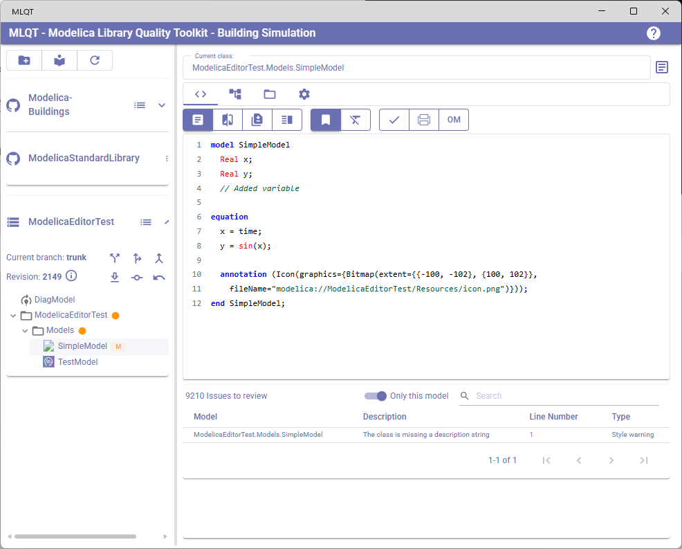
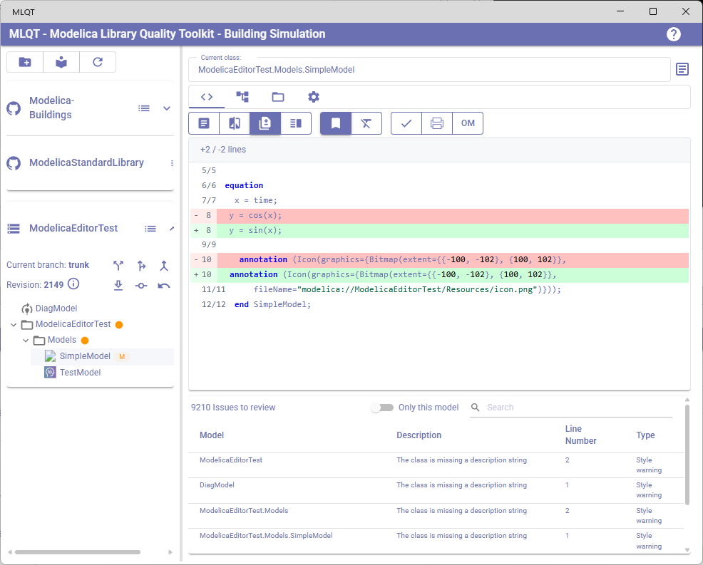
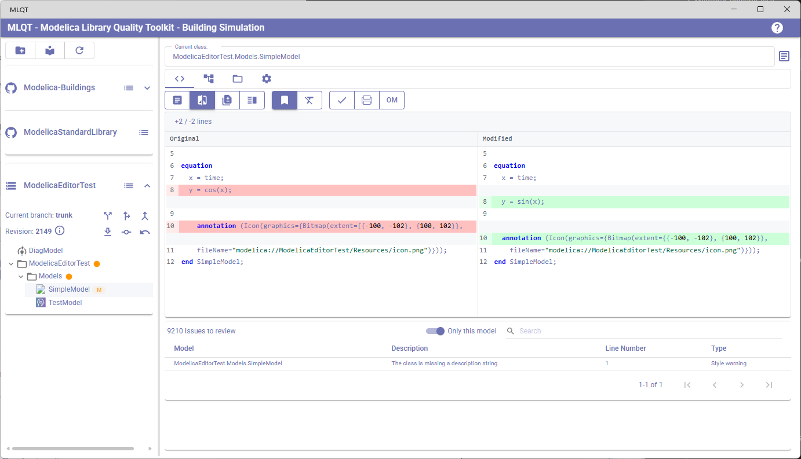

# Code Review

The Code Review tab is MLQT's primary view for inspecting Modelica source code, reviewing style checking issues, comparing changes against the last committed version, and running model checks with external tools like Dymola and OpenModelica.

To open this view, click on the **Code** tab (the code icon) in the right panel.

## Layout

The Code Review tab is divided into two areas:

1. **Code viewer** (upper area) — Displays the syntax-highlighted source code of the currently selected model
2. **Issues table** (lower area) — Lists all detected issues from parsing, style checking, and external tool checks

## Selecting a Model

Click on any model in the library tree (left panel) to view its code. The current model name is shown in the text field above the tab bar. For packages, the code viewer shows the package definition excluding nested class definitions (since those are separate nodes in the tree).

## Code Viewer Toolbar

The toolbar above the code viewer provides two groups of buttons:

### View Mode Buttons

These control how the code is displayed:

| Button | Icon | Description |
|--------|------|-------------|
| **View this version** | Article | Shows the current working copy code with syntax highlighting. This is the default view. |
| **Side-by-side diff** | Compare | Shows a side-by-side comparison between the HEAD (last committed) version and the current working copy. Only available when the file has uncommitted changes. |
| **Unified diff** | Difference | Shows a unified diff view where added and removed lines are interleaved. Only available when the file has uncommitted changes. |
| **View both versions** | Vertical split | Shows both the HEAD and working copy versions in full, side by side without collapsing unchanged sections. Only available when the file has uncommitted changes. |

### How the Diff View Works

When you select a model whose file has uncommitted VCS changes (Git or SVN), the diff buttons become enabled. MLQT detects changes by checking the working copy status against the repository.

The diff view:
- Fetches the file content at HEAD (the last committed version)
- Extracts the specific model's code from both versions
- Renders both through the Modelica formatter for consistent display
- Displays added lines, removed lines, and unchanged context

### Additional Buttons

| Button | Icon | Description |
|--------|------|-------------|
| **Exclude from Formatting** | FormatClear | Toggles formatting exclusion for the currently selected model. When active (yellow/orange, filled), the model is excluded from all auto-formatting operations. When inactive (primary color, outlined), the model follows normal formatting rules. Disabled when no model is selected or when the model is not part of a repository. When toggling ON, if the model's file has uncommitted VCS changes, the file is reverted first to undo any prior formatting. When toggling OFF, the model will be formatted on the next formatting pass. See [Code Formatting — Excluding Models](code-formatting.md#excluding-models-from-formatting) for full details. |
| **Show/Hide Annotations** | Bookmark | Toggles the display of Modelica annotations in the code viewer. Annotations (like `annotation(Documentation(...))`, icon definitions, etc.) can be verbose — hiding them lets you focus on the functional code. This toggle also affects the diff view. |
| **Check using Dymola** | Dymola logo | Sends the current model (or all models in a package) to Dymola for checking. Only visible if the Dymola path is configured in Settings > External Tools. |
| **Check using OpenModelica** | OM logo | Sends the current model (or all models in a package) to OpenModelica for checking. Only visible if the OpenModelica path is configured in Settings > External Tools. |

### External Tool Checking

When you click the Dymola or OpenModelica button:

- For a **single model**, the check runs immediately
- For a **package**, a progress dialog appears showing which model is currently being checked and a progress bar
- You can click **Stop** on the progress dialog to cancel the check
- Any errors found are added to the issues table below

## Syntax Highlighting

The code viewer displays Modelica code with syntax highlighting. Each element type is colored differently:

| Element | Examples |
|---------|----------|
| **Keywords** | `model`, `end`, `parameter`, `equation`, `algorithm`, `if`, `then`, `else`, `for`, `extends`, `import` |
| **Types** | `Real`, `Integer`, `Boolean`, `String` |
| **Identifiers** | Variable names, parameter names |
| **Names** | Class names, model names |
| **Functions** | Function calls |
| **Operators** | `=`, `+`, `-`, `*`, `/`, `:=` |
| **Numbers** | `3.14`, `42`, `1e-6` |
| **Strings** | `"description text"` |
| **Comments** | `// single line` and `/* multi-line */` |
| **Line numbers** | Shown in the left gutter |

The colors for each element type can be customized in **Settings > UI Settings > Syntax Highlighting**. You can choose from preset themes (VS Code, Dymola, OpenModelica) or define custom colors.

## Issues Table

The issues table at the bottom shows all detected problems across your loaded libraries. Issues come from three sources:

1. **Parser errors** — Syntax errors found when parsing Modelica code. Recoverable syntax errors are labelled **Parser error** (severity *Error*); issues severe enough that the whole file could not be parsed are labelled **Fatal parse failure** (severity *Fatal*), and the file appears in the library browser as a placeholder node so you can still open and correct it.
2. **Style checking violations** — Rules violations detected by the background style checker based on your repository settings
3. **External tool errors** — Errors reported by Dymola or OpenModelica during model checking

### Table Columns

| Column | Description |
|--------|-------------|
| **Model** | The fully qualified Modelica path of the model containing the issue. Long names are abbreviated with ellipsis (e.g., `MyLibrary...SubPackage.MyModel`). |
| **Description** | A summary of what the issue is (e.g., "Class has no description", "Parser error", "Check Failed"). |
| **Line Number** | The line number in the model's source code where the issue was found. For style issues that apply to the class as a whole, this may be 0. |
| **Type** | The severity of the issue — typically "Error", "Warning", or "Info". |

### Filtering Issues

The issues table provides two filtering mechanisms:

- **"Only this model" toggle** — When enabled, the table only shows issues for the currently selected model. When disabled (default), issues from all models are shown.
- **Search field** — Type text to filter issues by model name, description, details, or severity. Multiple search terms (space-separated) are matched independently.

### Interacting with Issues

- **Click a row** to navigate to the model containing that issue. The code viewer updates to show that model's code.
- If the issue has **additional details**, clicking the row opens an **Issue Details dialog** showing the full summary, severity, line number, and detailed description.
- In the Issue Details dialog, click **Resolve** to remove the issue from the list (marking it as addressed), or **Close** to dismiss the dialog without removing the issue.

### Spelling Violations

Spelling violations from the spell checker are handled differently from other issues. When you click a spelling violation (issues starting with "Misspelled word"), a **spelling popover** appears instead of the standard issue dialog, offering four actions:

| Button | Action |
|--------|--------|
| **Add to Dictionary** | Adds the word to your custom dictionary. All violations for this word across all models are immediately removed. The word will be accepted as correct in all future checks. |
| **Suggest** | Queries the loaded language dictionaries for similar words and displays a scrollable list of suggestions. This helps identify the correct spelling, but you need to fix the typo in your Modelica code manually. |
| **Ignore** | Removes this single violation from the list. The word will be flagged again on the next style check run. |
| **Close** | Closes the popover without taking any action. |

The spelling popover provides a fast workflow for triaging spelling issues: click a violation, assess whether it is a real typo or a valid term, and either add it to the dictionary or note it for correction in the source code.

For more details on configuring spell checking, language dictionaries, and the custom dictionary, see [Spell Checking](spell-checking.md).

### Naming Convention Violations

When naming convention checking is enabled, violations appear in the issues table with messages like "Variable name 'MyVar' should be camelCase (public variable)" or "Class name 'simpleModel' should be PascalCase (model)". Clicking a naming violation navigates to the model containing the offending name.

For details on configuring naming conventions, presets, exception names, and underscore suffix handling, see [Naming Conventions](naming-conventions.md).

### Issue Lifecycle

- Issues are **cleared and recalculated** whenever a library is loaded or reloaded
- **Parser errors** are detected immediately during loading
- **Style violations** are detected by a background process that runs after loading completes
- **External tool errors** are added when you manually run a Dymola or OpenModelica check
- Issues persist across model selections — switching models does not clear the issues list
- Resolving an issue removes it from the list for the current session
