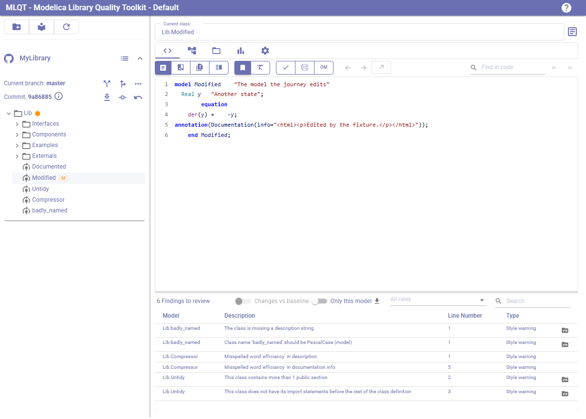
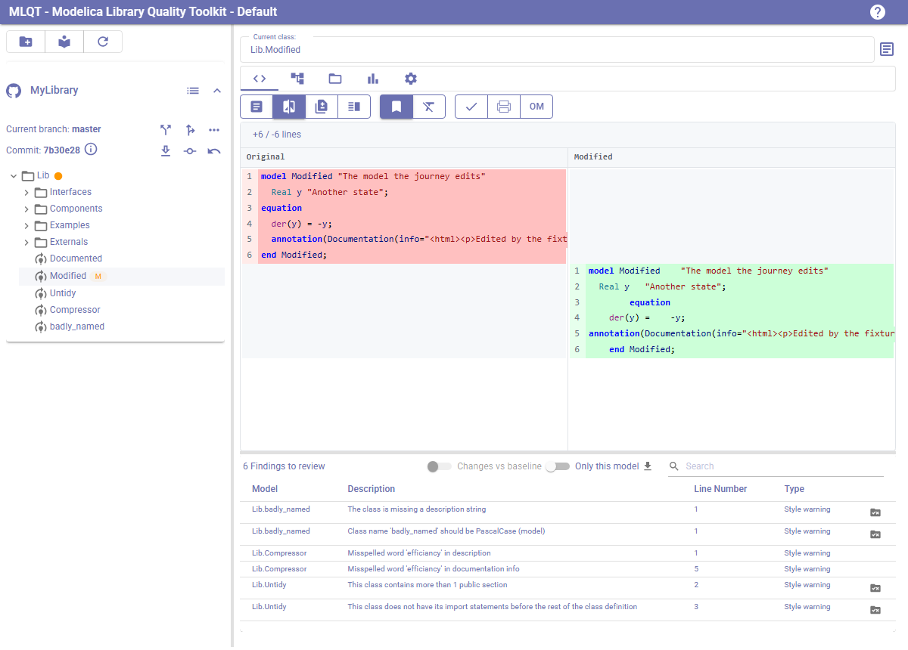
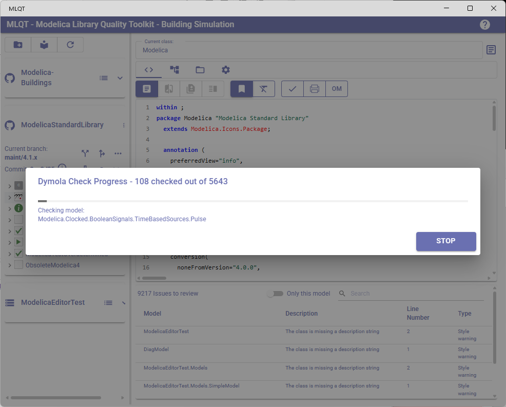

# Code Review

The Code Review tab is MLQT's primary view for inspecting Modelica source code, reviewing style checking findings, comparing changes against the last committed version, and running model checks with external tools like Dymola and OpenModelica.

To open this view, click on the **Code** tab (the code icon) in the right panel.



## Layout

The Code Review tab is divided into two areas:

1. **Code viewer** (upper area) — Displays the syntax-highlighted source code of the currently selected model
2. **Findings table** (lower area) — Lists all detected findings from parsing, style checking, and external tool checks

## Selecting a Model

Click on any model in the library tree (left panel) to view its code. The current model name is shown in the text field above the tab bar. For packages, the code viewer shows the package definition excluding nested class definitions (since those are separate nodes in the tree).

## Code Viewer Toolbar

The toolbar above the code viewer provides two groups of buttons:

### View Mode Buttons

These control how the code is displayed:

| Button | Icon | Description |
|--------|------|-------------|
| **View this version** | Article | Shows the current working copy code with syntax highlighting. This is the default view. |
| **Side-by-side diff** | Compare | Shows a side-by-side comparison between the HEAD (last committed) version and the current working copy. Only available when the file has uncommitted changes. |
| **Unified diff** | Difference | Shows a unified diff view where added and removed lines are interleaved. Only available when the file has uncommitted changes. |
| **View both versions** | Vertical split | Shows both the HEAD and working copy versions in full, side by side without collapsing unchanged sections. Only available when the file has uncommitted changes. |


### How the Diff View Works

When you select a model whose file has uncommitted VCS changes (Git or SVN), the diff buttons become enabled. MLQT detects changes by checking the working copy status against the repository.

The diff view:
- Fetches the file content at HEAD (the last committed version)
- Extracts the specific model's code from both versions
- Compares the raw Modelica source of each version (syntax highlighting is applied for readability, but the text is not run through the formatter)
- Displays added lines, removed lines, and unchanged context



### Additional Buttons

| Button | Icon | Description |
|--------|------|-------------|
| **Run Style Checking on ALL classes** | Check | Runs style checking across every loaded class (not just the current one) and populates the findings table with the results. Always available. |
| **Exclude from Formatting** | FormatClear | Toggles formatting exclusion for the currently selected model. When active (yellow/orange, filled), the model is excluded from all auto-formatting operations. When inactive (primary color, outlined), the model follows normal formatting rules. Disabled when no model is selected or when the model is not part of a repository. When toggling ON, if the model's file has uncommitted VCS changes, the file is reverted first to undo any prior formatting. When toggling OFF, the model will be formatted on the next formatting pass. See [Code Formatting — Excluding Models](code-formatting.md#excluding-models-from-formatting) for full details. The toggle writes a name into the repository's settings, which goes stale if the class is renamed or moved; for a permanent decision prefer the in-source `__MLQT(preserveOrder=true)` annotation, which travels with the class. |
| **Show/Hide Annotations** | Bookmark | Toggles the display of Modelica annotations in the code viewer. Annotations (like `annotation(Documentation(...))`, icon definitions, etc.) can be verbose — hiding them lets you focus on the functional code. This toggle also affects the diff view. |
| **Check using Dymola** | Dymola logo | Sends the current model (or all models in a package) to Dymola for checking. Only visible if the Dymola path is configured in Settings > External Tools. |
| **Check using OpenModelica** | OM logo | Sends the current model (or all models in a package) to OpenModelica for checking. Only visible if the OpenModelica path is configured in Settings > External Tools. |

### External Tool Checking

When you click the Dymola or OpenModelica button:

- For a **single model**, the check runs immediately
- For a **package**, a progress dialog appears showing which model is currently being checked and a progress bar
- You can click **Stop** on the progress dialog to cancel the check
- Any errors found are added to the findings table below



## Syntax Highlighting

The code viewer displays Modelica code with syntax highlighting. Each element type is colored differently:

| Element | Examples |
|---------|----------|
| **Keywords** | `model`, `end`, `parameter`, `equation`, `algorithm`, `if`, `then`, `else`, `for`, `extends`, `import` |
| **Types** | `Real`, `Integer`, `Boolean`, `String` |
| **Identifiers** | Variable names, parameter names |
| **Names** | Class names, model names |
| **Functions** | Function calls |
| **Operators** | `=`, `+`, `-`, `*`, `/`, `:=` |
| **Numbers** | `3.14`, `42`, `1e-6` |
| **Strings** | `"description text"` |
| **Comments** | `// single line` and `/* multi-line */` |
| **Line numbers** | Shown in the left gutter |

The colors for each element type can be customized in **Settings > UI Settings > Syntax Highlighting**. You can choose from preset themes (VS Code, Dymola, OpenModelica) or define custom colors.

## Findings Table

The findings table at the bottom shows all detected problems across your loaded libraries. Findings come from three sources:

1. **Parser errors** — Syntax errors found when parsing Modelica code. Recoverable syntax errors are labelled **Parser error** (severity *Error*); findings severe enough that the whole file could not be parsed are labelled **Fatal parse failure** (severity *Fatal*), and the file appears in the library browser as a placeholder node so you can still open and correct it.
2. **Style checking findings** — Rule findings from the background style checker, using your repository's settings
3. **External tool errors** — Errors reported by Dymola or OpenModelica during model checking

### Table Columns

| Column | Description |
|--------|-------------|
| **Model** | The fully qualified Modelica path of the model containing the finding. Long names are abbreviated with ellipsis (e.g., `MyLibrary...SubPackage.MyModel`). |
| **Description** | A summary of what the finding is (e.g., "Class has no description", "Parser error", "Check Failed"). |
| **Line Number** | The line number in the model's source code where the finding was found. For style findings that apply to the class as a whole, this may be 0. |
| **Type** | The severity of the finding — typically "Error", "Warning", or "Info". |

### Filtering Findings

The findings table provides two filtering mechanisms:

- **"Only this model" toggle** — When enabled, the table only shows findings for the currently selected model. When disabled (default), findings from all models are shown.
- **Search field** — Type text to filter findings by model name, description, details, or severity. Multiple search terms (space-separated) are matched independently.

### Exporting the Finding List

The download button in the findings toolbar writes every finding to a JSON file — you choose the folder,
and it is saved as `mlqt-findings-<timestamp>.json`.

**The export always contains the whole list**, regardless of the search box, the "Only this model"
toggle and the "Changes vs baseline" switch. That is deliberate: the usual reason to export is to
compare against a CI run, and an export that quietly honoured the on-screen filters would look like
evidence while reproducing the filter as a difference.

Each entry carries the same fields, with the same names *and the same meanings*, as the CLI's
`--format json` findings array — `RuleId`, `Severity`, `Status`, `Model`, `Element`, `Line`,
`ModelLine`, `Message`, `Fingerprint`, `File` — so the two can be compared directly. Two of them are
worth knowing about, because they are the ones that make a comparison meaningful:

- **`Line` is the line in the file; `ModelLine` is the line within the class.** They differ, often by
  hundreds, for a class stored inside a `package.mo`. The findings table on screen shows `ModelLine`,
  because that is what the code viewer beside it is numbering.
- **`File` is relative to the library the class belongs to**, with forward slashes — the same
  convention `mlqt check` uses for the library it was pointed at.

```powershell
mlqt check .\MyLibrary --format json --out cli.json
.\build\Compare-Findings.ps1 cli.json .\mlqt-findings-20260824-141530.json
```

`build/Compare-Findings.ps1` pairs the two up on model + rule + line and reports what each has that
the other does not, grouped by rule and by library. It needs nothing installed — PowerShell reads
JSON natively — and `-Detail` lists the individual findings rather than just the counts.

```
CLI 103683    App 103516    difference 167

Only the CLI reports (167)
  by rule:
       167  MLQT.Doc.ClassIcon                     e.g. MyLib.Widget:12
  by library:
       167  MyLib
```

The difference nearly always clusters on one rule id or one library prefix, and the cluster names
the cause: a rule enabled on one side only, a library loaded by one side only (or excluded by
`ExcludedLibraries` in only one), parse diagnostics — which the CLI emits for its checked set
regardless of which rules are enabled — or, when it is spread evenly, a filter left on in the app.

### Interacting with Findings

- **Click a row** to navigate to the model containing that finding. The code viewer updates to show that model's code.
- If the finding has **additional details**, clicking the row opens an **Finding Details dialog** showing the full summary, severity, line number, and detailed description.
- In the Finding Details dialog, click **Resolve** to remove the finding from the list (marking it as addressed), or **Close** to dismiss the dialog without removing the finding. For a spelling finding the dialog also offers **Add to Dictionary**, which accepts the flagged word into the word list of the repository that owns the class (`.mlqt/dictionary.txt`) so it is no longer reported there. It is disabled for a class that belongs to no repository, such as a library reconstructed from a vendor's encrypted documentation.


#### Suppressing a Rule

Each style-rule finding row (anything other than a spelling finding) has a **Suppress** button at the end of the row; the same action also appears in the Finding Details dialog when that dialog is shown. Unlike **Resolve** — which just clears the row until the next check re-reports it — **Suppress** records a permanent, in-source waiver so the rule is no longer reported for that element:

- MLQT writes a Modelica vendor annotation, `__MLQT(suppress="<rule id>")`, onto the class or, when the finding is about a specific component, onto that component.
- The annotation is scoped to the element the finding is about: a component-level waiver silences the rule only for that component; a class-level waiver silences it for the whole class (but not for sibling classes in the same file).
- The file is re-formatted and **saved to disk immediately**, then re-parsed, and the resolved finding is removed. If the result would fail to parse, the change is aborted and the file is left unchanged.

Because the waiver lives in the source, it survives re-formatting and is honoured everywhere findings are produced — the desktop app, the [`mlqt check` CLI](cli.md), and the [MCP server](mcp-server.md). This is the same suppression mechanism a reviewer or agent can apply headlessly; see the CI walk-through's suppression section in [CI Quality Gate](ci-quality-gate.md). `__MLQT` is a spec-sanctioned vendor annotation, so Dymola and OpenModelica ignore it.

### Spelling Findings

Spelling findings from the spell checker (findings starting with "Misspelled word") are handled differently from other findings. Clicking a spelling finding navigates to the model and scrolls the code viewer so the misspelled word is brought into view, **highlighted inline** with a wavy red underline. To act on the word, **right-click the underlined word** in the code viewer.

#### Correcting a Spelling Inline

To act on a misspelled word, right-click the highlighted word in the rendered code. A correction menu appears just below the word, offering:

| Option | Action |
|--------|--------|
| **Suggestions** | A scrollable list of similar words from the loaded language dictionaries. Click one to apply it in place. |
| **Replace with** | A text field for typing your own replacement; press **Enter** or click **Apply**. |
| **Add to Dictionary** | Accepts the word into the word list of the repository that owns this class. All findings for the word in that repository are immediately removed, and future checks — including CI, once `.mlqt/dictionary.txt` is committed — accept it. |
| **Ignore** | Accepts the word **in this class only**, by writing `__MLQT(spelling="<word>")` into the class and saving the file. Every finding for the word in that class is removed, and because the waiver lives in the source it holds through later checks and is honoured by the CLI and MCP server too. Other classes still report the word. If the class has no file MLQT can edit, the finding is dismissed for now and MLQT says so. |
| **Close** | Closes the menu without taking any action. |

When you apply a correction, MLQT replaces the word, re-formats and **saves the file to disk immediately**, re-parses it, and removes the resolved finding.

The replacement is whole-word and case-sensitive, and is applied only inside description strings and documentation prose — occurrences inside HTML links and `<code>`/`<pre>` blocks are left untouched so a correction never breaks a link. If the result would fail to parse, the change is aborted and the file is left unchanged. (Repairing already-broken documentation links is a separate, planned feature.)

For more details on configuring spell checking, language dictionaries, and each repository's accepted spellings, see [Spell Checking](spell-checking.md).

### Naming Convention Findings

When naming convention checking is enabled, findings appear in the findings table with messages like "Variable name 'MyVar' should be camelCase (public variable)" or "Class name 'simpleModel' should be PascalCase (model)". Clicking a naming finding navigates to the model containing the offending name.

For details on configuring naming conventions, presets, exception names, and underscore suffix handling, see [Naming Conventions](naming-conventions.md).

### Finding Lifecycle

- Findings are **cleared and recalculated** whenever a library is loaded or reloaded
- **Parser errors** are detected immediately during loading
- **Style findings** are detected by a background process that runs after loading completes
- **External tool errors** are added when you manually run a Dymola or OpenModelica check
- Findings persist across model selections — switching models does not clear the findings list
- Resolving an finding removes it from the list for the current session

## Filtering to what you have changed

A mature library carries a lot of standing debt, and on a first look the Findings list is mostly that
rather than anything you did. When the repository has a committed baseline
(`.mlqt/baseline.json` — see [ci-quality-gate.md](ci-quality-gate.md)), the Findings toolbar offers a
**Changes vs baseline** switch, and each row gains a **Baseline** column:

| Label | Meaning |
|---|---|
| `new` | Not in the baseline — something introduced since it was taken |
| `touched` | In the baseline, but in a file your working copy has pending |
| `accepted` | In the baseline, in a file you have not touched |

With the switch on, only `new` and `touched` are listed; `accepted` is hidden. The heading keeps both
numbers, so the standing debt is never invisible:

```
132 Findings to review (7 changed vs baseline)
```

**"Touched" means pending commit, not a diff between commits.** A file counts as touched when the
working copy has it modified, added, renamed, untracked or conflicted — the question the app answers
is *what have I done to this library right now*, and that must not depend on which commit you happen
to be sitting on. (The `mlqt check --changed-from <ref>` CLI option is the commit-to-commit variant,
for CI.)

Findings with no baseline entry to compare against — a library in a repository with no baseline, or an
external tool's output, which carries no finding identity — are always shown. "Not classifiable" is not
the same as "already accepted".

The switch is disabled when none of the loaded repositories has a baseline; hover it for the reason.
The classification follows the loaded libraries and the working copy automatically, so committing or
editing updates it without a manual refresh.
