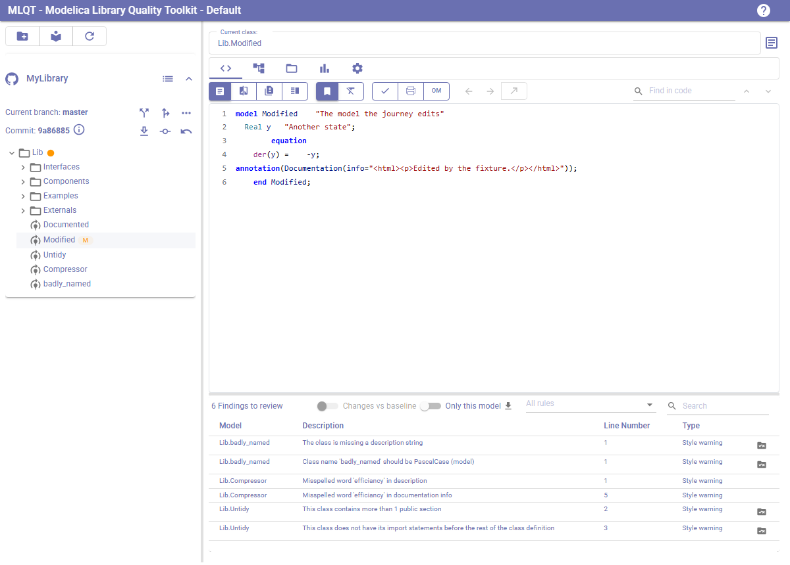
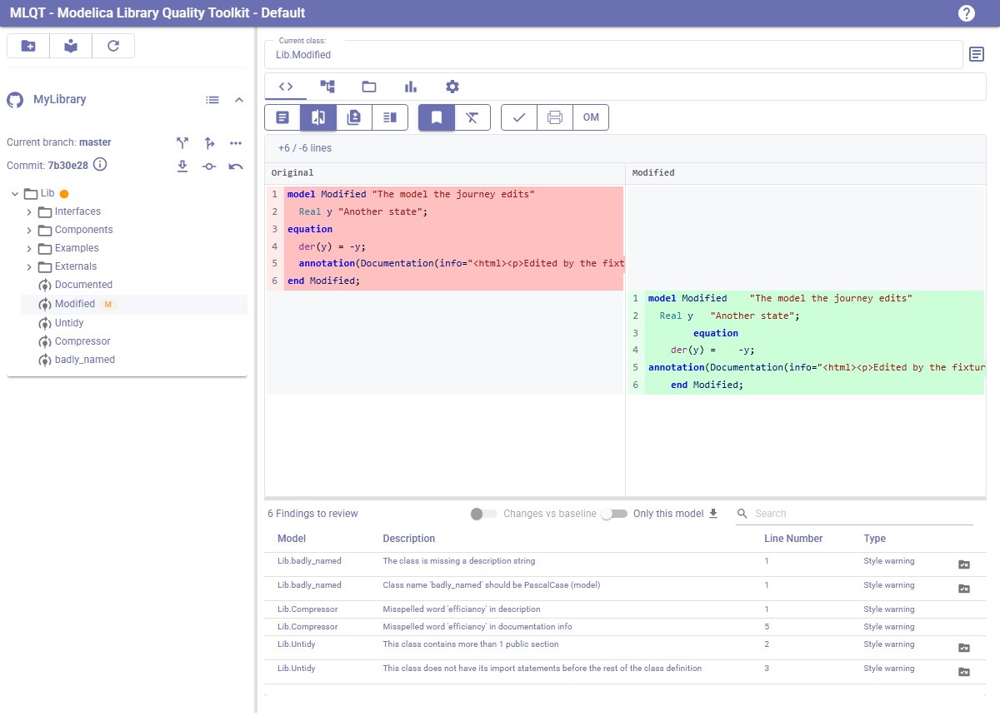

# Code Review

The Code Review tab is MLQT's primary view for inspecting Modelica source code, reviewing style checking findings, comparing changes against the last committed version, and running model checks with external tools like Dymola and OpenModelica.

To open this view, click on the **Code** tab (the code icon) in the right panel.



## Layout

The Code Review tab is divided into two areas:

1. **Code viewer** (upper area) — Displays the syntax-highlighted source code of the currently selected model
2. **Findings table** (lower area) — Lists all detected findings from parsing, style checking, and external tool checks

## Selecting a Model

Click on any model in the library tree (left panel) to view its code. The current model name is shown in the text field above the tab bar. For packages, the code viewer shows the package definition excluding nested class definitions (since those are separate nodes in the tree).

**The viewer shows the class as you wrote it.** Nothing is reformatted for display: every line on
screen is a line of your file, with the same text and layout, and lines are numbered from the start
of the class — the numbering a finding's line uses — so a finding points at the text your editor
shows. Only the colouring is added, and whatever you choose to hide is taken out by whole lines.

**A very large class appears before it has finished parsing.** Above 64 KB, a class with nothing to
hide is coloured from the lexer straight away, and the full colouring replaces it once the parse
finishes — the only visible difference in the meantime is that a name is not yet told apart as a type
or a function call. A package whose nested classes must be hidden, or a class shown with annotations
hidden, waits for the parse, so what should be hidden never appears.

## Code Viewer Toolbar

The toolbar above the code viewer provides two groups of buttons:

### View Mode Buttons

These control how the code is displayed:

| Button | Icon | Description |
|--------|------|-------------|
| **View this version** | Article | Shows the current working copy code with syntax highlighting. This is the default view. |
| **Side-by-side diff** | Compare | Shows a side-by-side comparison between the HEAD (last committed) version and the current working copy. Only available when the file has uncommitted changes. |
| **Unified diff** | Difference | Shows a unified diff view where added and removed lines are interleaved. Only available when the file has uncommitted changes. |
| **View both versions** | Vertical split | Shows both the HEAD and working copy versions in full, side by side without collapsing unchanged sections. Only available when the file has uncommitted changes. |


### How the Diff View Works

When you select a model whose file has uncommitted VCS changes (Git or SVN), the diff buttons become enabled. MLQT detects changes by checking the working copy status against the repository.

The diff view:
- Fetches the file content at HEAD (the last committed version)
- Extracts the specific model's code from both versions
- Compares the raw Modelica source of each version (syntax highlighting is applied for readability, but the text is not run through the formatter)
- Displays added lines, removed lines, and unchanged context

The class is found at HEAD by its full name in the file, or, if it has moved since, by its short name
when only one class in the committed file has it. **If neither finds it** — the class was renamed, or
the committed file does not parse — the diff says so rather than comparing the class with the whole
committed file. And a diff too long to draw (more than 20,000 rows) says how many lines were added
and removed and suggests an external diff tool, instead of rendering every row.



### Additional Buttons

| Button | Icon | Description |
|--------|------|-------------|
| **Run Style Checking on ALL classes** | Check | Runs style checking across every loaded class (not just the current one) and populates the findings table with the results. Always available. |
| **Exclude from auto-formatting** / **Include in auto-formatting** | FormatClear | Toggles formatting exclusion (the tooltip names what a click will do) for the currently selected model. When active (yellow/orange, filled), the model is excluded from all auto-formatting operations. When inactive (primary color, outlined), the model follows normal formatting rules. Disabled when no model is selected or when the model is not part of a repository. When toggling ON, if the model's file has uncommitted VCS changes that are only formatting, the file is reverted first to undo it; a new file, or one with any other uncommitted edit, is left as it is. When toggling OFF, the model will be formatted on the next formatting pass. See [Code Formatting — Excluding Models](code-formatting.md#excluding-models-from-formatting) for full details. The toggle writes `__MLQT(format=false)` into the class itself, so the exclusion travels with it when it is renamed or moved and is committed alongside the code it applies to; toggling off removes the directive again. Write the annotation by hand if you want to record a `reason` for it. |
| **Suppress rules in this class** | PlaylistRemove | Opens a dialog that sets which rules the selected class suppresses, for itself **and every class nested in it** — see [Suppressing Rules for a Whole Class](#suppressing-rules-for-a-whole-class). When the class already suppresses something (yellow/orange, filled), the tooltip says how many rules. Disabled when no class is selected. |
| **Show/Hide Annotations** | Bookmark | Toggles the display of Modelica annotations in the code viewer. Annotations (like `annotation(Documentation(...))`, icon definitions, `Placement`, `Line`) can be verbose — hiding them lets you focus on the functional code. **Every annotation goes, including the ones written on the same line as code** — so a `connect(...)` in an equation section comes back as just the connection. Nothing is left in their place: the button is filled while annotations are shown and outlined while they are hidden, and that is the only marker. Line numbers are unaffected, so a finding still points at the right line. The diff views always show the full source, annotations included, whatever this is set to. |
| **Check this class using Dymola** | Dymola logo | Sends the current model (or all models in a package) to Dymola for checking. Only visible if the Dymola path is configured in Settings > External Tools, and disabled when no class is selected. |
| **Check this class using OpenModelica** | OM logo | Sends the current model (or all models in a package) to OpenModelica for checking. Only visible if the OpenModelica path is configured in Settings > External Tools, and disabled when no class is selected. |

### Moving between classes

Three controls sit together on the toolbar, because they are one job:

| Button | Icon | Description |
|--------|------|-------------|
| **Go to a class this one uses** | CallMade (↗) | Lists the classes the current one depends on; pick one to open it. Needs dependency analysis to have run — until it has, the button says so. |
| **Back** | ArrowBack (←) | Returns to the class you came from. The tooltip names it, so you know before you press it. |
| **Forward** | ArrowForward (→) | Undoes a **Back**. |

**The history is shared across every tab** — selecting a class anywhere records it — but the arrows
themselves are on the Code Review toolbar, so that is where you go back from.

### Finding text in the class on screen

The **Find in code** box at the right of the toolbar searches the class you are looking at, rather
than the findings list. The count beside it says which match you are on and how many there are, and
the arrows step through them, wrapping at both ends so the last match steps back to the first.

The box is disabled until a class is open, and the count appears only once you have typed something.
It is also disabled while a diff view is showing: it searches the single view, so switch back to
that to use it. Clicking a finding while the diff is showing does the same — the line it names is
scrolled to when you switch back.

Matches are tinted inside the code's own colouring, one token at a time, so a match that spans
several tokens — `der(y)` is three — is not tinted, though its line is still counted and stepped to
by the arrows.

### External Tool Checking

When you click the Dymola or OpenModelica button:

- A progress dialog opens straight away, for a single model as well as for a package, showing what the tool is doing (starting, opening the library), then which model is being checked, with a progress bar. Its title is "Dymola check" (or "OpenModelica check"); for a package it adds the count, e.g. "Dymola check - 3 of 12 classes checked"
- You can click **Stop** on the progress dialog to cancel the check
- When the check finishes, a results dialog titled "Dymola check" or "OpenModelica check" opens with a one-line summary of how it went and the tool's own log for each class it has something to say about
- Any errors found are added to the findings table below


## Syntax Highlighting

The code viewer displays Modelica code with syntax highlighting. Each element type is colored differently:

| Element | Examples |
|---------|----------|
| **Keywords** | `model`, `end`, `parameter`, `equation`, `algorithm`, `if`, `then`, `else`, `for`, `extends`, `import` |
| **Types** | `Real`, `Integer`, `Boolean`, `String` |
| **Identifiers** | Variable names, parameter names |
| **Names** | Class names, model names |
| **Functions** | Function calls |
| **Operators** | `=`, `+`, `-`, `*`, `/`, `:=` |
| **Numbers** | `3.14`, `42`, `1e-6` |
| **Strings** | `"description text"` |
| **Comments** | `// single line` and `/* multi-line */` |
| **Line numbers** | Shown in the left gutter |

The colors for each element type can be customized in **Settings > UI Settings > Syntax Highlighting**. You can choose from preset themes (VS Code, Dymola, OpenModelica) or define custom colors.

## Findings Table

The findings table at the bottom shows all detected problems across your loaded libraries. Findings come from three sources:

1. **Parser errors** — Syntax errors found when parsing Modelica code. Recoverable syntax errors are labelled **Parser error** (severity *Error*); findings severe enough that the whole file could not be parsed are labelled **Fatal parse failure** (severity *Fatal*), and the file appears in the library browser as a placeholder node so you can still open and correct it.
2. **Style checking findings** — Rule findings from the background style checker, using your repository's settings
3. **External tool errors** — Errors reported by Dymola or OpenModelica during model checking

### Table Columns

| Column | Description |
|--------|-------------|
| **Model** | The fully qualified Modelica path of the model containing the finding. Names longer than 40 characters are abbreviated to the first two parts and the last, with an ellipsis between (e.g., `MyLibrary.Fluid.Pipes.Examples.MyLongModelName` becomes `MyLibrary.Fluid....MyLongModelName`). |
| **Description** | A summary of what the finding is (e.g., "Class has no description", "Parser error", "Check Failed"). |
| **Line Number** | The line number in the model's source code where the finding was found. For style findings that apply to the class as a whole, this may be 0. |
| **Type** | The severity of the finding — typically "Error", "Warning", or "Info". |

### Filtering Findings

Four controls narrow the findings table, and they combine — each one applies on top of the others:

- **"Only this model" toggle** — When enabled, the table only shows findings for the currently selected model. When disabled (default), findings from all models are shown.
- **Search field** — Type text to filter findings by model name, description, details, severity, or rule id. **Every space-separated term must match**, so a second word narrows the list rather than widening it. Terms may match different fields, so a partial class name and a keyword work together.
- **Rule list** — Narrows to one rule. Only the rules the current findings actually use are offered, so the list is never longer than it needs to be. The list selects a rule by its title; the search box matches a rule's id (such as part of `MLQT.Structure.UsesUndeclared`) but not its title, which is not in its findings' text.
- **"Changes vs baseline" switch** — Hides accepted debt; see [Filtering to what you have changed](#filtering-to-what-you-have-changed) below.

**The heading always says what you are looking at.** With nothing filtered it counts the findings
held; once anything narrows the list it names both numbers, so a filter that matched nothing is
never mistaken for a table that failed to load:

```
40 Findings to review        ← nothing narrowed
3 of 40 findings             ← something did
0 of 40 findings             ← the filter matched nothing
```

### Exporting the Finding List

The download button in the findings toolbar writes every finding to a JSON file — you choose the folder,
and it is saved as `mlqt-findings-<timestamp>.json`.

**The export always contains the whole list**, regardless of the search box, the "Only this model"
toggle and the "Changes vs baseline" switch. That is deliberate: the usual reason to export is to
compare against a CI run, and an export that quietly honoured the on-screen filters would look like
evidence while reproducing the filter as a difference.

Each entry carries the same fields, with the same names *and the same meanings*, as the CLI's
`--format json` findings array — `RuleId`, `Severity`, `Status`, `Model`, `Element`, `Line`,
`ModelLine`, `Message`, `Fingerprint`, `File` — so the two can be compared directly. Two of them are
worth knowing about, because they are the ones that make a comparison meaningful:

- **`Line` is the line in the file; `ModelLine` is the line within the class.** They differ, often by
  hundreds, for a class stored inside a `package.mo`. The findings table on screen shows `ModelLine`,
  because that is what the code viewer beside it is numbering.
- **`File` is relative to the library the class belongs to**, with forward slashes — the same
  convention `mlqt check` uses for the library it was pointed at.

```powershell
mlqt check .\MyLibrary --format json --out cli.json
.\build\Compare-Findings.ps1 cli.json .\mlqt-findings-20260824-141530.json
```

`build/Compare-Findings.ps1` pairs the two up on model + rule + line and reports what each has that
the other does not, grouped by rule and by library. It needs nothing installed — PowerShell reads
JSON natively — and `-Detail` lists the individual findings rather than just the counts.

```
CLI 103683    App 103516    difference 167

Only the CLI reports (167)
  by rule:
       167  MLQT.Doc.ClassIcon                     e.g. MyLib.Widget:12
  by library:
       167  MyLib
```

The difference nearly always clusters on one rule id or one library prefix, and the cluster names
the cause: a rule enabled on one side only, a library loaded by one side only (or excluded by
`ExcludedLibraries` in only one), parse diagnostics — which the CLI emits for its checked set
regardless of which rules are enabled — or, when it is spread evenly, a filter left on in the app.

### Interacting with Findings

- **The order is stable**: by class, then by line within the class, then by rule — the order a reader
  works through a class, and the same order each time the same library is reviewed.
- **Click a row** to navigate to the model containing that finding. The code viewer updates to show that model's code and scrolls to the line the finding names (a finding with no line leaves the viewer at the top of the class). A finding inside a nested class the viewer has hidden scrolls to the marker line that stands in for that class.
- If the finding has **additional details**, clicking the row opens an **Finding Details dialog** showing the full summary, severity, line number, and detailed description.
- In the Finding Details dialog, click **Resolve** to remove the finding from the list (marking it as addressed), or **Close** to dismiss the dialog without removing the finding. 


#### Splitting a single-file package

A finding from `MLQT.Structure.SingleFilePackage` — a package held in one `.mo` file whose classes
could each have a file of their own — carries a **Split into files** button at the end of its row,
and the same action in the Finding Details dialog. This is the usual way a package arrives from
another Modelica tool, which saves the whole thing as one file; MLQT never restructures it on its
own, because the formatting that runs day to day rewrites files in place and never moves a class
between them.

The action writes that package as a directory with one file per class and a matching
`package.order`, deletes the file it came from, and leaves the rest of the repository untouched. A
package that is already a directory, with some classes inline in its `package.mo` and others in files
of their own, has only the inline ones moved; where it had no `package.order`, the one written names
the classes that were already in their own files too, after the ones it moved. It
asks first, since it creates a directory and deletes a file. Everything it does is an ordinary
working-copy change, so version control can undo it. A library in a repository that is itself a single `.mo` file (`MyLib.mo`) is split the same way into `MyLib/`, and MLQT carries on with the library as that directory — the project records the new location, so a Refresh, a VCS update or reopening the project all find it there, just as after **Format All Files**. A library read from an archive is never written to, so the action declines there.

The alternative is **Format All Files** in repository settings, which does the same restructuring to
the whole library — the right thing when you mean it, and a commit of thousands of files when you
only wanted to correct one package.

See [Code Formatting — A package that arrives from another tool](code-formatting.md#a-package-that-arrives-from-another-tool).

#### Suppressing a Rule

Each style-rule finding row has a **Suppress** button at the end of the row — except a spelling finding, which gets the word-scoped **Ignore** in the correction menu instead, and a diagnostic (`MLQT.Parse.*`, `MLQT.Check.Failed`), which cannot be waived at all because it reports that the results are incomplete; the same action also appears in the Finding Details dialog when that dialog is shown. Unlike **Resolve** — which just clears the row until the next check re-reports it — **Suppress** records a permanent, in-source waiver so the rule is no longer reported for that element:

- MLQT writes a Modelica vendor annotation, `__MLQT(suppress="<rule id>")`, onto the class or, when the finding is about a specific component, onto that component.
- The annotation is scoped to the element the finding is about: a component-level waiver silences the rule only for that component; a class-level waiver silences it for the whole class and every class nested in it (but not for sibling classes in the same file). To waive a rule for a whole sub-package, such as the generated `_fmu` models from a Dymola FMU import, put `__MLQT(suppress="<rule id>")` — or `suppress="*"` — in the package's own annotation; see [CI Quality Gate](ci-quality-gate.md#suppressing-intentional-findings).
- The file is re-formatted and **saved to disk immediately**, then re-parsed, and the resolved finding is removed. If the result would fail to parse, the change is aborted and the file is left unchanged.

Because the waiver lives in the source, it survives re-formatting and is honoured everywhere findings are produced — the desktop app, the [`mlqt check` CLI](cli.md), and the [MCP server](mcp-server.md). This is the same suppression mechanism a reviewer or agent can apply headlessly; see the CI walk-through's suppression section in [CI Quality Gate](ci-quality-gate.md). `__MLQT` is a spec-sanctioned vendor annotation, so Dymola and OpenModelica ignore it.

#### Suppressing Rules for a Whole Class

**Suppress** on a row waives one finding's rule on one class. That isn't enough for generated code
such as the models Dymola writes when it imports an FMU, whose findings are almost all in the
records and types nested inside the model: with the model selected, those findings aren't the ones
the table shows.

The **Suppress rules in this class** button on the toolbar opens a dialog for the selected class:

- It lists every rule with a finding in the class **or any class nested in it**, with how many.
  **Show every rule** lists the whole catalogue instead.
- Tick the rules to suppress. **All rules (\*)** suppresses every rule; the rules ticked underneath
  are kept, so turning it off again leaves them suppressed.
- **Reason** is written beside the list, for whoever reviews the change.
- The dialog opens with what the class already says ticked. If a package above the class already
  suppresses something here, the dialog says so.

**Save** writes the choice into the class's source as `__MLQT(suppress="…", reason="…")`, replacing
the list it had. The rows it waived leave the table at once. If you turned a rule *off*, the class
and the classes nested in it are checked again so its findings come back. As with the row action,
the waiver lives in the source, so `mlqt check` and the MCP server honour it too, and
`mlqt check --no-suppress` shows everything it hides.

For an FMU import, consider suppressing on the **package** that holds the `_fmu` models rather than
on each model: Dymola rewrites a model when the FMU is imported again, and the annotation goes with
it.

### Very Large Classes

The viewer shows at most the first **5,000 lines** of a class. Longer ones are mostly generated,
such as the models Dymola writes when it imports an FMU, which can run past 100,000 lines. A notice
above the code then gives the class's full length and its file. Findings and search matches past
line 5,000 can't be scrolled to; open the file in your editor to see them. A package counts only
the lines left after its nested classes are hidden, so a large package of small classes shows in
full. The limit is there because the browser slows sharply with length: 5,000 lines take about two
seconds, and a 100,000-line class used to freeze the app.

### Spelling Findings

Spelling findings from the spell checker (findings starting with "Misspelled word") are handled differently from other findings. Clicking a spelling finding navigates to the model and scrolls the code viewer so the misspelled word is brought into view, **highlighted inline** with a wavy red underline. To act on the word, **right-click the underlined word** in the code viewer.

#### Correcting a Spelling Inline

To act on a misspelled word, right-click the highlighted word in the rendered code. A correction menu appears just below the word, offering:

| Option | Action |
|--------|--------|
| **Suggestions** | A scrollable list of similar words from the loaded language dictionaries. Click one to apply it in place. |
| **Replace with** | A text field for typing your own replacement; press **Enter** or click **Apply**. |
| **Add to Dictionary** | Accepts the word into the word list of the repository that owns this class. All findings for the word in that repository are immediately removed, and future checks — including CI, once `.mlqt/dictionary.txt` is committed — accept it. |
| **Ignore** | Accepts the word **in this class only** (and any class nested in it), by writing `__MLQT(spelling="<word>")` into the class and saving the file. Every finding for the word in that class is removed, and because the waiver lives in the source it holds through later checks and is honoured by the CLI and MCP server too. Other classes still report the word. If the class has no file MLQT can edit, the finding is dismissed for now and MLQT says so. |
| **Close** | Closes the menu without taking any action. |

When you apply a correction, MLQT replaces the word, re-formats and **saves the file to disk immediately**, re-parses it, and removes the resolved finding.

The replacement is whole-word and case-sensitive, and is applied only inside description strings and documentation prose — occurrences inside HTML links and `<code>`/`<pre>` blocks are left untouched so a correction never breaks a link. If the result would fail to parse, the change is aborted and the file is left unchanged. (Repairing already-broken documentation links is a separate, planned feature.)

For more details on configuring spell checking, language dictionaries, and each repository's accepted spellings, see [Spell Checking](spell-checking.md).

### Naming Convention Findings

When naming convention checking is enabled, findings appear in the findings table with messages like "Variable name 'MyVar' should be camelCase (public variable)" or "Class name 'simpleModel' should be PascalCase (model)". Clicking a naming finding navigates to the model containing the offending name.

For details on configuring naming conventions, presets, exception names, and underscore suffix handling, see [Naming Conventions](naming-conventions.md).

### Finding Lifecycle

- Findings are **cleared and recalculated** whenever a library is loaded or reloaded
- **Parser errors** are detected immediately during loading, and read again when a style check finishes — code reformatted in place (**Format All Files**) is parsed again by that check, so its errors, if it has any, are listed then
- **Style findings** are detected by a background process that runs after loading completes
- **External tool errors** are added when you manually run a Dymola or OpenModelica check
- Findings persist across model selections — switching models does not clear the findings list
- Resolving a finding removes it from the list for the current session

## Filtering to what you have changed

A mature library carries a lot of standing debt, and on a first look the Findings list is mostly that
rather than anything you did. When the repository has a committed baseline 
(`.mlqt/baseline.json` — see [ci-quality-gate.md](ci-quality-gate.md)), the Findings toolbar offers a
**Changes vs baseline** switch, and each row gains a **Baseline** column:

| Label | Meaning |
|---|---|
| `new` | Not in the baseline — something introduced since it was taken |
| `touched` | In the baseline, but in a file your working copy has pending |
| `accepted` | In the baseline, in a file you have not touched |

With the switch on, only `new` and `touched` are listed; `accepted` is hidden. The heading keeps both
numbers, so the standing debt is never invisible:

```
132 Findings to review (7 changed vs baseline)   ← switch off
7 changed of 132 findings                        ← switch on
2 of 7 changed findings                          ← switch on, and a search as well
```

With the switch on, the heading counts against the changed findings rather than the whole ledger —
a search that leaves 2 of the 7 says so, instead of crediting itself with hiding the 125 the switch
hid.

**"Touched" means pending commit, not a diff between commits.** A file counts as touched when the
working copy has it modified, added, renamed, untracked or conflicted — the question the app answers
is *what have I done to this library right now*, and that must not depend on which commit you happen
to be sitting on. (The `mlqt check --changed-from <ref>` CLI option is the commit-to-commit variant,
for CI.)

Findings with no baseline entry to compare against — a library in a repository with no baseline, or an
external tool's output, which carries no finding identity — are always shown. "Not classifiable" is not
the same as "already accepted".

The switch is disabled when none of the loaded repositories has a baseline; hover it for the reason.
The classification follows the loaded libraries and the working copy automatically, so committing or
editing updates it without a manual refresh.
