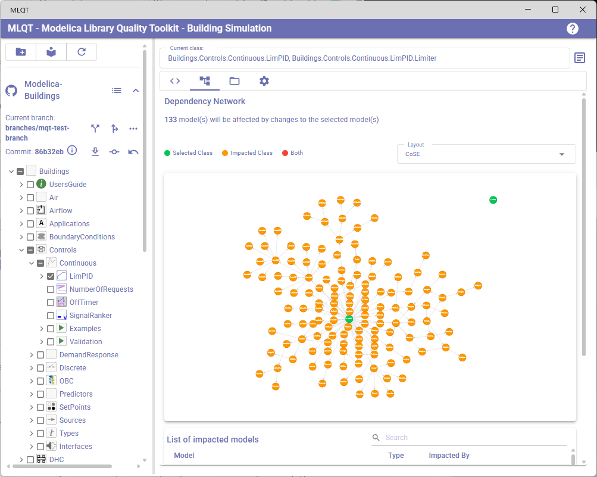
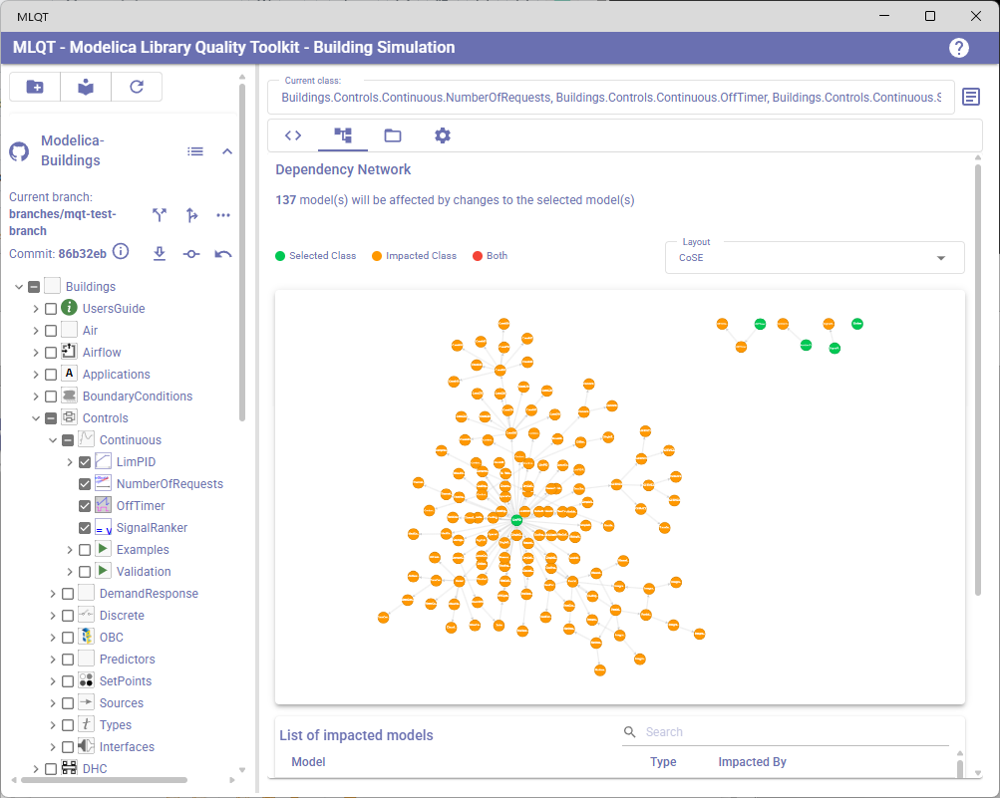
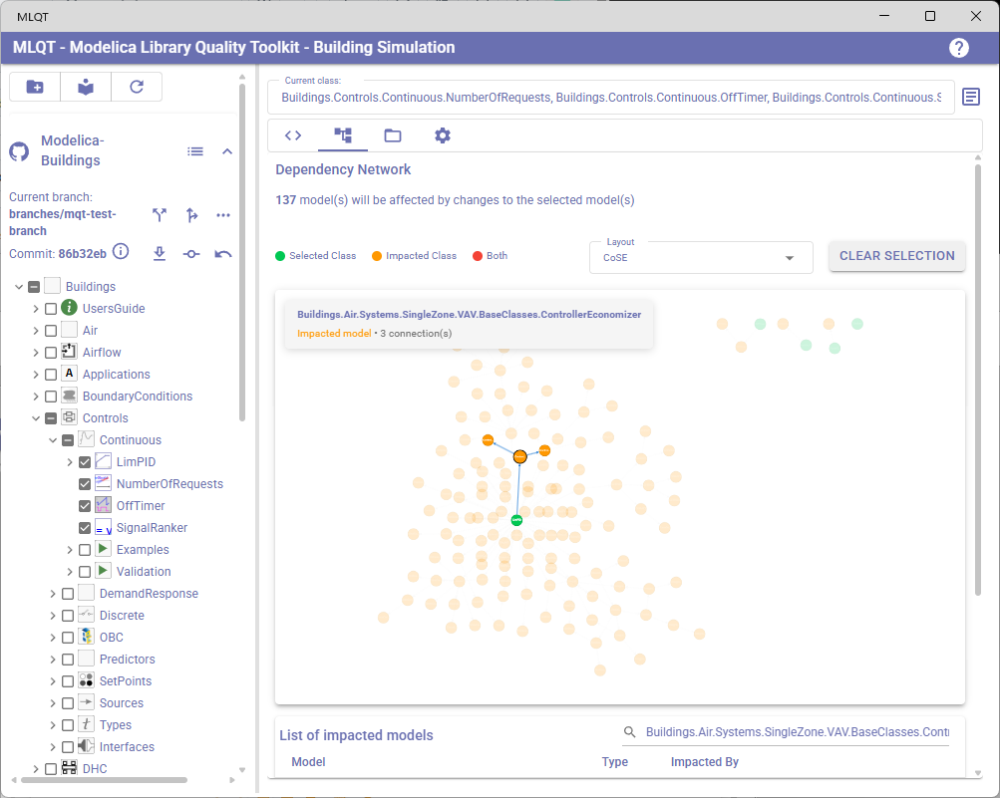
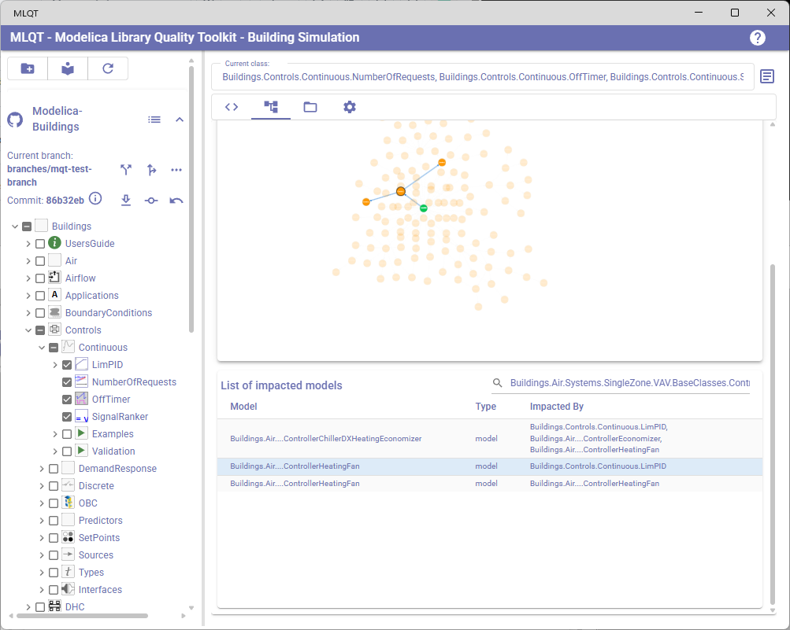

# Dependency Analysis

The Dependency Analysis tab helps you understand the relationships between Modelica models and assess the impact of changes. It answers the question: *"If I change this model, what other models will be affected?"*

To open this view, click on the **Dependencies** tab (the tree/graph icon) in the right panel.

## Multi-Selection Mode

When you switch to the Dependencies tab, MLQT automatically enables **multi-selection mode** in the library tree (left panel). This means:

- Checkboxes appear next to each model in the tree
- You can select one or more models to analyze their combined impact
- The currently selected model (from single-click) is automatically included as the first selection

When you leave the Dependencies tab, multi-selection mode is automatically disabled and the tree returns to single-selection behavior.

## Understanding the Network Graph

The dependency network graph is an interactive visualization showing the selected models and all models that would be impacted by changes to them. It uses directed edges to show dependency relationships.

### Node Colors

The graph uses a color-coded legend to distinguish between different types of nodes:

| Color | Meaning |
|-------|---------|
| **Green** | **Selected Class** — A model you explicitly selected for analysis in the tree view |
| **Orange/Warning** | **Impacted Class** — A model that depends on one or more selected models and would be affected by changes |
| **Red/Error** | **Both** — A model that is both selected for analysis and impacted by another selected model (this happens when you select multiple models that depend on each other) |

### What "Impacted" Means

A model is considered impacted if it depends on a selected model through any of these Modelica relationships:

- **extends** — The impacted model extends (inherits from) the selected model
- **Component usage** — The impacted model declares a component of the selected model's type
- **Nested model references** — The impacted model references the selected model inside equations, algorithms, or annotations

The analysis is transitive: if Model A depends on Model B, and Model B depends on Model C, then selecting Model C will show both Model A and Model B as impacted.

### Edges

Directed edges (arrows) in the graph show the direction of dependency:

- An edge from Model A to Model B means "Model A depends on Model B"
- Following the arrows from an impacted (orange) node leads back toward the selected (green) node(s) that caused the impact

## Interacting with the Graph

### Clicking Nodes

Click on any node in the graph to:

1. **Highlight** the node and dim all others — making it easy to see its connections
2. **Show a tooltip** in the top-left corner of the graph with the model's full name, whether it is selected or impacted, and how many connections it has
3. **Filter the impact table** below to show only entries related to that node

Click the same node again or click the graph background to clear the highlight.

### Panning and Zooming

- **Scroll** to zoom in and out
- **Click and drag** the background to pan the graph
- **Click and drag** a node to reposition it (for force-directed layouts, other nodes will adjust accordingly)

### Changing the Layout

The **Layout** dropdown in the top-right area of the graph lets you switch between different graph layout algorithms:

| Layout | Description |
|--------|-------------|
| **Hierarchy (Top→Bottom)** | Arranges nodes in a top-to-bottom hierarchy using the Dagre algorithm. Good for seeing the overall dependency structure. |
| **Hierarchy (Left→Right)** | Same as above but oriented horizontally. |
| **Tree** | Breadth-first tree layout. Good for small to medium graphs. |
| **KLay** | KLay layered layout. Produces clean hierarchical arrangements. |
| **Concentric** | Arranges nodes in concentric circles with selected models in the center. |
| **fCoSE (Force-Directed)** | Force-directed layout that tries to minimize edge crossings. Good for seeing clusters. |
| **Spread** | Spreads nodes evenly across the available space. Good for dense graphs. |
| **CoSE** | Compound Spring Embedder — another force-directed layout. This is the default. |
| **Circle** | Arranges all nodes in a simple circle. |

### Clear Selection Button

When a node is highlighted in the graph, a **Clear Selection** button appears next to the layout dropdown. Click it to remove the highlight and show all nodes equally.

## Impacted Models Table

Below the graph, a table lists every impacted model with detailed information. This is the same data shown in the graph but in a structured, searchable format.

### Table Columns

| Column | Description |
|--------|-------------|
| **Model** | The fully qualified Modelica path of the impacted model. Long names are abbreviated with ellipsis. |
| **Type** | The Modelica class type (e.g., `model`, `block`, `package`, `function`, `record`, `connector`). |
| **Impacted By** | A list of the selected model(s) that cause this model to be impacted. If more than 3 models contribute, only the first 3 are shown with a count of additional ones (e.g., "+2 more"). |

### Filtering the Table

- Use the **Search field** to filter by model name or impacted-by names
- **Click a row** in the table to highlight the corresponding node in the graph (and vice versa — clicking a node in the graph filters the table to that node)
- Highlighted rows have a distinct background color so you can see which table row corresponds to the selected graph node

### Reading the Impact Summary

At the top of the Dependencies tab, a summary line tells you how many models are impacted:

- **"No models will be affected by changes to the selected model(s)"** — The selected model(s) are not used by any other model. Changes can be made safely without affecting anything else.
- **"X model(s) will be affected by changes to the selected model(s)"** — X models use the selected model(s) either directly or transitively. You should review these models after making changes.

## Practical Use Cases

### Before Making a Change

1. Select the model you plan to modify in the tree
2. Switch to the Dependencies tab
3. Review how many models are impacted
4. Use the table to identify which models and their types
5. Consider whether the change is safe, or whether impacted models need to be updated too

### Assessing Multiple Changes

1. Check multiple models in the tree that you plan to change together
2. The graph shows the combined impact — models impacted by any of the selected models
3. Models that appear as "Both" (red) indicate circular or mutual dependencies between your selected models

### Finding Dependency Chains

1. Select a model and review its impacted models
2. Click on an impacted model in the graph to see its connections
3. Follow the edges to understand the chain of dependencies
4. Use different layouts (especially Hierarchy) to see the layered structure clearly
