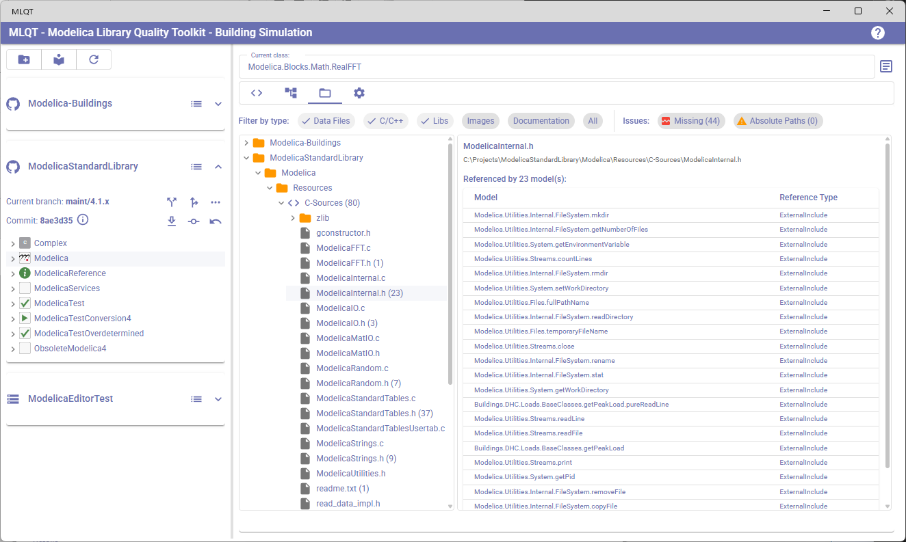
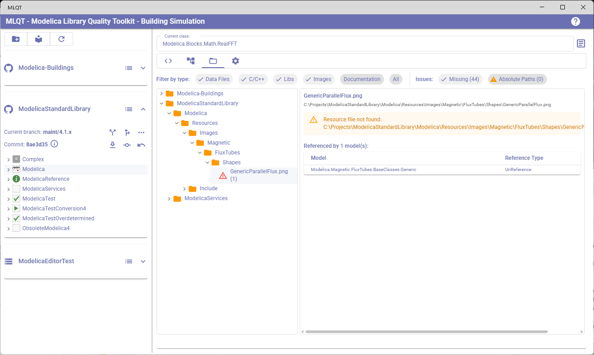
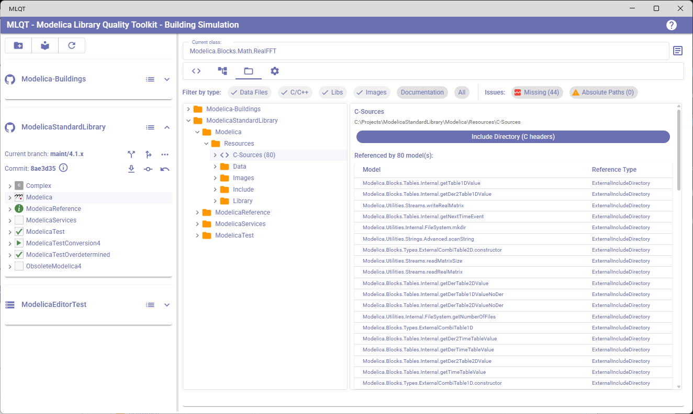

# External Resources

The External Resources tab provides a comprehensive view of all non-Modelica files referenced by your libraries — data files, C/C++ source code, compiled libraries, images, and documentation. It helps you understand what external dependencies your models have, verify that referenced files exist, and identify which models use each resource.

To open this view, click on the **External Resources** tab (the folder icon) in the right panel.

## What Are External Resources?

Modelica models can reference external files in several ways:

| Reference Type | Modelica Syntax | Example |
|----------------|----------------|---------|
| **LoadResource** | `Modelica.Utilities.Files.loadResource("modelica://MyLib/Resources/data.mat")` | Data files loaded at runtime |
| **URI Reference** | `modelica://MyLib/Resources/Images/logo.png` in documentation or Bitmap annotations | Images and documentation |
| **LoadSelector** | Parameters with `annotation(Dialog(loadSelector(...)))` | User-selectable file paths |
| **External Include** | `annotation(Include="#include \"myheader.h\"")` | C header files for external functions |
| **External Library** | `annotation(Library="mylib")` | Compiled libraries (`.lib`, `.dll`, `.so`) |
| **Include Directory** | `annotation(IncludeDirectory="modelica://MyLib/Resources/Include")` | Directory of C header files |
| **Library Directory** | `annotation(LibraryDirectory="modelica://MyLib/Resources/Library")` | Directory of compiled libraries |
| **Source Directory** | `annotation(SourceDirectory="modelica://MyLib/Resources/Source")` | Directory of C/Fortran source files |

MLQT automatically scans all loaded models and extracts these references, resolving `modelica://` URIs to actual file paths on disk.

### What Is NOT Detected

MLQT does not extract or track the following as external resources:

- **Website URLs** (`http://`, `https://`) in documentation HTML or string annotations — these are web links, not file dependencies
- **Email links** (`mailto:`) in documentation — these are contact references, not resources
- **Modelica model references** (`modelica://Modelica.Blocks.Continuous`) — `modelica://` URIs that point to other models (without a file extension or path separator) are model cross-references, not file resources. These can be validated separately using the **Validate modelica:// model references** style rule in repository settings.

Only `modelica://` URIs that include a path separator (`/`) and a file extension are treated as resource references. For example, `modelica://Modelica/Resources/Images/logo.png` is extracted as a resource, but `modelica://Modelica.Blocks.Continuous` is recognized as a model reference and ignored.

### How Paths Are Resolved

MLQT resolves extracted resource paths to absolute file system locations using the following strategies:

| Path Type | Resolution |
|-----------|------------|
| **`modelica://` URIs** | The library name is extracted from the URI and matched to loaded libraries. Sub-package components are resolved to subdirectories. For example, `modelica://Modelica.Blocks/Resources/data.mat` resolves to `{ModelicaRoot}/Blocks/Resources/data.mat` |
| **Relative paths** | Resolved relative to the directory containing the Modelica source file |
| **Absolute paths** | Used as-is, but flagged as non-portable |
| **Library names** | Searched across platform directories (`win32`, `win64`, `linux64`, `darwin64`, etc.) and compiler variants (`vs2022`, `gcc`, `clang`, etc.), with common library prefixes and extensions |
| **`#include` directives** | Header filenames are searched in the annotated IncludeDirectory, or the default `Resources/Include` subdirectory |

## Layout

The External Resources view is split into two panels:

- **Left panel** — A directory tree showing all referenced resources organized by their file system location
- **Right panel** — Details about the selected resource, including which models reference it

## File Type Filters

At the top of the view, a row of filter chips lets you control which types of files are shown in the tree. Click a chip to toggle its filter on or off.

| Filter | File Extensions | Default |
|--------|----------------|---------|
| **Data Files** | `.mat`, `.csv`, `.txt`, `.dat`, `.json`, `.xml`, `.sdf`, `.hdf`, `.h5` | On |
| **C/C++** | `.c`, `.cpp`, `.h`, `.hpp` | On |
| **Libs** | `.lib`, `.dll`, `.a`, `.so` | On |
| **Images** | `.png`, `.jpg`, `.jpeg`, `.gif`, `.bmp`, `.svg`, `.ico`, `.tiff`, `.webp` | Off |
| **Documentation** | `.pdf`, `.html`, `.htm`, `.doc`, `.docx`, `.md` | Off |
| **All** | Everything else not covered above | Off |

Hover over any filter chip to see the exact file extensions it covers.

Only files matching at least one active filter are shown. Directories that contain no matching files are automatically hidden.

## Issue Filters

Next to the file type filters, a separate set of **Issue** filter chips lets you quickly find resources with problems. Each chip shows the count of affected resources.

| Filter | What It Shows |
|--------|---------------|
| **Missing** | Resources where the file or directory does not exist on disk. This includes resolved paths that point to non-existent files and unresolved `modelica://` URIs that could not be mapped to a path at all. |
| **Absolute Paths** | Resources referenced using non-portable absolute paths (e.g., `C:\Data\file.mat`) instead of `modelica://` URIs. These will break when the library is used on a different machine. |

When an issue filter is active, only resources matching the selected issue type(s) are shown in the tree. The file type filters still apply, so you can combine them — for example, select "Missing" and "Data Files" to see only missing data files.

When no issue filters are selected, all resources are shown (subject to file type filters).

## Resource Tree

The left panel shows a directory tree rooted at the common parent directory of all referenced resources. The tree uses lazy loading — directories are expanded on demand.

### Icons and Colors

The tree uses different icons and colors to convey information at a glance:

| Icon | Color | Meaning |
|------|-------|---------|
| **Folder** | Yellow/orange | Regular directory containing referenced resources |
| **Code** | Blue (Primary) | **Include Directory** — annotated as containing C header files |
| **LibraryBooks** | Purple (Secondary) | **Library Directory** — annotated as containing compiled libraries |
| **DataObject** | Teal (Tertiary) | **Source Directory** — annotated as containing C/Fortran source code |
| **File** | Default | A regular referenced resource file |
| **Warning triangle** | Red (Error) | A file or path that could not be found on disk |
| **Image** | Blue (Info) | An image file (`.png`, `.jpg`, etc.) |

### Reference Counts

Files and annotated directories show a count in parentheses after their name, indicating how many models reference that resource. For example, `data.mat (3)` means three models reference that file.

Regular (non-annotated) directories do not show a count.

### Unresolved References

If MLQT cannot resolve a `modelica://` URI to a file on disk, the resource appears under a special **"Unresolved References"** node at the top of the tree. These are shown with warning icons and indicate potential problems — the referenced file may have been moved, deleted, or the URI may be incorrect.

## Detail Panel

When you click on a file or annotated directory in the tree, the right panel shows detailed information:

### Resource Header

- **Name** — The file or directory name
- **Full path** — The complete path on disk
- **Annotation type chip** (directories only) — A colored chip indicating the directory type: "Include Directory (C headers)", "Library Directory (compiled libs)", or "Source Directory (C/Fortran)"
- **Warning alert** (if applicable) — An orange warning box if the file is missing, the directory does not exist, or the path uses an absolute reference

### Referencing Models Table

Below the resource header, a table lists every model that references the selected resource:

| Column | Description |
|--------|-------------|
| **Model** | The fully qualified Modelica path of the model that references this resource |
| **Reference Type** | How the model references the resource — `LoadResource`, `UriReference`, `LoadSelector`, `ExternalInclude`, `ExternalLibrary`, `ExternalIncludeDirectory`, `ExternalLibraryDirectory`, or `ExternalSourceDirectory` |

Click on a row in this table to navigate to that model — the Code Review tab will show the model's code, and the left panel tree will scroll to and highlight the model.

### Clicking Regular Directories

Clicking on a regular (non-annotated) directory in the tree does nothing in the detail panel — it simply shows the "Select a resource to see which models reference it" placeholder. Only files and annotated directories have detail information.

## Interpreting Warnings

Warnings in the External Resources view help identify potential problems:

| Warning | Meaning | Action |
|---------|---------|--------|
| **File not found** | The referenced file does not exist at the resolved path | Check if the file was deleted, moved, or never committed to the repository |
| **Directory not found** | An annotated directory (Include, Library, or Source) does not exist | The external function annotations may reference a directory that needs to be created or populated |
| **Could not resolve path** | A `modelica://` URI could not be mapped to a file on disk | Check for typos in the URI, or ensure the referenced library is loaded |
| **Absolute path reference** | The resource is referenced using an absolute path rather than a `modelica://` URI | Absolute paths break portability — consider converting to a `modelica://` URI |

## Practical Use Cases

### Auditing External Dependencies

1. Load your library and switch to the External Resources tab
2. Enable all file type filters to see everything
3. Review the tree to understand what external files your library depends on
4. Check for warnings — especially missing files that could cause runtime errors

### Preparing for Library Distribution

1. Review all resources to ensure nothing is missing
2. Check for absolute path references that would break on other machines
3. Verify that Include and Library directories contain the expected files
4. Ensure all data files are committed to version control

### Understanding External Function Dependencies

1. Filter to show only **C/C++** and **Libs** types
2. Look for annotated directories (Include, Library, Source) to understand the C compilation requirements
3. Click on each directory to see which models declare external functions using those resources
4. Verify that header files, source files, and compiled libraries are all present

### Finding Where a Resource Is Used

1. Navigate to the resource file in the tree
2. Click it to see all referencing models in the detail panel
3. Click a model name to jump to its code and review how it uses the resource
