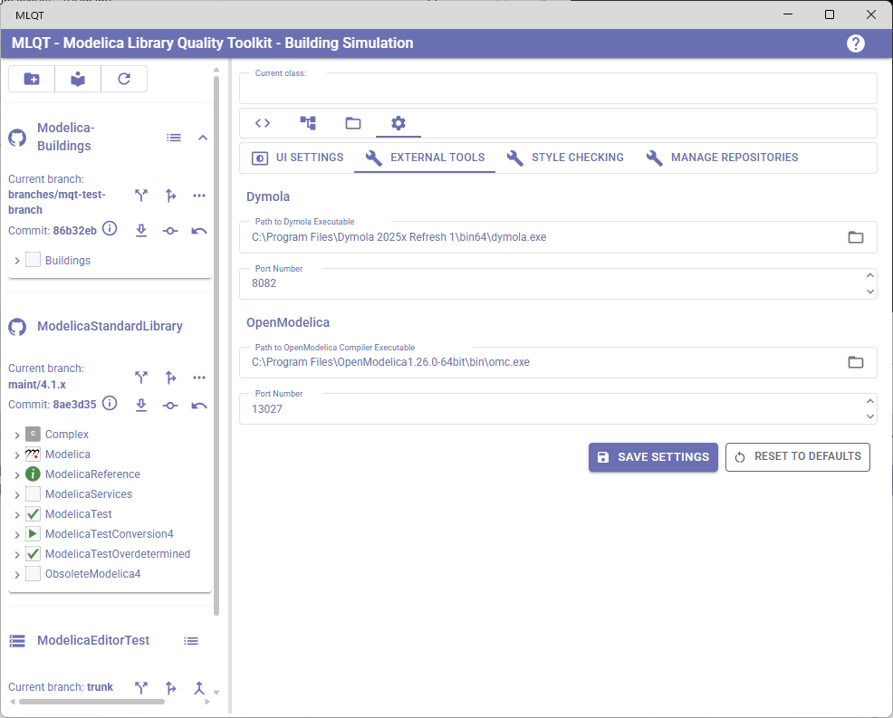
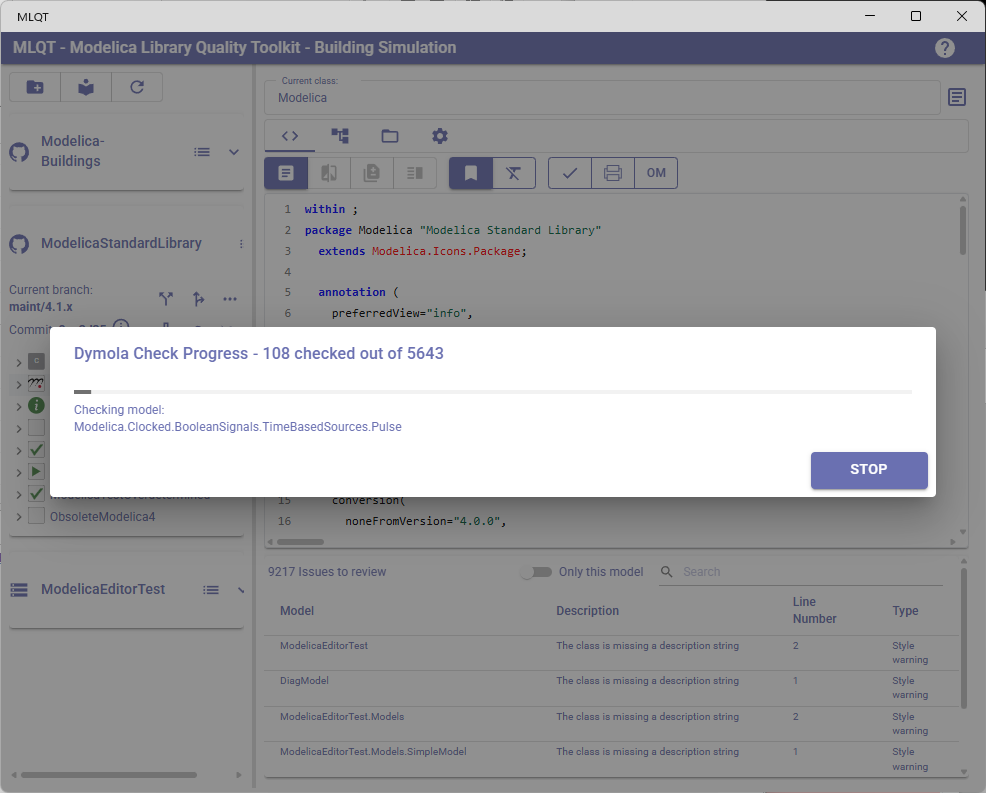

# External Tool Integration

MLQT can integrate with **Dymola** and **OpenModelica** to check your Modelica models for errors using these simulation tools' built-in model checking capabilities. This goes beyond MLQT's static analysis by actually loading models into the tools and verifying they are valid.

## Configuring External Tools

### Accessing Tool Settings

1. Click the **Settings** tab (gear icon) in the right panel
2. Select the **External Tools** sub-tab
3. Configure the tool paths and port numbers
4. Click **Save Settings**

### Auto-Detection

MLQT attempts to auto-detect installed tools on startup:
- **Dymola**: Scans `Program Files` for recent Dymola versions (2020 onwards), checking both standard and Refresh installations
- **OpenModelica**: Scans `Program Files` for recent OpenModelica versions, trying common installation paths

If auto-detection succeeds, the path is pre-filled. If your tool is installed in a non-standard location, you'll need to set the path manually.

## Dymola Configuration

| Field | Description |
|-------|-------------|
| **Path to Dymola Executable** | The full path to `dymola.exe`. Click the folder icon to browse — MLQT navigates to the selected folder and looks for `bin64/dymola.exe`. |
| **Port Number** | The port Dymola uses for its HTTP JSON-RPC interface. Default: `8082`. Change this if the default conflicts with another service. |

If the specified executable is not found, a warning message appears below the path field.

## OpenModelica Configuration

| Field | Description |
|-------|-------------|
| **Path to OpenModelica Compiler Executable** | The full path to `omc.exe`. Click the folder icon to browse — MLQT navigates to the selected folder and looks for `bin/omc.exe`. |
| **Port Number** | The port used for the ZeroMQ communication channel. Default: `13027`. |

## Using External Tool Checks

Once a tool is configured, its check button appears in the **Code Review** tab toolbar:
- **Dymola button** — A schematic rectangle icon
- **OpenModelica button** — An "OM" text icon

### Checking a Single Model

1. Select a model in the library tree
2. Click the Dymola or OpenModelica button in the Code Review toolbar
3. The tool loads the model and checks it
4. Any errors are added to the issues table

### Checking an Entire Package

1. Select a package node in the library tree
2. Click the Dymola or OpenModelica button
3. A **progress dialog** appears showing:
   - Total number of models to check
   - How many have been checked so far
   - The name of the model currently being checked
   - A progress bar
4. Click **Stop** to cancel the check at any time
5. Errors for each model are added to the issues table as they are found

### Understanding Check Results

Errors from external tools appear in the Code Review issues table with:
- **Model**: The fully qualified name of the model that failed
- **Description**: "Check Failed" or a summary of the error
- **Type**: "Error"
- **Details**: The full error message from the tool (visible by clicking the row)

These errors represent issues that a simulation tool found when trying to load the model — things like:
- Missing type references (a used model or connector doesn't exist)
- Incorrect number of equations (over/under-determined systems)
- Type mismatches in connections
- Invalid modifications or parameter bindings
- Syntax that the tool doesn't support

### Dymola vs OpenModelica Results

The two tools may report different errors for the same model because:
- They implement slightly different subsets of the Modelica specification
- Error messages have different formats and levels of detail
- Some Modelica features have tool-specific extensions

It can be valuable to check with both tools if you need your library to be compatible across simulation environments.

## Limitations

- External tool checking requires the tool to be installed on your machine
- The tool must be able to start and accept commands via its communication interface
- Large libraries may take significant time to check (the progress dialog helps track this)
- MLQT does not modify your models based on tool results — it only reports errors
- Only one tool check can run at a time
