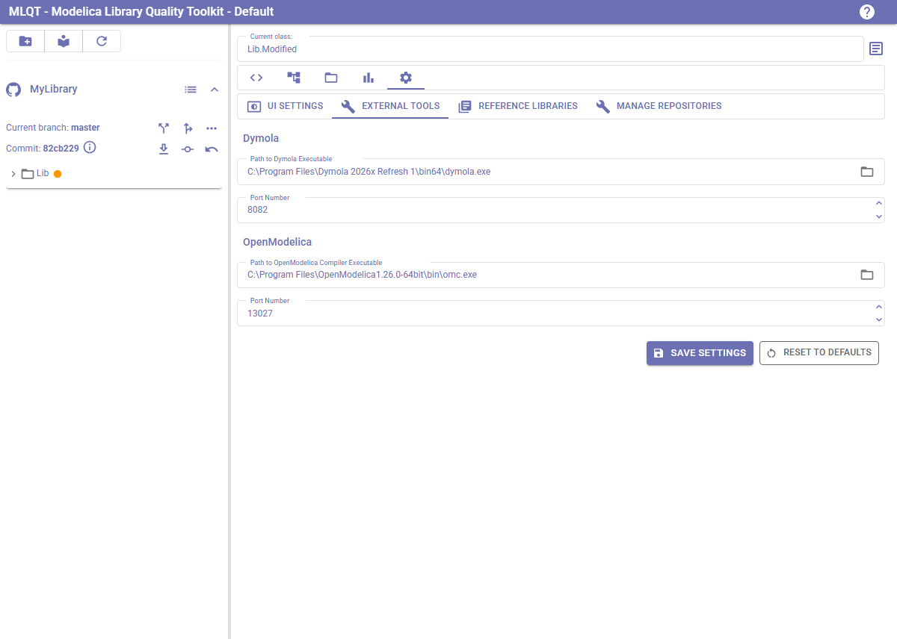

# External Tool Integration

MLQT can integrate with **Dymola** and **OpenModelica** to check your Modelica models for errors using these simulation tools' built-in model checking capabilities. This goes beyond MLQT's static analysis by actually loading models into the tools and verifying they are valid.

## Configuring External Tools

### Accessing Tool Settings

1. Click the **Settings** tab (gear icon) in the right panel
2. Select the **External Tools** sub-tab
3. Configure the tool paths and port numbers
4. Click **Save Settings**



### Auto-Detection

MLQT attempts to auto-detect installed tools on startup:
- **Dymola**: Scans `Program Files` for recent Dymola versions (2020 onwards), checking both standard and Refresh installations
- **OpenModelica**: Scans `Program Files` for recent OpenModelica versions, trying common installation paths

If auto-detection succeeds, the path is pre-filled. If your tool is installed in a non-standard location, you'll need to set the path manually.

## Dymola Configuration

| Field | Description |
|-------|-------------|
| **Path to Dymola Executable** | The full path to `dymola.exe`. Click the folder icon to browse — MLQT navigates to the selected folder and looks for `bin64/dymola.exe`. |
| **Port Number** | The port Dymola uses for its HTTP JSON-RPC interface. Default: `8082`. Change this if the default conflicts with another service. |

If the specified executable is not found, a warning message appears below the path field.

## OpenModelica Configuration

| Field | Description |
|-------|-------------|
| **Path to OpenModelica Compiler Executable** | The full path to `omc.exe`. Click the folder icon to browse — MLQT navigates to the selected folder and looks for `bin/omc.exe`. |
| **Port Number** | The port used for the ZeroMQ communication channel. Default: `13027`. |

## Using External Tool Checks

Once a tool is configured, its check button appears in the **Code Review** tab toolbar:
- **Dymola button** — A schematic rectangle icon
- **OpenModelica button** — An "OM" text icon

### Checking a Single Model

1. Select a model in the library tree
2. Click the Dymola or OpenModelica button in the Code Review toolbar
3. A **progress dialog** appears straight away, saying what is happening: starting the tool, then
   opening the library in it, then checking
4. The tool loads the model and checks it
5. Any errors are added to the findings table

The first two of those are most of the wait, and neither is quick on a large library. The dialog
opens on the click rather than when the first class is checked, because otherwise there is nothing
on screen during them — and OpenModelica has no window of its own to appear, so there would be
nothing anywhere to say the check was running.

### Checking an Entire Package

1. Select a package node in the library tree
2. Click the Dymola or OpenModelica button
3. A **progress dialog** appears showing:
   - Total number of models to check
   - How many have been checked so far
   - The name of the model currently being checked
   - A progress bar
4. Click **Stop** to cancel the check at any time
5. Errors for each model are added to the findings table as they are found


### Which file the tool is asked to open

MLQT opens the **library's own top-level `package.mo`** and then asks the tool about the class by
its full name. Checking `Modelica.Blocks.Continuous.Integrator` in a checkout of the Modelica
Standard Library therefore loads `MSL\Modelica\package.mo`, not
`MSL\Modelica\Blocks\Continuous\Integrator.mo`.

That is not an optimisation, it is what OpenModelica requires. A class stored in its own file is
only `Modelica.Blocks.Continuous.Integrator` because of the packages above it; handed that file on
its own, OpenModelica sees a class called `Integrator` with nothing to resolve its `within` clause
against, and refuses to load it. Dymola accepts the same file and finds the enclosing package
itself, which is why the same code worked for one tool and not the other. Both are now given the
same file, because two tools answering "which file do I open?" differently is how one of them
came to be broken while the other worked.

A library that is a single `.mo` file, or a class with no package above it, is its own answer.

### Understanding Check Results

**Every check reports what the tool said**, whether or not it found anything. When it finishes, a
dialog names the tool and says how it went:

```
Dymola checked 27 classes with no problems reported.
OpenModelica reported problems with 3 of 27 classes.
Dymola check stopped after 5 classes.
```

Where something failed, the dialog quotes the tool's own message for each class rather than
paraphrasing it — a summary saying "check failed" only sends you to the tool to find out why. Those
same failures are added to the findings table, so they are still there after the dialog is closed.

**A clean check can still have something to say.** Dymola's `checkModel` returns true for a model
that is fine and for one that is fine apart from six warnings, so MLQT reads the tool's log either
way and shows it when it is not empty. To keep that log attributable to the check you just ran,
MLQT **clears Dymola's log immediately before checking** — otherwise a model that checked cleanly
could be shown the error left behind by one checked before it. OpenModelica's `getErrorString`
empties itself as it is read, so the same is achieved there by reading and discarding first.

Before this, a check that passed produced nothing at all: no window, no dialog, no finding. The only
sign an OpenModelica check had run was that you had pressed the button, and the only sign for Dymola
was that Dymola's own window appeared — which made the answer depend on a vendor window MLQT does
not control.

Errors from external tools appear in the Code Review findings table with:
- **Model**: The fully qualified name of the model that failed
- **Description**: "Check Failed" or a summary of the error
- **Type**: "Error"
- **Details**: The full error message from the tool (visible by clicking the row)

These errors represent findings that a simulation tool found when trying to load the model — things like:
- Missing type references (a used model or connector doesn't exist)
- Incorrect number of equations (over/under-determined systems)
- Type mismatches in connections
- Invalid modifications or parameter bindings
- Syntax that the tool doesn't support

### Closing Dymola between checks

You can close Dymola's window and check again. MLQT asks whether the session it has is still
answering before reusing it, and starts a new one when it is not — so the second check works like
the first. The probe is a two-second ping rather than a command, so a dead session is noticed
quickly rather than after the command timeout.

### What happens to the tool when MLQT closes

**The OpenModelica session ends with MLQT.** `omc` runs headless — no window, no taskbar entry — so
one left behind would sit there indefinitely with nothing to say what it was or that it should be
closed. MLQT ends the session it started as it exits.

**Dymola is left running.** Its window is visible and you may well have carried on working in it,
so closing it from underneath you could lose work. If you no longer want it, close it yourself; MLQT
notices a session that has gone and starts a new one for the next check.

### Dymola vs OpenModelica Results

The two tools may report different errors for the same model because:
- They implement slightly different subsets of the Modelica specification
- Error messages have different formats and levels of detail
- Some Modelica features have tool-specific extensions

It can be valuable to check with both tools if you need your library to be compatible across simulation environments.

## Limitations

- External tool checking requires the tool to be installed on your machine
- The tool must be able to start and accept commands via its communication interface
- Large libraries may take significant time to check (the progress dialog helps track this)
- MLQT does not modify your models based on tool results — it only reports errors
- Only one tool check can run at a time
