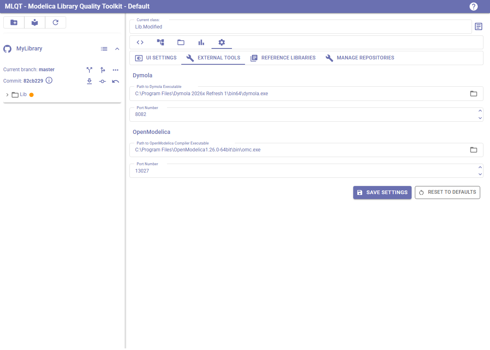
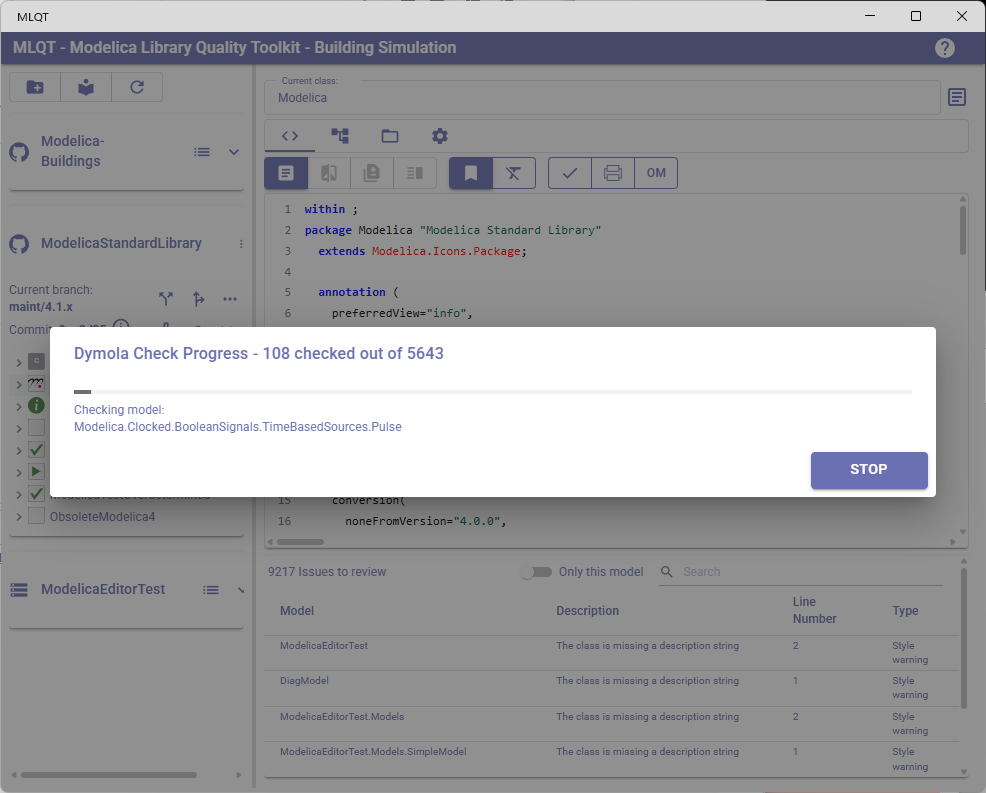

# External Tool Integration

MLQT can integrate with **Dymola** and **OpenModelica** to check your Modelica models for errors using these simulation tools' built-in model checking capabilities. This goes beyond MLQT's static analysis by actually loading models into the tools and verifying they are valid.

## Configuring External Tools

### Accessing Tool Settings

1. Click the **Settings** tab (gear icon) in the right panel
2. Select the **External Tools** sub-tab
3. Configure the tool paths and port numbers
4. Click **Save Settings**



### Auto-Detection

MLQT attempts to auto-detect installed tools on startup:
- **Dymola**: Looks in `Program Files` for `bin64\dymola.exe` under a folder named `Dymola {year}x Refresh 1`,
  `Dymola {year}x` or `Dymola {year}` — for example `Dymola 2026x Refresh 1`, `Dymola 2024x` or
  `Dymola 2023` — for every year from next year's back to 2021, and takes the newest it finds.
  Anything else (Dymola 2020 or earlier, a renamed folder, another drive) is set by hand, or found
  as `dymola.exe` in a folder on `PATH`, which is looked at after Program Files. On Linux, see
  [Dymola on Linux](#dymola-on-linux)
- **OpenModelica**: on Windows, looks in `Program Files` for the installer's versioned folders
  (`OpenModelica1.26.0-64bit\bin\omc.exe` and so on, newest first, back to 1.21), then for `omc.exe`
  in each folder on `PATH`. On Linux, looks for `/usr/bin/omc` (where OpenModelica's own apt
  repository installs it), `/usr/local/bin/omc` and `/opt/openmodelica/bin/omc`, then for `omc` in
  each folder on `PATH`

If auto-detection succeeds, the path is pre-filled. If your tool is installed in a non-standard location, you'll need to set the path manually.

For both tools, a **blank** path is looked for again every time the settings are loaded, so clearing
the field and restarting MLQT finds the installation again. The **Auto-detect** button beside each
path runs the same search on demand, whatever the field holds: it fills in the installation it finds,
or clears the field if it finds none.

## Dymola Configuration

| Field | Description |
|-------|-------------|
| **Path to Dymola Executable** | The full path to `dymola.exe` on Windows, or to `dymola` or its launcher on Linux. **Auto-detect**, beside the field, searches for it — see [Auto-Detection](#auto-detection). Click the folder icon to browse. On Windows, choose the installation folder and MLQT takes `bin64\dymola.exe` inside it, or `dymola.exe` directly if you chose the `bin64` folder itself. On Linux, choose the program or its launcher itself — the dialog opens in `/usr/local/bin`, where Dymola's launcher scripts go. |
| **Port Number** | The port Dymola uses for its HTTP JSON-RPC interface. Default: `8082`. Change this if the default conflicts with another service. |
| **Check time limit (seconds)** | How long one check, or opening the library, may take before MLQT stops waiting. Default: `300` (five minutes). `0` means no limit. |

If the specified executable is not found, a warning message appears below the path field.

### Dymola on Linux

Dassault's installation guide puts Dymola in `/opt/dymola-<version>-x86_64` (for example
`/opt/dymola-2025x-x86_64`), with the program at `bin64/dymola` inside it, and installs a launcher
script, `/usr/local/bin/dymola-<version>-x86_64`, that sets the environment Dymola needs to find its
libraries. Setup guides often add `/usr/local/bin/dymola` as a shorter name for it. MLQT looks for, in
order:

1. `/usr/local/bin/dymola`
2. the versioned launchers `/usr/local/bin/dymola-<version>-x86_64`, newest release first
3. `bin64/dymola` in each `/opt/dymola-<version>-x86_64`, newest release first
4. `dymola` in each folder on `PATH`

Launchers come first because the program started directly may not find its own libraries.

When MLQT ends a Dymola it started, it ends the launcher and everything the launcher started, so a
launcher that runs Dymola as a child rather than replacing itself with it does not leave Dymola
running. (MLQT closing is not one of those times: see
[What happens to the tool when MLQT closes](#what-happens-to-the-tool-when-mlqt-closes).) A launcher that starts Dymola in the background and exits at once is the exception: MLQT
cannot tell which program it left behind, so that Dymola stays open and has to be closed by hand.

A Dymola that MLQT starts on Linux **prints nothing to the terminal** MLQT was started from: its
console output is discarded, because Dymola stays open after MLQT closes and would otherwise be
writing to a terminal, or a pipe, that has gone. If you need that output, start Dymola yourself from a
terminal with `-serverport` and the port in these settings; MLQT uses a Dymola already answering on
that port rather than starting another.

**This search has not yet been tried against a real Linux installation of Dymola** — the locations
come from Dassault's installation guide and published setup guides rather than from a machine MLQT
has run on. If it finds nothing, or finds something that will not start, type or browse to the
launcher your installation uses.

## OpenModelica Configuration

| Field | Description |
|-------|-------------|
| **Path to OpenModelica Compiler Executable** | The full path to `omc.exe` on Windows, or `omc` on Linux. **Auto-detect**, beside the field, searches for it — see [Auto-Detection](#auto-detection). Click the folder icon to browse. On Windows, choose the installation folder and MLQT takes `bin\omc.exe` inside it, or `omc.exe` directly if you chose the `bin` folder itself. On Linux, choose `omc` itself — the dialog opens in `/usr/bin`, where OpenModelica's apt packages put it. |
| **Port Number** | The port OpenModelica listens on for MLQT's commands (ZeroMQ). Default: `0`, which lets OpenModelica choose any free port, so two MLQT sessions at once - the desktop app and the MCP server, say - never contend for one. Set a port only if a firewall rule needs a fixed one. |
| **Check time limit (seconds)** | How long one check, or opening the library, may take before MLQT stops waiting. Default: `60`. `0` means no limit. |

### OpenModelica on Linux

Install OpenModelica from its own apt repository (see
[openmodelica.org/download](https://openmodelica.org/download/)); that puts the compiler at
`/usr/bin/omc`, which MLQT finds by itself. For an installation somewhere else, either put its `bin`
folder on your `PATH` before starting MLQT, or type the path to `omc` into the field above — or browse
to `omc` itself (for example `/opt/openmodelica/bin/omc`).
Everything else — the port, the time limit, what a check reports — is the same as on Windows.

### When a check runs out of time

A large model can take longer to check than the limit allows. That is not the same as the model
being wrong, so MLQT does not report it as a failed check: the result says the tool **ran out of
time**, names the class, and points to **Check time limit** above. A check over a package stops at
the first class that runs out of time, because the tool is still busy with it (Dymola) or has been
restarted (OpenModelica), and every class after it would wait out the same limit.

The two tools are left in different states, and the result says which:

- **Dymola cannot be interrupted.** It carries on with the check and answers nothing else until it
  finishes, so a check started straight afterwards waits for it.
- **OpenModelica's session is closed**, because its connection cannot be reused once a reply has
  been given up on. The next check starts a fresh session, which takes a second or two.

**Stop** now ends a check that is already running, not only the ones still waiting their turn — and
a check that is still starting the tool, which for Dymola can take a minute. The
tools themselves are interrupted in the same way as above: Dymola finishes the check it was given,
and OpenModelica's session is closed.

## Using External Tool Checks

Once a tool is configured, its check button appears in the **Code Review** tab toolbar:
- **Dymola button** — A schematic rectangle icon
- **OpenModelica button** — An "OM" text icon

### Checking a Single Model

1. Select a model in the library tree
2. Click the Dymola or OpenModelica button in the Code Review toolbar
3. A **progress dialog** appears straight away, saying what is happening: starting the tool, then
   opening the library in it, then checking
4. The tool loads the model and checks it
5. Any errors are added to the findings table

The first two of those are most of the wait, and neither is quick on a large library. The dialog
opens on the click rather than when the first class is checked, because otherwise there is nothing
on screen during them — and OpenModelica has no window of its own to appear, so there would be
nothing anywhere to say the check was running.

### Checking an Entire Package

1. Select a package node in the library tree
2. Click the Dymola or OpenModelica button
3. A **progress dialog** appears showing:
   - Total number of models to check
   - How many have been checked so far
   - The name of the model currently being checked
   - A progress bar
4. Click **Stop** to cancel the check at any time
5. Errors for each model are added to the findings table as they are found



### Which file the tool is asked to open

MLQT opens the **library's own top-level `package.mo`** and then asks the tool about the class by
its full name. Checking `Modelica.Blocks.Continuous.Integrator` in a checkout of the Modelica
Standard Library therefore loads `MSL\Modelica\package.mo`, not
`MSL\Modelica\Blocks\Continuous\Integrator.mo`.

That is not an optimisation, it is what OpenModelica requires. A class stored in its own file is
only `Modelica.Blocks.Continuous.Integrator` because of the packages above it; handed that file on
its own, OpenModelica sees a class called `Integrator` with nothing to resolve its `within` clause
against, and refuses to load it. Dymola accepts the same file and finds the enclosing package
itself, which is why the same code worked for one tool and not the other. Both are now given the
same file, because two tools answering "which file do I open?" differently is how one of them
came to be broken while the other worked.

A library that is a single `.mo` file, or a class with no package above it, is its own answer.

### Understanding Check Results

**Every check reports what the tool said**, whether or not it found anything. When it finishes, a
dialog names the tool and says how it went:

```
Dymola checked 27 classes with no problems reported.
OpenModelica reported problems with 3 of 27 classes.
Dymola check stopped after 5 classes.
Dymola checked 12 classes, then ran out of time on MyLib.BigModel and stopped there.
OpenModelica was not available, so nothing was checked.
```

A run the tool cut short — a class that ran out of time, a tool that would not start, or one that
stopped answering partway through — says so in the headline and never reads as a clean pass. The
result underneath gives the reason: the time limit and where to raise it, or the tool's own error
for a start that failed (a wrong path, say).

Where something failed, the dialog quotes the tool's own message for each class rather than
paraphrasing it — a summary saying "check failed" only sends you to the tool to find out why. Those
same failures are added to the findings table, so they are still there after the dialog is closed.
Only a verdict on a model goes there: a class that ran out of time, or a tool that was not there to
ask, says nothing about your code, so it is reported in the dialog and not filed as an error against
the class.

**A clean check can still have something to say.** Dymola's `checkModel` returns true for a model
that is fine and for one that is fine apart from six warnings, so MLQT reads the tool's log either
way and shows it when it is not empty. To keep that log attributable to the check you just ran,
MLQT **clears Dymola's log immediately before checking** — otherwise a model that checked cleanly
could be shown the error left behind by one checked before it. OpenModelica's `getErrorString`
empties itself as it is read, so the same is achieved there by reading and discarding first.

Before this, a check that passed produced nothing at all: no window, no dialog, no finding. The only
sign an OpenModelica check had run was that you had pressed the button, and the only sign for Dymola
was that Dymola's own window appeared — which made the answer depend on a vendor window MLQT does
not control.

Errors from external tools appear in the Code Review findings table with:
- **Model**: The fully qualified name of the model that failed
- **Description**: "<Tool> Check Failed" (for example "Dymola Check Failed"), "Failed to load library", or a summary of the error
- **Type**: "Error"
- **Details**: The full error message from the tool (visible by clicking the row)

These errors represent findings that a simulation tool found when trying to load the model — things like:
- Missing type references (a used model or connector doesn't exist)
- Incorrect number of equations (over/under-determined systems)
- Type mismatches in connections
- Invalid modifications or parameter bindings
- Syntax that the tool doesn't support

### Closing Dymola between checks

You can close Dymola's window and check again. MLQT asks whether the session it has is still
answering before reusing it, and starts a new one when it is not — so the second check works like
the first. The probe is a two-second ping rather than a command, so a dead session is noticed
quickly rather than after the command timeout.

If the tool goes away **during** a check — Dymola's window closed, or `omc` exits — the run ends at
the class it was checking, and the result says the tool stopped answering and that the classes after
it were not checked. None of it is filed as a finding against your models, and the next check starts
a new session.

A Dymola that is **busy** is not mistaken for one that has gone. Dymola answers nothing while it
works on a command, so after a check that ran out of time or was stopped it looks silent to a ping;
MLQT tells the two apart by whether Dymola still accepts the connection. A busy Dymola is waited
for, never closed and never joined by a second one on the same port — the next check's commands
queue behind the one Dymola is finishing, and if that still takes longer than the time limit the
result says Dymola ran out of time again rather than blaming the model.

**Do not work in the Dymola MLQT is checking with while a check runs.** That wait covers only work
MLQT itself gave Dymola. A command you start in Dymola's own window - a check, a translation, a
simulation - leaves its server answering, so MLQT cannot see that Dymola is busy and sends its
request; Dymola then interrupts your command to run MLQT's and **closes as soon as that check
finishes**, losing whatever else was open. This is Dymola's behaviour, the same whether its server
was started with `-serverport` or with `startHttpServer`, and nothing MLQT can observe over the
connection tells it apart from an idle Dymola. Let your own command finish before checking from
MLQT, or give MLQT a Dymola of its own on another port (the port is set on the External Tools tab).

### What happens to the tool when MLQT closes

The two tools are treated differently on purpose, and the same way on Windows and Linux.

**The OpenModelica session ends with MLQT.** `omc` runs headless — no window, no taskbar entry — so
one left behind would sit there indefinitely with nothing to say what it was or that it should be
closed. MLQT ends the session it started as it exits: it asks `omc` to quit, and if `omc` is too busy
to answer — in the middle of a check, a compilation or a simulation — it ends `omc` together with
everything `omc` started. It does this however MLQT exits: the window closed, the process ended by
the system (logging out, `kill`), Ctrl+C or the terminal closing when MLQT was started from one, and
an unexpected error that takes MLQT down. The one exception is MLQT being killed outright (Task
Manager's **End task**, `kill -9`), where nothing in MLQT gets to run; end the `omc` process
yourself then.

**Dymola is left running.** Its window is visible and you may well have carried on working in it,
so closing it from underneath you could lose work. That includes a Dymola MLQT started for a check:
MLQT lets go of it and leaves it open. If you no longer want it, close it yourself; the next time
MLQT runs it attaches to a Dymola still answering on the configured port, or starts a new one when
there is none.

### Dymola vs OpenModelica Results

The two tools may report different errors for the same model because:
- They implement slightly different subsets of the Modelica specification
- Error messages have different formats and levels of detail
- Some Modelica features have tool-specific extensions

It can be valuable to check with both tools if you need your library to be compatible across simulation environments.

## Limitations

- External tool checking requires the tool to be installed on your machine
- The tool must be able to start and accept commands via its communication interface
- Large libraries may take significant time to check (the progress dialog helps track this)
- MLQT does not modify your models based on tool results — it only reports errors
- Only one tool check can run at a time. Both check buttons are disabled while one is running,
  including a check you have stopped that is still winding down (Dymola finishing the class it was
  given, for instance)
