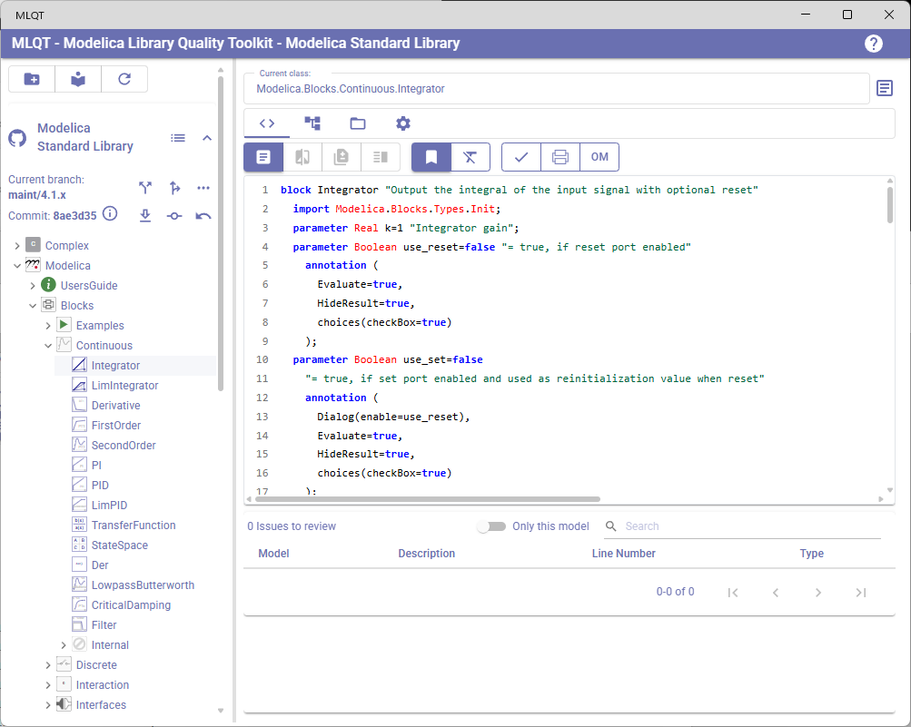
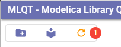
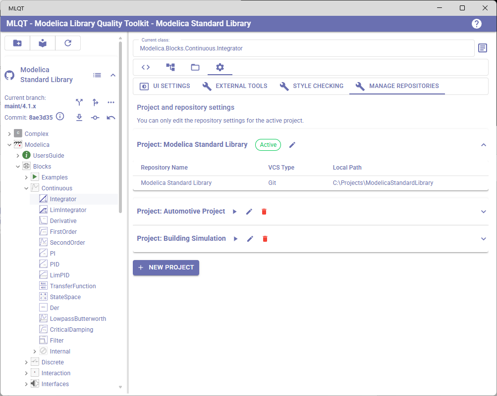
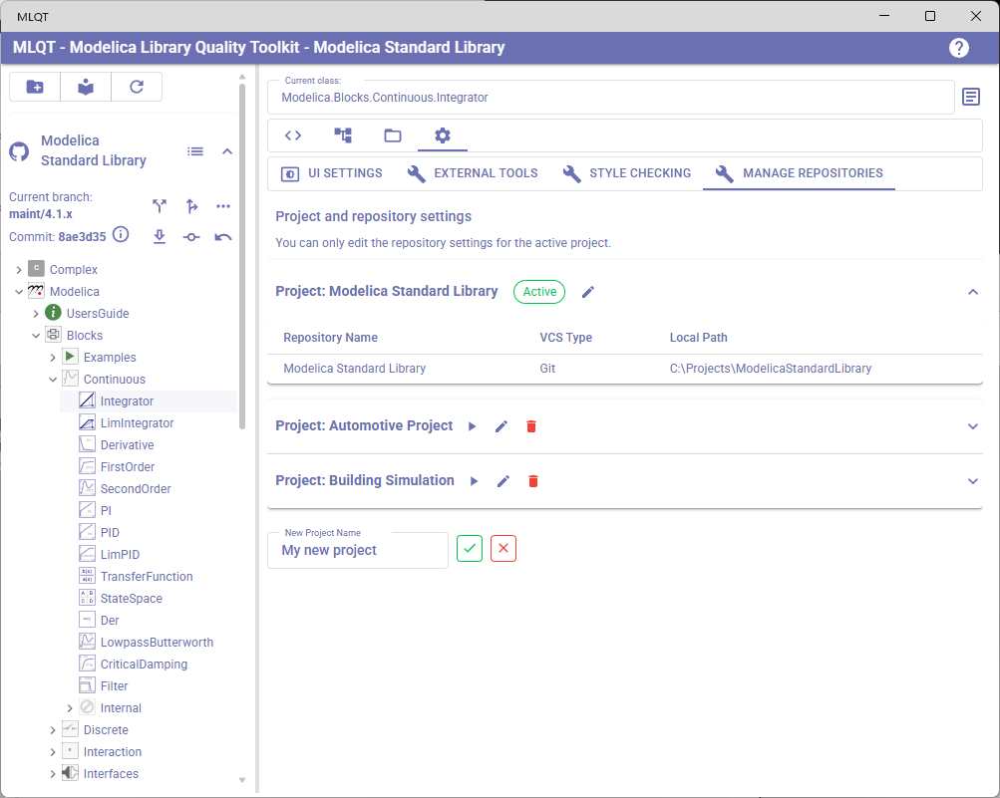
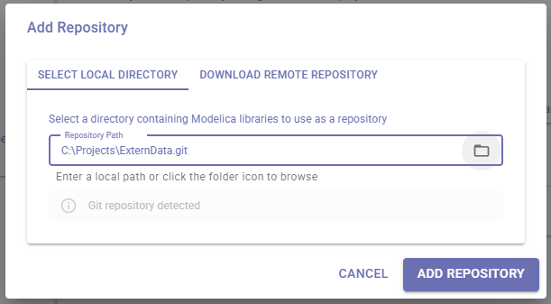
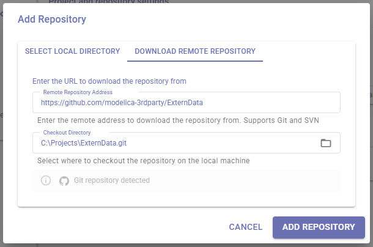
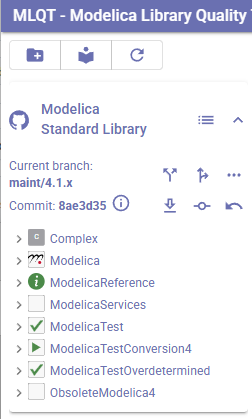
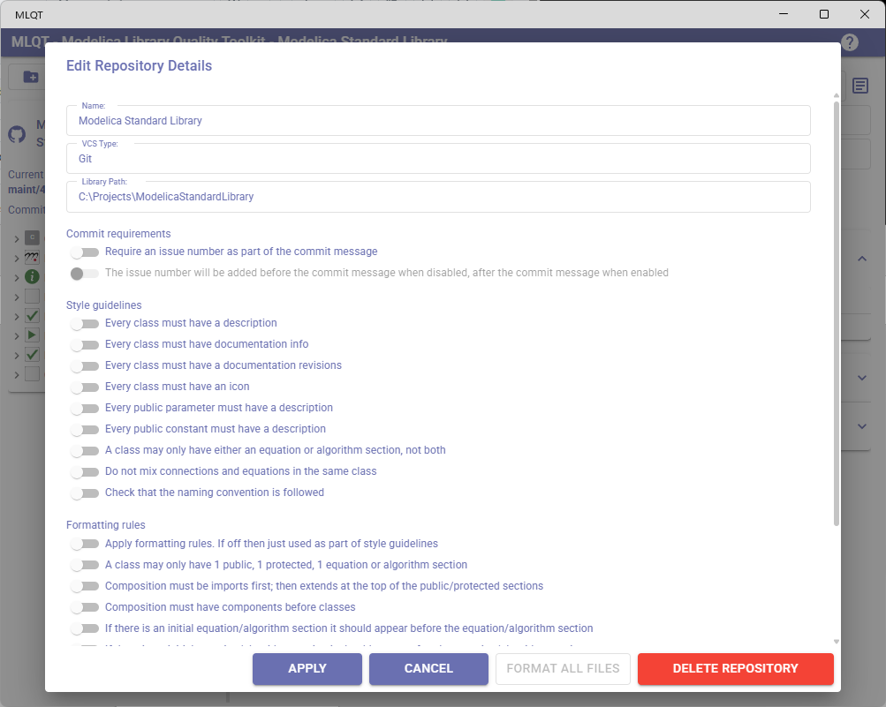
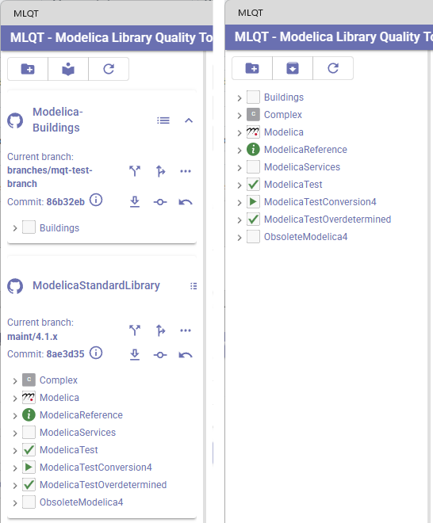

# Getting Started with MLQT

This guide walks you through setting up your first project in MLQT (Modelica Library Quality Toolkit), adding repositories, and configuring settings to match your team's workflow.

## What is MLQT?

MLQT is a desktop application for managing Modelica libraries under revision control. It supports both Git and SVN repositories, and provides tools for:

- Browsing and navigating Modelica libraries
- Reviewing code changes and committing them to revision control
- Analyzing dependencies and impact of changes
- Applying formatting rules and checking code against style guidelines
- Spell checking descriptions and documentation
- Managing external resources referenced by models

## Prerequisites

### Required

| Requirement | Details |
|-------------|---------|
| **.NET 10 Runtime** | MLQT is built on .NET 10. The runtime is bundled with the installer on Windows. |
| **Windows 10/11** | MLQT currently targets Windows via .NET MAUI. macOS and Linux support is planned. |

### Required for Git Repositories

| Requirement | Details |
|-------------|---------|
| **Git** | MLQT uses LibGit2Sharp for local operations (commit, branch, history) but shells out to `git.exe` for remote operations (fetch, push, rebase) to leverage your configured credential helpers (Git Credential Manager, SSH keys, etc.). Install Git from [git-scm.com](https://git-scm.com/) and ensure it is on your PATH. |

SVN repositories do **not** require any external tools — MLQT uses SharpSvn, a fully managed SVN client library.

### Optional External Tools

| Tool | Purpose |
|------|---------|
| **Dymola** | Model checking via Dymola's simulation engine. Configure the installation path in Settings > External Tools. Requires a valid Dymola license. |
| **OpenModelica** | Model checking via the OpenModelica compiler. Configure the installation path in Settings > External Tools. Free and open-source. |

These tools are only needed if you want to use the **Check Model** feature, which sends models to Dymola or OpenModelica for compilation and reports any errors. All other MLQT features work without them.

## Application Layout

When you first launch MLQT, you will see the main application window divided into two panels:

- **Left panel** — The library/repository browser showing your loaded Modelica libraries
- **Right panel** — A tabbed area with views for Code Review, Dependencies, External Resources, and Settings

The **app bar** at the top shows the application name and the currently active project name.

### Left Panel Toolbar

At the top of the left panel you will find three buttons:

| Button | Description |
|--------|-------------|
| **Add Repository** (folder+ icon) | Opens the dialog to add a new repository to the current project |
| **Library/Repository view** (toggle) | Switches between viewing libraries grouped by repository, or as a flat combined library list |
| **Refresh** (refresh icon) | Reloads libraries to pick up any file changes detected by the file monitor. A badge shows the count of pending changes |

## Step 1: Create a Project

MLQT organizes your work into **projects**. A project is a named collection of repositories that you want to work with together. For example, you might have one project for a product development library set and another for a research library set.

When MLQT starts for the first time, it creates a default project automatically called "Default". You can rename this or create additional projects later in the settings.

To manage projects, navigate to **Settings > Manage Repositories** (the last tab in the Settings panel on the right side). To load a project, click on the "play" icon button.  You can also edit the project name or delete the project.

### Creating a New Project

1. Navigate to **Settings > Manage Repositories**
2. Click the **New Project** button at the bottom of the panel
3. Enter a name for your project in the text field that appears
4. Click the **checkmark** button to confirm, or the **X** button to cancel

The new project is created and automatically becomes the active project. You can now add repositories to it.

### Switching Between Projects

Each project is shown as an expansion panel. The active project has a green **Active** chip beside its name. To switch to a different project:

1. Click the **play** button beside the project name you want to activate
2. MLQT will save the current project state and load all repositories from the selected project

### Renaming and Deleting Projects

- Click the **pencil** icon beside any project name to rename it inline
- Click the **delete** icon beside an inactive project to delete it (you cannot delete the active project or the last remaining project)

## Step 2: Add a Repository

Click the **Add Repository** button (folder+ icon) in the left panel toolbar. This opens the Add Repository dialog.

The dialog offers two ways to add a repository:

### Option A: Select a Local Directory

Use this when you already have a repository checked out on your machine.

1. Select the **Select Local Directory** tab
2. Enter the path to your repository, or click the **folder icon** to browse
3. MLQT automatically detects whether the directory is a Git repository, SVN working copy, or a plain local directory
4. Click **Add Repository**

### Option B: Download a Remote Repository

Use this to clone a Git repository or check out an SVN repository from a remote server.

1. Select the **Download Remote Repository** tab
2. Enter the remote URL (supports Git and SVN URLs)
3. Select or enter a local directory where the repository should be checked out
4. MLQT detects the VCS type from the URL
5. Click **Add Repository**

### What Happens When You Add a Repository

When you add a repository, MLQT:

1. Validates the path or URL
2. For remote repositories, clones or checks out the repository to the specified local directory
3. Scans the directory for Modelica libraries (by finding `package.mo` files)
4. Loads all discovered libraries into the library browser
5. Parses all Modelica files and builds the dependency graph
6. If "Apply formatting rules" is enabled, formats any files that VCS reports as modified or untracked (MLQT assumes committed files are already correctly formatted)
7. Depending on the repository size it might starts the dependency analysis and style checking.  For large repositories the user is asked whether they want to do this now as it can take several minutes.
8. Reads any existing repository settings from the `.mlqt/settings.json` file (see [Settings Storage](#where-settings-are-stored))

After loading, the left panel switches to **Repository view** and shows the newly added repository with its libraries expanded as a tree.

## Step 3: Configure Repository Settings

Each repository has its own set of settings that control commit requirements, style checking rules, formatting behavior, and spell checking. To edit these settings:

1. Navigate to **Settings > Manage Repositories**
2. Click on a repository row in the active project's table
3. The **Edit Repository Details** dialog opens

The dialog has the following fields and sections:

### Repository Details

| Field | Description |
|-------|-------------|
| **Name** | A display name for the repository (editable) |
| **VCS Type** | The detected version control type — Git, SVN, or Local (read-only) |
| **Local Path** | The local directory path where the repository is located (editable) |

### Settings Sections

The repository settings are organized into four categories. Each setting is a toggle switch that can be turned on or off. See the [Settings Reference](settings-reference.md) for a detailed explanation of every setting.

When you are done making changes, click **Apply** to save them, or **Cancel** to discard changes. Click **Format All Files** to immediately reformat every Modelica file in the repository — this is the recommended way to do an initial formatting pass when first enabling formatting rules (a progress dialog is shown as this can take several minutes for large repositories). Click **Delete Repository** to remove the repository from the project, it is not removed from the file system.

## Step 4: Explore Your Libraries

With repositories loaded, you can explore your Modelica libraries using the tree view in the left panel. Click on any model to view its code, issues, and dependencies in the right panel tabs:

- **Code Review** — Shows the Modelica source code with syntax highlighting and any style checking issues
- **Dependencies** — Shows an interactive dependency graph for the selected model
- **External Resources** — Shows files and directories referenced by models (data files, C libraries, images, etc.)
- **Settings** — Application and repository settings

### Repository View vs Library View

Use the toggle button in the left panel toolbar to switch between:

- **Repository view** — Libraries grouped under their parent repository, with VCS operations available on each repository
- **Library view** — All libraries from all repositories shown as a single flat list, focused on the Modelica package structure

## Documentation Guide

### Using the Application
- [Library Browser & Navigation](library-browser.md) — How the tree view works, VCS status indicators, repository vs library view
- [Code Review](code-review.md) — Inspecting code, reviewing issues, comparing changes with diff view
- [Spell Checking](spell-checking.md) — Language dictionaries, custom words, and reviewing spelling issues
- [Dependency Analysis](dependency-analysis.md) — Assessing the impact of changes across your libraries
- [External Resources](external-resources.md) — Auditing data files, C libraries, and other non-Modelica dependencies
- [File Monitoring & Refresh](file-monitoring.md) — How MLQT detects external file changes and when to refresh

### Version Control
- [Git Operations](git-operations.md) — Committing, branching, merging, rebasing, pushing, pull requests, and history browsing with Git
- [SVN Operations](svn-operations.md) — Committing, branching, merging, updating, and history browsing with SVN

### Configuration
- [Settings Reference](settings-reference.md) — All settings explained, formatting rules implications, and where settings are stored
- [UI Customization](ui-customization.md) — Themes, custom colors, and syntax highlighting
- [External Tool Integration](external-tools.md) — Configuring Dymola and OpenModelica for model checking

### Reference
- [Modelica Concepts](modelica-concepts.md) — Brief primer on Modelica language concepts relevant to MLQT
- [Troubleshooting & FAQ](troubleshooting.md) — Common issues, solutions, and frequently asked questions
