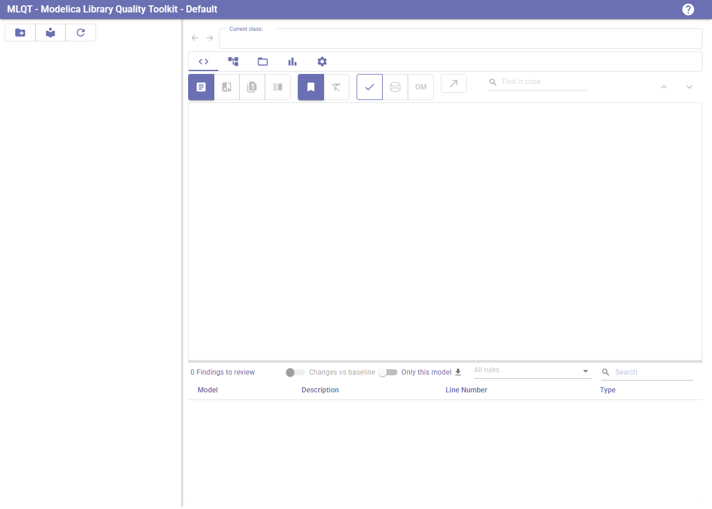
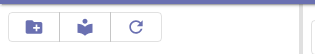
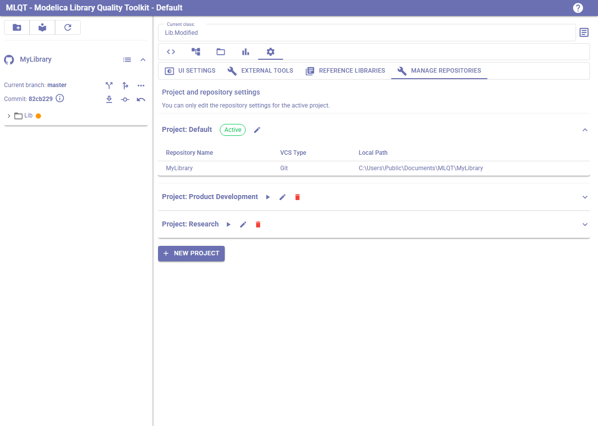
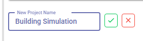
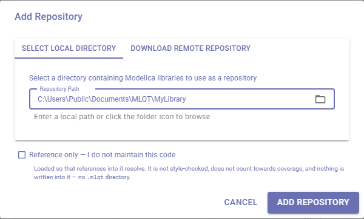
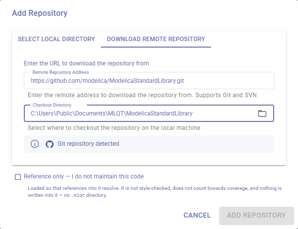
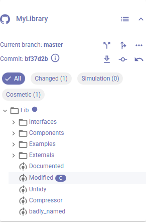
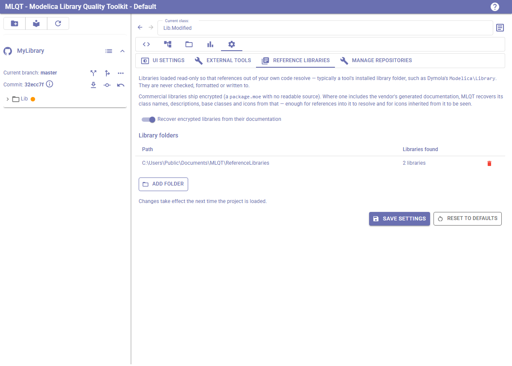
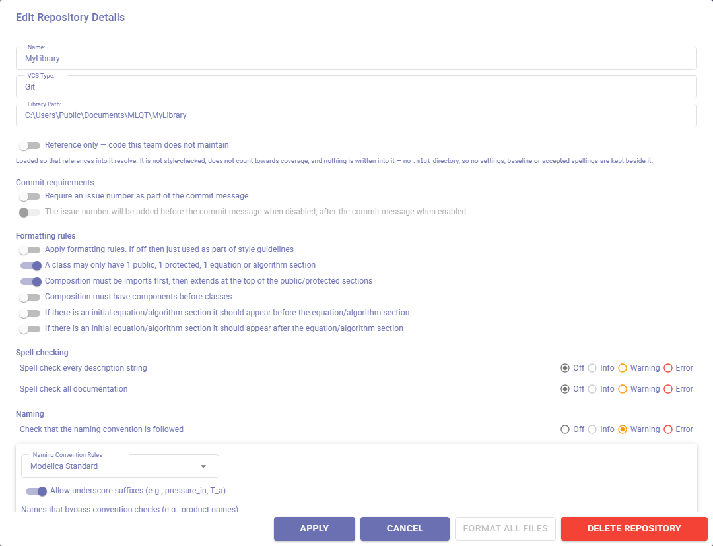

# Getting Started with MLQT

This guide walks you through setting up your first project in MLQT (Modelica Library Quality Toolkit), adding repositories, and configuring settings to match your team's workflow.

## What is MLQT?

MLQT is a desktop application for managing Modelica libraries under revision control. It supports both Git and SVN repositories, and provides tools for:

- Browsing and navigating Modelica libraries
- Reviewing code changes and committing them to revision control
- Analyzing dependencies and impact of changes
- Applying formatting rules and checking code against style guidelines
- Spell checking descriptions and documentation
- Managing external resources referenced by models

## Prerequisites

### Required

| Requirement | Details |
|-------------|---------|
| **Windows 10/11**, or **Ubuntu 22.04 / Debian 12** or newer | x86-64 in both cases. The Linux build needs WebKitGTK 4.1, which is why Ubuntu 20.04 or older aren't supported. |
| **.NET 10 Runtime** | Nothing to install. The Windows installer fetches it if it is absent; the Linux `.deb` bundles it. |

See [installation.md](installation.md) for both installers, what they put where, and how to remove them.

### Required for Git Repositories

| Requirement | Details |
|-------------|---------|
| **Git** | MLQT uses LibGit2Sharp for local operations (commit, branch, history) but shells out to the `git` command for remote operations (fetch, push, rebase) to leverage your configured credential helpers (Git Credential Manager, SSH keys, etc.). On Windows, install Git from [git-scm.com](https://git-scm.com/) and ensure it is on your PATH; on Linux the `.deb` recommends it, so apt installs it with MLQT. |

### Required for SVN Repositories

MLQT performs all SVN operations through the `svn` command-line client, and where it comes from
differs by platform:

| | |
|---|---|
| **Windows** | **Bundled.** Nothing to install — everything needed is in the MLQT download. |
| **Linux** | From your `PATH`. The `.deb` recommends `subversion`, so apt installs it with MLQT unless you decline; `sudo apt install subversion` if you did. |

### Optional External Tools

| Tool | Purpose |
|------|---------|
| **Dymola** | Model checking via Dymola's simulation engine. Configure the installation path in Settings > External Tools. Requires a valid Dymola license. |
| **OpenModelica** | Model checking via the OpenModelica compiler. Configure the installation path in Settings > External Tools. Free and open-source. |

These tools are only needed if you want to use the **Check Model** feature, which sends models to Dymola or OpenModelica for checking and reports any errors. All other MLQT features work without them.

## Application Layout

When you first launch MLQT, you will see the main application window divided into two panels:

- **Left panel** — The library/repository browser showing your loaded Modelica libraries
- **Right panel** — A tabbed area with views for Code Review, Dependencies, External Resources, Metrics and Settings

The **app bar** at the top shows the application name and the currently active project name (Default in this case).

### Left Panel Toolbar

At the top of the left panel you will find three buttons:

| Button | Description |
|--------|-------------|
| **Add Repository** (folder+ icon) | Opens the dialog to add a new repository to the current project |
| **Library/Repository view** (toggle) | Switches between viewing libraries grouped by repository, or as a flat combined library list |
| **Refresh** (refresh icon) | Reloads libraries to pick up any file changes detected by the file monitor. A badge shows the count of pending changes |

## Step 1: Create a Project

MLQT organizes your work into **projects**. A project is a named collection of repositories that you want to work with together. For example, you might have one project for a product development library set and another for a research library set.

When MLQT starts for the first time, it creates a default project automatically called "Default". You can rename this or create additional projects later in the settings.

To manage projects, navigate to **Settings > Manage Repositories** (the last tab in the Settings panel on the right side). To load a project, click on the "play" icon button.  You can also edit the project name or delete the project.

### Creating a New Project

1. Navigate to **Settings > Manage Repositories**
2. Click the **New Project** button at the bottom of the panel
3. Enter a name for your project in the text field that appears
4. Click the **checkmark** button to confirm, or the **X** button to cancel

Project names have to be different from one another, so that a list of projects can be read. A name another project already has is refused as you type, with the checkmark unavailable until you change it — the comparison ignores capitalisation and surrounding spaces, since "Work" and "work " are not two projects anyone could tell apart. The same applies when renaming a project, and when naming one from the project selector MLQT shows at startup.

The new project is created and automatically becomes the active project. You can now add repositories to it.

### Switching Between Projects

Each project is shown as an expansion panel. The active project has a green **Active** chip beside its name. To switch to a different project:

1. Click the **play** button beside the project name you want to activate
2. MLQT will save the current project state and load all repositories from the selected project

### Renaming and Deleting Projects

- Click the **pencil** icon beside any project name to rename it inline
- Click the **delete** icon beside an inactive project to delete it (you cannot delete the active project or the last remaining project)

## Step 2: Add a Repository

Click the **Add Repository** button (folder+ icon) in the left panel toolbar. This opens the Add Repository dialog.

The dialog offers two ways to add a repository:

### Option A: Select a Local Directory

Use this when you already have a repository checked out on your machine.

1. Select the **Select Local Directory** tab
2. Enter the path to your repository, or click the **folder icon** to browse
3. MLQT automatically detects whether the directory is a Git repository, SVN working copy, or a plain local directory
4. Click **Add Repository**

### Option B: Download a Remote Repository

Use this to clone a Git repository or check out an SVN repository from a remote server.

1. Select the **Download Remote Repository** tab
2. Enter the remote URL (supports Git and SVN URLs)
3. Select or enter a local directory where the repository should be checked out
4. MLQT detects the VCS type from the URL
5. Click **Add Repository**

### Reference Only

Beneath the two tabs is a single **Reference only — I do not maintain this code** checkbox, so it applies whichever way you added the repository. Tick it for a repository that holds code you depend on but do not maintain — another team's library, or a vendor's.

MLQT then loads the repository so that references into it resolve, and leaves it alone otherwise:

- it is not style-checked, so no findings are raised against code you cannot change;
- its classes do not count towards coverage, so someone else's descriptions and icons do not move your percentages;
- it is not formatted;
- nothing is written into it — no `.mlqt` directory, and so no settings, baseline or accepted spellings kept beside it.

The version control actions go too. In the library browser the repository carries a **Reference only** chip with a padlock where the branch, update and commit buttons would be, so there is no way to change it by accident.

If you choose a folder MLQT cannot write into, the toggle is ticked for you — such a folder could never hold those files anyway. It is only ever a suggestion, and you can untick it. Ticking it for a repository you *can* write to is the point of the setting: another team's Git repository that you have read access to is exactly the case.

The choice is not permanent. Untick **Reference only** in **Settings > Manage Repositories** when you need to start working in the repository.

### What Happens When You Add a Repository

When you add a repository, MLQT:

1. Validates the path or URL
2. For remote repositories, clones or checks out the repository to the specified local directory
3. Scans the directory for Modelica libraries (by finding `package.mo` files)
4. Loads all discovered libraries into the library browser
5. Parses all Modelica files and builds the dependency graph
6. Reads any existing repository settings from the `.mlqt/settings.json` file (see [Where Settings Are Stored](settings-reference.md#where-settings-are-stored))
7. If "Apply formatting rules" is enabled, formats any files that VCS reports as modified or untracked (MLQT assumes committed files are already correctly formatted)
8. Depending on the repository size it might start the dependency analysis and style checking.  For large repositories the user is asked whether they want to do this now as it can take several minutes.

After loading, the left panel switches to **Repository view** and shows the newly added repository with its libraries expanded as a tree.

## Step 3: Set Up Reference Libraries

A reference-only repository covers code you depend on in *this* project. The **Reference Libraries** tab covers the libraries that sit behind everything you do — most often the library folder your Modelica tool installed, such as Dymola's `Modelica\Library`.

Without them, a reference into a library you have not loaded is reported as broken, and an icon inherited from one is reported as missing, so the findings list fills up with problems that are not in your code.

1. Navigate to **Settings > Reference Libraries**
2. Add the folders to scan. Each may hold a single library or many; MLQT finds every library beneath
3. Click **Save Settings**

The table shows how many libraries each folder contributes and how many of them are encrypted, so a mistyped or moved path shows up immediately rather than later as unresolved references. Changes take effect the next time the project is loaded.

Reference libraries are never checked, formatted, committed or written to. They appear in the library browser for reading only.

Commercial libraries that ship encrypted (`package.moe`) are handled here too: **Recover encrypted libraries from their documentation** is on by default, and reconstructs their classes from the vendor's shipped HTML so that references into them resolve. See [encrypted-libraries.md](encrypted-libraries.md).

Both settings on this tab are described in full in [settings-reference.md](settings-reference.md#reference-libraries).

### Which one should I use?

Both make a library readable without letting it into your quality figures — nothing in either is checked, measured, formatted or written to. The difference is how far the choice reaches.

| | **Settings > Reference Libraries** | **A repository marked Reference only** |
|---|---|---|
| **Applies to** | Every project on this machine | Only the project you add it to |
| **Use it for** | Libraries behind all of your work — the Modelica Standard Library, and whatever else your Modelica tool installs | A library that matters to one piece of work — another team's repository that this product depends on, or a vendor library used by a single customer project |
| **What you add** | A folder to scan | A repository, the same way as any other: a local directory, or cloned or checked out from a remote |
| **Stored in** | Application settings on this machine | The project |

As a rule: if you would want the library loaded whichever project you opened, put it in **Reference Libraries** and forget about it. If it belongs to one line of work, add it to that project and tick **Reference only**.

Reference library paths are deliberately machine-level rather than committed alongside a repository, because an install location is a property of your machine — a colleague's checkout or a CI runner will not share it. In CI, pass the equivalent with the `mlqt` CLI's `--dependency` option instead (see [cli.md](cli.md)).

## Step 4: Configure Repository Settings

Each repository has its own set of settings that control commit requirements, style checking rules, formatting behavior, and spell checking. To edit these settings:

1. Navigate to **Settings > Manage Repositories**
2. Click on a repository row in the active project's table
3. The **Edit Repository Details** dialog opens

The dialog has the following fields and sections:

### Repository Details

| Field | Description |
|-------|-------------|
| **Name** | A display name for the repository (editable) |
| **VCS Type** | The detected version control type — Git, SVN, or Local (read-only) |
| **Library Path** | The local directory path where the library is located (editable) |

### Settings Sections

The repository settings are organized into these sections: **Commit requirements**, **Formatting rules**, **Spell checking**, **Naming**, **Style guidelines**, **Reference validation**, **Static analysis**, **Excluded libraries**, and — for SVN repositories only — **SVN branch directories**. The commit requirements and formatting rules are switches that are turned on or off; each checking rule instead takes a severity of **Off**, **Info**, **Warning** or **Error**. See the [Settings Reference](settings-reference.md) for a detailed explanation of every setting.

When you are done making changes, click **Apply** to save them, or **Cancel** to discard changes. Click **Format All Files** to immediately reformat every Modelica file in the repository — this is the recommended way to do an initial formatting pass when first enabling formatting rules (a progress dialog is shown as this can take several minutes for large repositories). Click **Delete Repository** to remove the repository from the project, it is not removed from the file system.

## Step 5: Explore Your Libraries

With repositories loaded, you can explore your Modelica libraries using the tree view in the left panel. Click on any model to view its code, findings, and dependencies in the right panel tabs:

- **Code Review** — Shows the Modelica source code with syntax highlighting and any style checking findings
- **Dependencies** — Shows an interactive dependency graph for the selected model
- **External Resources** — Shows files and directories referenced by models (data files, C libraries, images, etc.)
- **Metrics** — Shows how much of the library is in the state you want, as a coverage percentage per quality dimension, and how those numbers are moving over time
- **Settings** — Application and repository settings

### Repository View vs Library View

Use the toggle button in the left panel toolbar to switch between:

- **Repository view** — Libraries grouped under their parent repository, with VCS operations available on each repository
- **Library view** — All libraries from all repositories shown as a single flat list, focused on the Modelica package structure

## Documentation Guide

### Using the Application
- [Library Browser & Navigation](library-browser.md) — How the tree view works, VCS status indicators, repository vs library view
- [Code Review](code-review.md) — Inspecting code, reviewing findings, comparing changes with diff view
- [Spell Checking](spell-checking.md) — Language dictionaries, custom words, and reviewing spelling findings
- [Code Formatting](code-formatting.md) — The formatting rules, when they run, how they interact with version control, and how to exclude a model
- [Dependency Analysis](dependency-analysis.md) — Assessing the impact of changes across your libraries
- [External Resources](external-resources.md) — Auditing data files, C libraries, and other non-Modelica dependencies
- [Metrics & Coverage](metrics-dashboard.md) — Coverage per quality dimension, comparing sub-libraries, and the trend that builds from your commits
- [File Monitoring & Refresh](file-monitoring.md) — How MLQT detects external file changes and when to refresh

### Version Control
- [Git Operations](git-operations.md) — Committing, branching, merging, rebasing, pushing, pull requests, and history browsing with Git
- [SVN Operations](svn-operations.md) — Committing, branching, merging, updating, and history browsing with SVN

### Configuration
- [Settings Reference](settings-reference.md) — All settings explained, formatting rules implications, and where settings are stored
- [UI Customization](ui-customization.md) — Themes, custom colors, and syntax highlighting
- [External Tool Integration](external-tools.md) — Configuring Dymola and OpenModelica for model checking

### Automation
- [CLI Reference](cli.md) — The headless `mlqt` command: checking a library, baselines, comparing two copies, and the pre-commit hook
- [CI Quality Gate](ci-quality-gate.md) — A worked example of putting the checks on your build server and gating on new findings
- [MCP Server (AI Agent Access)](mcp-server.md) — Let an AI agent read, author, check and format Modelica code through MLQT's Model Context Protocol server

### Reference
- [Modelica Concepts](modelica-concepts.md) — Brief primer on Modelica language concepts relevant to MLQT
- [Troubleshooting & FAQ](troubleshooting.md) — Common findings, solutions, and frequently asked questions
