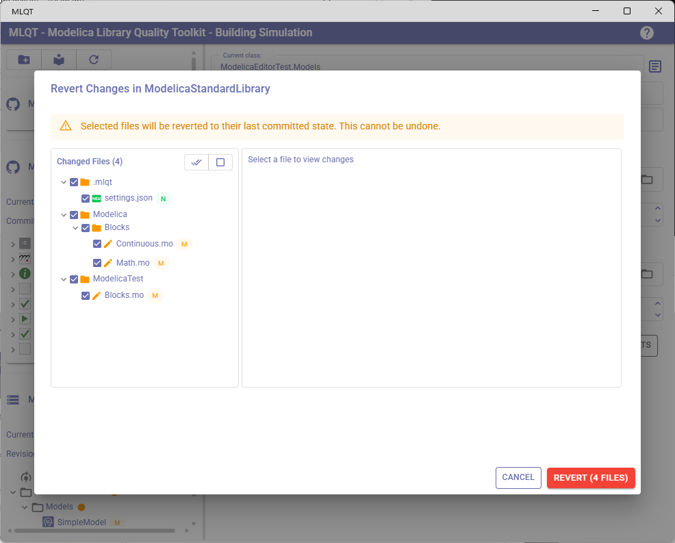
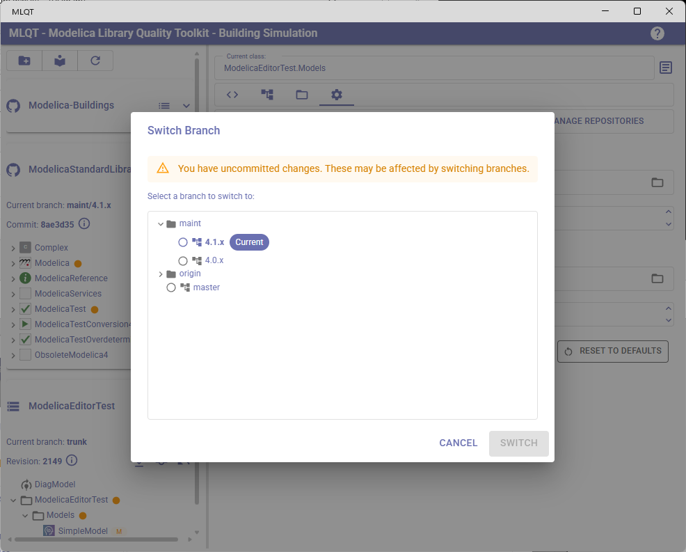
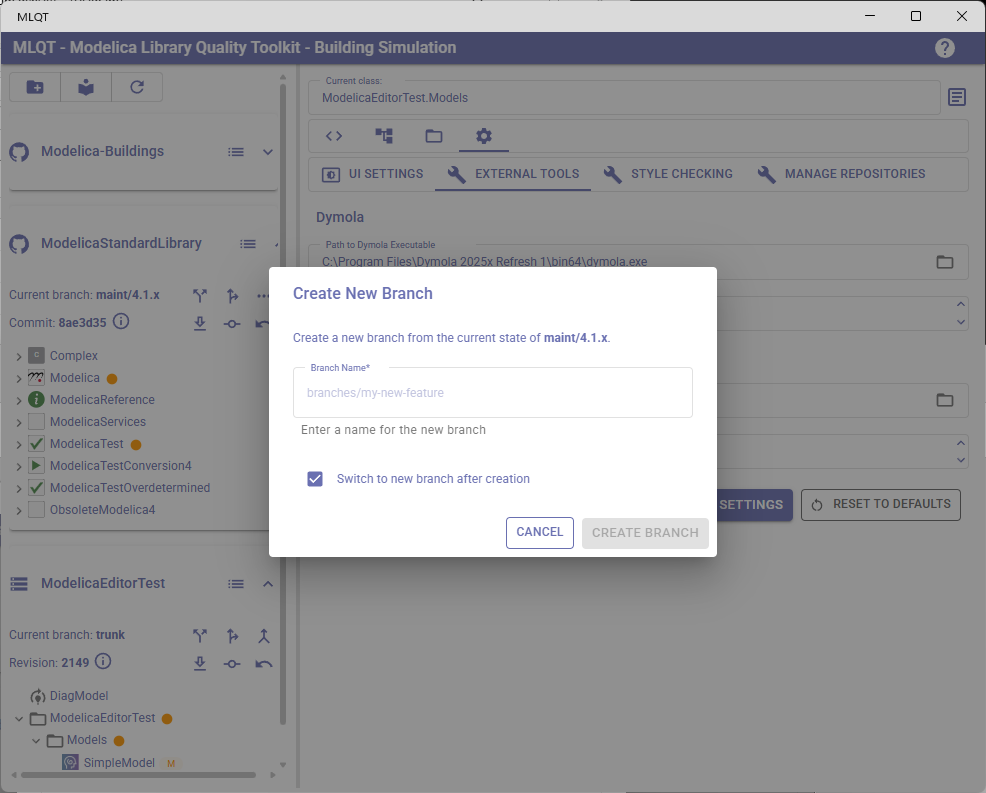
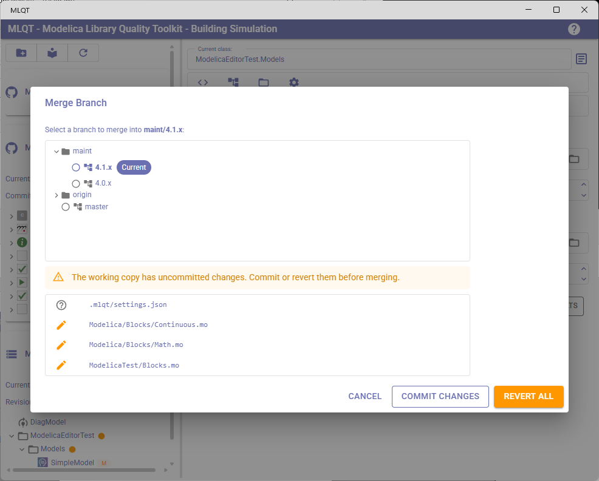
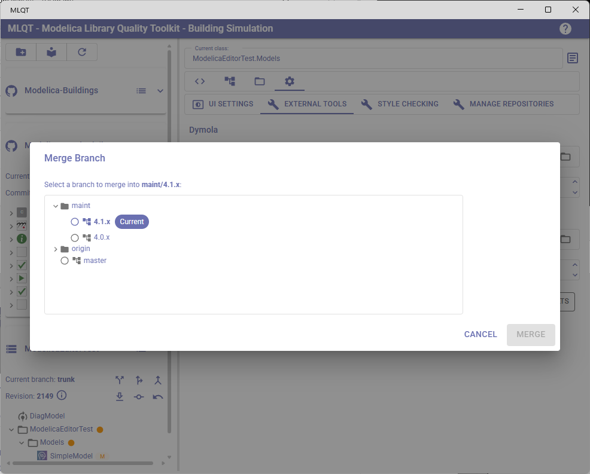
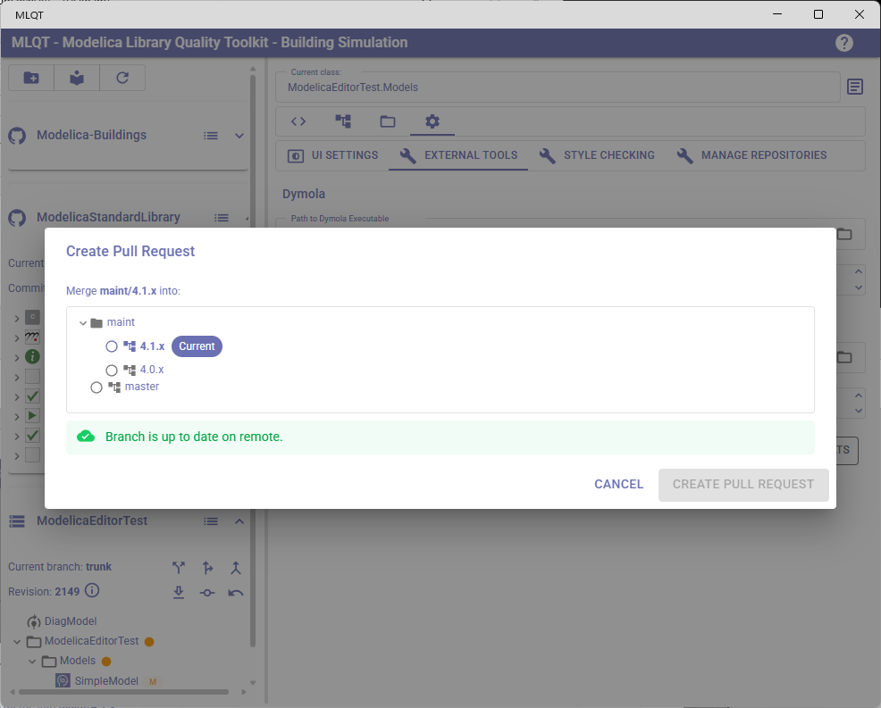
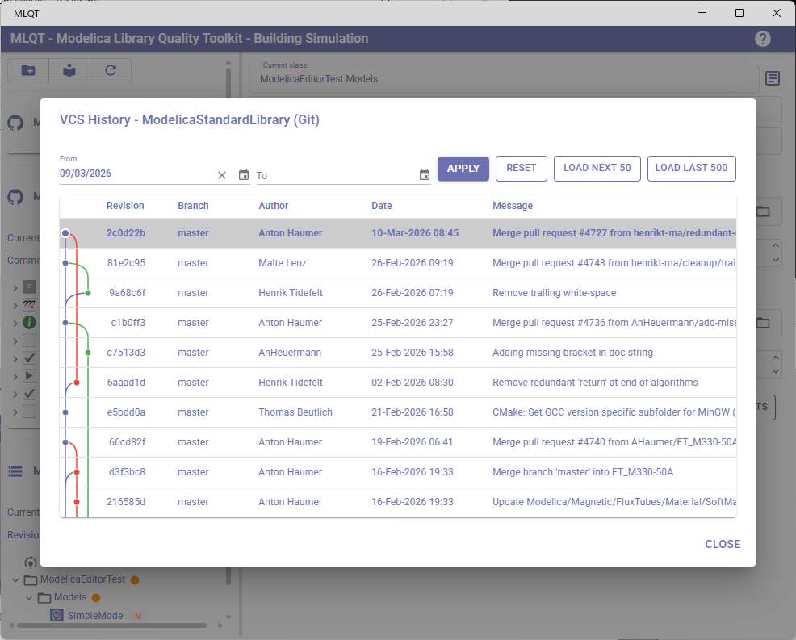
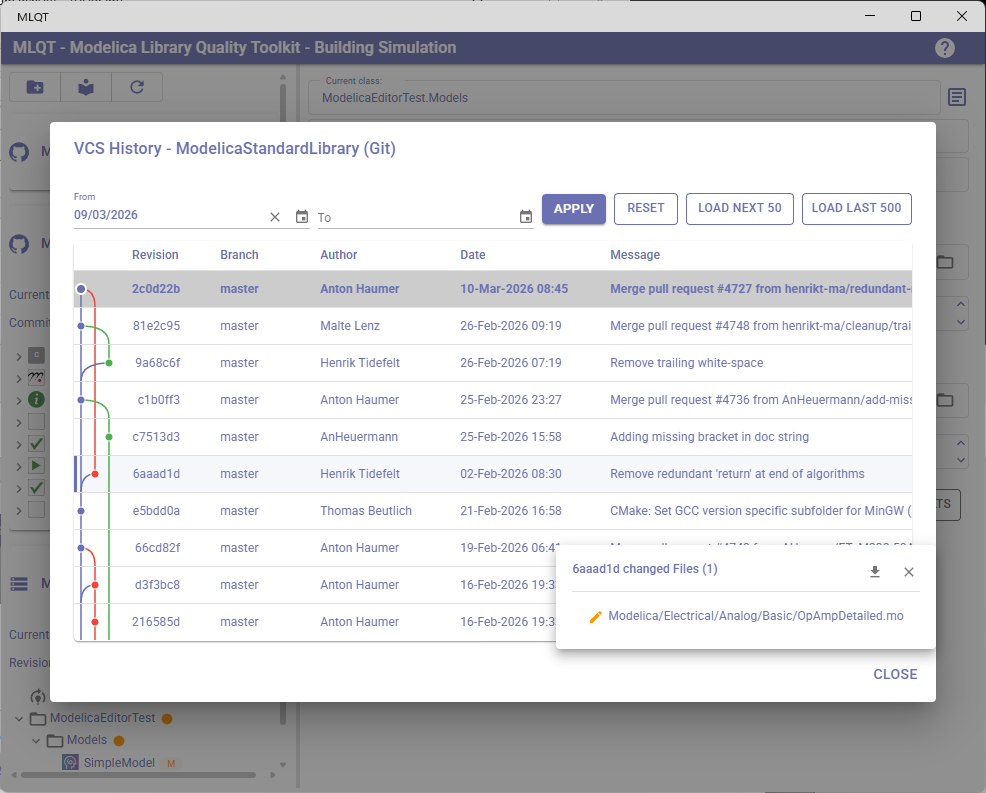
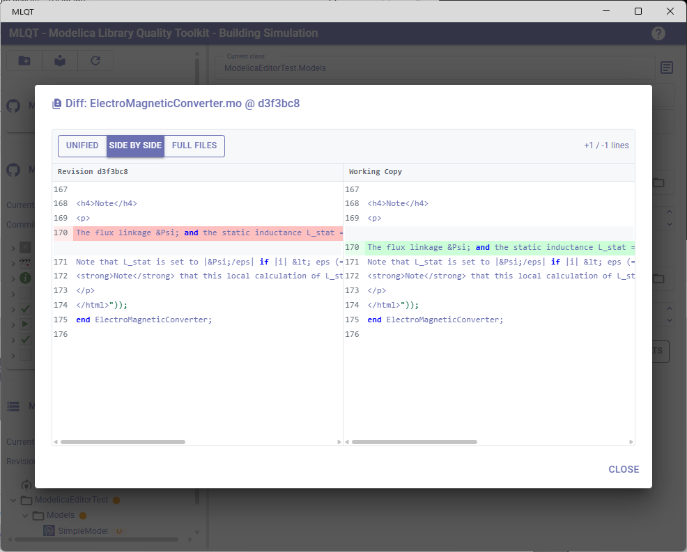

# Git Operations

MLQT provides a complete set of Git operations directly within the application, allowing you to manage branches, commit changes, merge, rebase, push, and create pull requests without switching to a terminal or external Git client.

This guide explains each Git operation available in MLQT and how it fits into common Git workflows.

## Common Git Workflows with MLQT

### Feature Branch Workflow

The most common Git workflow for teams. You create a branch for each feature or fix, work on it, then merge it back.

**In MLQT:**
1. **Create a branch** from the repository header
2. Make your changes in an external editor (MLQT monitors the files)
3. Click **Refresh** to pick up changes
4. Review changes in the **Code Review** tab using diff view
5. **Commit** your changes with a descriptive message
6. **Push** to the remote
7. **Create a pull request** to merge into the main branch

### Gitflow / Release Branch Workflow

For teams that maintain release branches alongside development branches.

**In MLQT:**
1. **Switch branch** to the target release or development branch
2. **Merge** feature branches into the development branch
3. Resolve any conflicts using the built-in conflict resolution
4. **Push** the merged result
5. Use **Browse history** to review the commit log across branches

### Trunk-Based Development

For teams that commit directly to the main branch with short-lived feature branches.

**In MLQT:**
1. **Update** frequently to stay current with the remote
2. Make changes and **commit** directly
3. If working on a brief side task, **create a branch**, commit, then merge back
4. **Push** regularly to share your work

---

## Updating (Pull)

**Button:** Download icon in the repository header (Row 2)

Pulls the latest changes from the remote repository into your local working copy. This is equivalent to `git pull`.

**What happens:**
1. MLQT pauses file monitoring to avoid detecting intermediate states
2. Fetches and integrates remote changes
3. Reloads the library to reflect any changed files
4. Formats any files that changed during the update (if "Apply formatting rules" is enabled)
5. Re-runs dependency analysis and style checking on affected files
6. Shows a snackbar message: "Updated to revision [hash]" or "Already up to date"

**When to use:** Before starting work, or periodically to stay current with your team's changes.

---

## Committing Changes

**Button:** Commit icon in the repository header (Row 2, only enabled when uncommitted changes exist)

Opens the **Commit Changes** dialog where you can review modified files, select which ones to include, and write a commit message.

### Dialog Fields

| Field | Description |
|-------|-------------|
| **Commit message** | Required. A description of what you changed and why. |
| **Issue ID** | Optional (required if "Require an issue number" is enabled in repository settings). The issue or ticket number associated with this change. |

### Issue Number Handling

If the repository setting **Require an issue number as part of the commit message** is enabled:
- An additional text field appears for the issue ID
- You cannot commit without entering an issue number
- The issue number is automatically prepended or appended to your commit message depending on the **Issue number position** setting

### File Selection

The dialog shows all files with uncommitted changes. Each file has a checkbox — you can select which files to include in this commit. The commit button shows the count of selected files (e.g., "Commit (5 files)").

### Out-of-Date Handling

If your working copy is behind the remote (someone else pushed since your last update), MLQT automatically:
1. Detects the out-of-date condition
2. Updates your working copy
3. Retries the commit

### After Committing

- The commit dialog closes and shows a success message
- The repository header updates to show the new commit hash
- The tree refreshes to clear VCS status chips from committed files
- The issues list is **not** recalculated (a commit does not change file content)

---

## Reverting Changes

**Button:** Undo icon in the repository header (Row 2, only enabled when uncommitted changes exist)

Opens the **Revert Files** dialog to discard uncommitted changes and restore files to their last committed state.

### Important Warning

Reverting is **irreversible**. The dialog shows a prominent warning:

> "Selected files will be reverted to their last committed state. This cannot be undone."

You select which files to revert — you don't have to revert everything. Unselected files keep their modifications.

### After Reverting

- The reverted files are restored to their HEAD content
- MLQT re-runs dependency analysis and style checking on affected files
- VCS status chips are cleared for reverted files

---

## Switching Branches

**Button:** Branch/split icon in the repository header (Row 1)

Opens the **Switch Branch** dialog to check out a different branch.

### Branch Selector

The dialog shows all available branches:
- **Local branches** — Branches that exist on your machine
- **Remote branches** — Branches on the remote that you haven't checked out locally (shown with the remote prefix, e.g., `origin/feature-xyz`)
- The current branch is excluded from the list

### Uncommitted Changes Warning

If you have uncommitted changes when switching branches, the dialog shows a warning:

> "You have uncommitted changes. These may be affected by switching branches."

You can still proceed, but consider committing or reverting your changes first to avoid potential conflicts.

### After Switching

- MLQT reloads all libraries from the new branch
- The analysis pipeline runs on all files (formatting, dependencies, style checking)
- The repository header updates to show the new branch name and commit

---

## Creating Branches

**Button:** Fork icon in the repository header (Row 1)

Opens the **Create Branch** dialog to create a new branch from the current HEAD.

### Dialog Fields

| Field | Description |
|-------|-------------|
| **Branch name** | The name for the new branch. Validated against Git naming rules (no spaces, no `..`, no special characters like `~`, `^`, `:`, `?`, `*`). |
| **Switch to new branch after creation** | Checkbox (default: on). If checked, MLQT immediately switches to the new branch after creating it. |

### Validation

- The branch name is validated in real-time as you type
- An error is shown if the name already exists (checking both local and remote branches)
- The "Create Branch" button is disabled until the name is valid and unique

---

## Merging Branches

**Button:** Merge icon in the Git More actions menu

Opens the **Git Merge Branch** dialog to merge another branch into your current branch. This is equivalent to `git merge <branch>`.

### Merge Workflow

The dialog guides you through a multi-phase process:

**Phase 1: Pre-merge check**
MLQT checks for uncommitted changes. If your working copy is dirty, you must either:
- **Commit** the changes first (opens the Commit dialog)
- **Revert all** changes to clean the working copy

**Phase 2: Branch selection**
Select which branch to merge into your current branch using the branch selector.

**Phase 3: Merge execution**
MLQT performs the merge. If there are no conflicts, a merge commit is automatically created and the dialog proceeds to the push prompt.

**Phase 4: Conflict resolution** (if needed)
If the merge produces conflicts, the dialog shows a list of conflicted files with resolution options:

| Action | Description |
|--------|-------------|
| **Accept Incoming** | Use the version from the branch being merged in |
| **Keep Mine** | Keep your current branch's version |
| **Edit Externally** | Open the file in your default editor to manually resolve |
| **View Conflict** | Opens a side-by-side diff showing "Ours (current branch)" vs "Theirs (incoming)" |

A progress indicator shows how many conflicts have been resolved (e.g., "2 of 5 resolved"). Once all conflicts are resolved, click **Commit Merge** to create the merge commit.

**Phase 5: Push prompt**
After a successful merge, the dialog offers to push the result:

> "Merge complete. Push changes to remote?"

Click **Push** to push immediately, or **Skip** to push later.

---

## Rebasing

**Button:** Rebase icon in the Git More actions menu

Opens the **Git Rebase** dialog to rebase your current branch onto another branch. This is equivalent to `git rebase <branch>`.

Rebasing replays your branch's commits on top of the target branch, creating a linear history. This is an alternative to merging that produces a cleaner commit log.

### Rebase Workflow

The workflow is similar to merging but with key differences:

**Phase 1-2: Pre-check and branch selection**
Same as merge — clean working copy required, then select the target branch.

**Phase 3: Rebase execution**
MLQT replays your commits one at a time onto the target branch.

**Phase 4: Conflict resolution** (if needed)
Conflicts may arise at any commit during the replay. The dialog shows:
- The list of conflicted files with the same resolution options as merge
- An **Abort Rebase** button (red) to cancel the entire rebase and return to the original state
- A **Continue Rebase** button to proceed to the next commit after resolving conflicts

**Phase 5: Push prompt**
After a successful rebase, the dialog shows an important warning:

> "Because rebase rewrites history, a force push is required if this branch was previously pushed."

Click **Force Push** to push the rebased branch, or **Skip** to handle it later.

### When to Use Rebase vs Merge

| Situation | Recommended |
|-----------|-------------|
| Updating a feature branch with changes from main | **Rebase** — keeps your feature commits on top, clean history |
| Integrating a completed feature into main | **Merge** — preserves the feature branch history |
| Branch has been shared/pushed and others are working on it | **Merge** — rebase rewrites history which disrupts collaborators |
| Personal/local branch that hasn't been pushed | **Rebase** — safe since no one else has the old history |

---

## Pushing

**Button:** Push icon in the Git More actions menu

Pushes your committed changes to the remote repository. This is equivalent to `git push`.

**What happens:**
1. MLQT pushes the current branch to the remote
2. On success: shows "Push successful." and refreshes the repository display
3. On failure: shows the error message (e.g., rejected because the remote has newer commits — update first)

---

## Creating Pull Requests

**Button:** Pull request icon in the Git More actions menu

Opens the **Create Pull Request** dialog to create a pull request on your Git hosting platform (GitHub, GitLab, etc.).

### Workflow

**Phase 1: Pre-check**
MLQT checks whether your branch has been pushed to the remote.

**Phase 2: Push if needed**
If the branch hasn't been pushed yet, the dialog warns:

> "Branch has not been pushed to remote yet. It will be pushed before opening the pull request."

Click **Push and Create Pull Request** to push first, then open the PR.

**Phase 3: Open PR**
If the branch is already pushed (or after pushing), click **Create Pull Request**. MLQT:
1. Constructs the pull request URL for your Git hosting platform
2. Opens the URL in your default web browser
3. You complete the PR details (title, description, reviewers) in the browser

### Base Branch Selection

The dialog includes a branch selector where you choose the **base branch** — the branch you want to merge your changes into (typically `main` or `develop`).

---

## Browsing History

**Button:** List icon in the repository header (top right, visible for all VCS repositories)

Opens the **VCS History** dialog showing the commit log for the repository.

### Commit Graph (Git)

For Git repositories, the history view includes a visual **commit graph** on the left side of the table. This shows:
- **Commit dots** — Each commit as a colored dot
- **Branch lines** — Colored lanes showing branch and merge history
- **Branch colors** — Different colors for different branches to make the graph easier to read

### Table Columns

| Column | Description |
|--------|-------------|
| **Revision** | The commit hash (shortened). The current HEAD commit is shown in **bold**. |
| **Branch** | The branch name for this commit. |
| **Author** | The commit author's name (hover for email). |
| **Date** | The commit date in `dd-MMM-yyyy HH:mm` format. |
| **Message** | The short commit message (hover for the full message). |

### Filtering by Date

Use the **From** and **To** date pickers at the top to filter the history to a specific date range. Click **Apply** to filter or **Reset** to clear the filter.

### Loading More History

The history loads incrementally for performance:
- **Load Next 50** — Loads 50 more entries beyond what's currently shown
- **Load Last 500** — Loads up to 500 entries for a broader view

### Viewing Changed Files

Click on any commit row to see a popover showing:
- The list of **changed files** in that commit, each with an icon indicating the change type (Added, Modified, Deleted, Renamed, Copied)
- A **Diff** button next to each file to open a side-by-side diff comparing the file at that revision with the current working copy

### Checking Out a Revision

From the changed files popover, you can click **Checkout** to switch to that specific revision (detached HEAD state). A confirmation dialog warns:

> "Checkout revision [hash]? Any uncommitted changes will be lost."

After checkout:
- MLQT reloads all libraries from the checked-out revision
- The repository header shows "Detached HEAD" instead of a branch name
- The full analysis pipeline runs on all files

### Viewing File Diffs

Clicking on any changed file opens the **Revision Diff** dialog, which shows a side-by-side comparison:
- **Left side**: The file content at the selected revision
- **Right side**: The current working copy content
- For **added** files: left side is empty
- For **deleted** files: right side is empty

