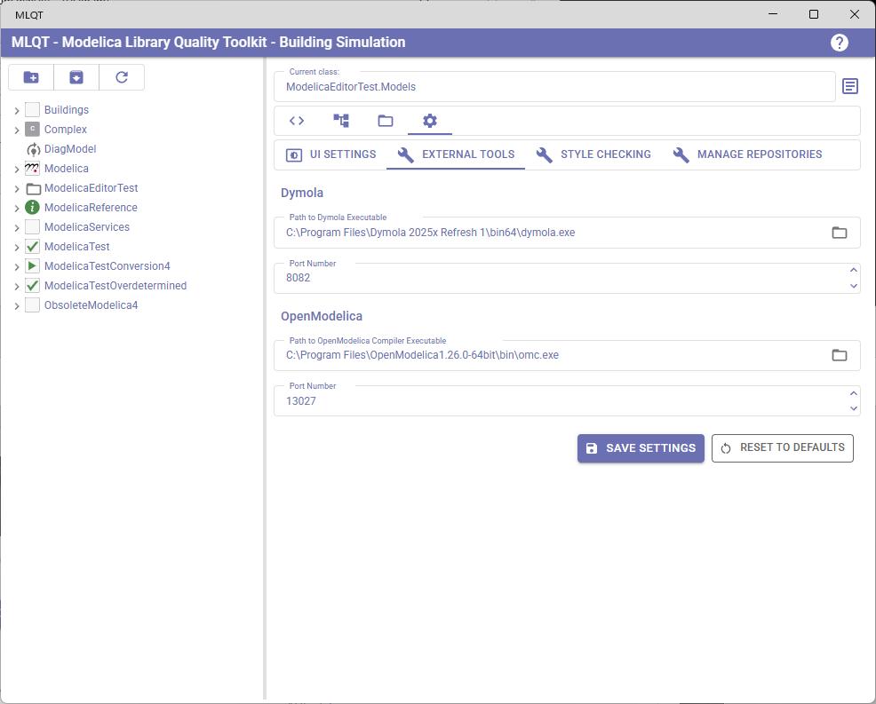
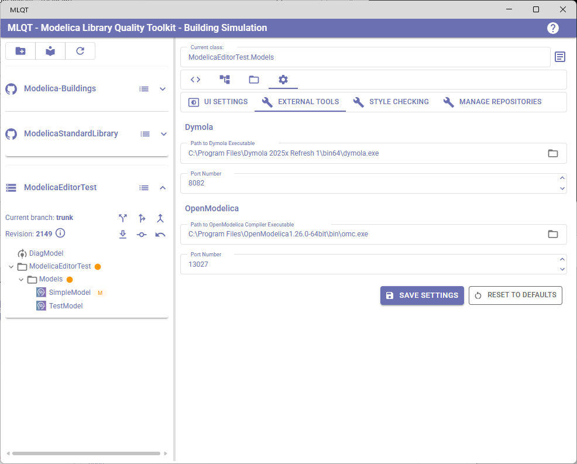
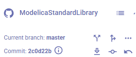
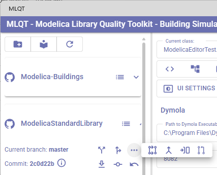
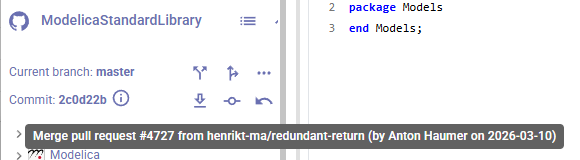
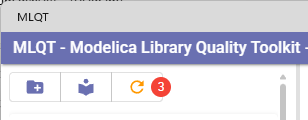

# Library Browser & Navigation

The library browser is the left panel of MLQT and your primary way to explore, navigate, and interact with Modelica libraries. It shows the package hierarchy of all loaded libraries and, when in repository mode, provides access to version control operations.

## Two View Modes

The library browser has two modes, toggled by the second button in the left panel toolbar:

### Repository View

In repository view, libraries are grouped under their parent repository. Each repository appears as a collapsible expansion panel with its own header showing VCS information and operation buttons.

This is the default view and is the one you'll use most often, as it provides access to all version control operations.

### Library View

In library view, all libraries from all repositories are shown in a single flat tree. There are no repository headers or VCS operations — just the pure Modelica package hierarchy.

This view is useful when you want to focus on the library structure without the repository context, especially when working with multiple repositories whose libraries reference each other.

## The Package Tree

In both views, the Modelica package hierarchy is displayed as an expandable tree. Each node in the tree represents a Modelica class.

### Tree Structure

The tree mirrors the Modelica package structure:
- **Top-level nodes** are the root packages (libraries)
- **Child nodes** are nested packages, models, blocks, functions, records, connectors, and other class types
- **Lazy loading** — child nodes are loaded on demand when you expand a parent, keeping the initial load fast even for large libraries

### Selecting a Model

**Single click** on any node to select it. The selected model's code appears in the Code Review tab, and its name is shown in the "Current class" text field above the tab bar.

### Multi-Selection Mode

When you switch to the Dependencies tab, the tree automatically enters multi-selection mode:
- Checkboxes appear next to each node
- You can check multiple models to analyze their combined dependency impact
- Multi-selection mode is automatically disabled when you leave the Dependencies tab

## VCS Status Indicators

When working with Git or SVN repositories, the tree shows the VCS status of each file directly on the tree nodes. This lets you see at a glance which models have been modified, added, or deleted.

### Status Chips

Models whose files have uncommitted changes display a small colored chip next to their name:

| Chip | Color | Meaning |
|------|-------|---------|
| **A** | Green | **Added** — A new file that has been added to version control |
| **M** | Orange | **Modified** — An existing file that has been changed |
| **D** | Orange | **Deleted** — A file that has been deleted |
| **R** | Orange | **Renamed** — A file that has been renamed |
| **N** | Green | **Untracked** — A new file not yet added to version control |
| **!** | Red | **Conflicted** — A file with merge conflicts that need resolution |

### Descendant Change Indicator

Parent packages that contain modified files (but are not themselves directly modified) show a small **orange dot** next to their name. This lets you quickly spot which branches of the tree contain changes without expanding every node.

## Repository Header (Repository View Only)

In repository view, each repository has a header section that shows key information and provides VCS operation buttons. The header has two rows for VCS repositories:

### Row 1: Branch Information

- **VCS icon** — GitHub icon for Git, storage icon for SVN, folder icon for local directories
- **Repository name** — The display name you gave the repository
- **Browse history** — Opens the [VCS History](git-operations.md#browsing-history) dialog

For Git and SVN repositories, when expanded:
- **Current branch name** (or "Detached HEAD" if not on a branch)
- **Switch branch** button — Opens the branch switching dialog
- **Create new branch** button — Opens the branch creation dialog
- **Merge** button (SVN) or **More actions** menu (Git)

### Git More Actions Menu

For Git repositories, clicking the **More actions** (three dots) button reveals additional operations:

| Button | Description |
|--------|-------------|
| **Rebase** | Rebase the current branch onto another branch |
| **Merge** | Merge another branch into the current branch |
| **Push** | Push committed changes to the remote repository |
| **Create Pull Request** | Open a pull request in your browser |

### Row 2: Revision Information

- **Git**: Shows "Commit: **abc1234**" (7-character shortened hash, hover for full SHA)
- **SVN**: Shows "Revision: **1234**"
- **Commit message tooltip** — Hover over the info icon to see the commit message
- **Update** button — Pulls the latest changes from the remote repository
- **Commit** button — Opens the commit dialog (disabled if no uncommitted changes)
- **Revert** button — Opens the revert dialog (disabled if no uncommitted changes)

## Toolbar Buttons

The toolbar at the top of the left panel has three buttons:

| Button | Icon | Description |
|--------|------|-------------|
| **Add Repository** | Folder+ | Opens the [Add Repository](getting-started.md#step-2-add-a-repository) dialog to add a new repository to the current project |
| **Toggle View** | Library/Archive | Switches between repository view and library view |
| **Refresh** | Refresh | Processes pending file changes detected by the [file monitor](file-monitoring.md). A red badge shows the count of pending changes. The button turns orange when changes are waiting. |

## Navigating Large Libraries

For large libraries with many packages:

- **Expand selectively** — Only expand the packages you need. Lazy loading keeps unexpanded branches lightweight.
- **Use Library view** — When you don't need VCS operations, library view gives you more vertical space by removing repository headers.
- **Use the Dependencies tab** — To find a model by its relationships rather than its location in the package hierarchy.
- **Use the search in Issues table** — The Code Review tab's issues table lets you search by model name across all loaded libraries.
