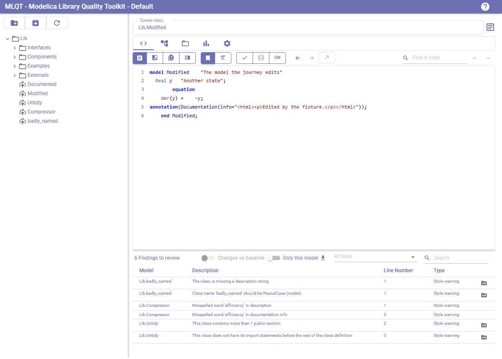
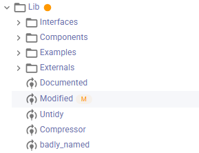
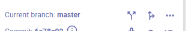
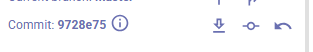
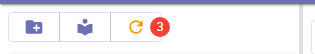

# Library Browser & Navigation

The library browser is the left panel of MLQT and your primary way to explore, navigate, and interact with Modelica libraries. It shows the package hierarchy of all loaded libraries and, when in repository mode, provides access to version control operations.

## Two View Modes

The library browser has two modes, toggled by the second button in the left panel toolbar:

### Repository View

In repository view, libraries are grouped under their parent repository. Each repository appears as a collapsible expansion panel with its own header showing VCS information and operation buttons.

This is the default view and is the one you'll use most often, as it provides access to all version control operations.

### Library View

In library view, all libraries from all repositories are shown in a single flat tree. There are no repository headers or VCS operations — just the pure Modelica package hierarchy.

This view is useful when you want to focus on the library structure without the repository context, especially when working with multiple repositories whose libraries reference each other.

## The Package Tree

In both views, the Modelica package hierarchy is displayed as an expandable tree. Each node in the tree represents a Modelica class.

### Tree Structure

The tree mirrors the Modelica package structure:
- **Top-level nodes** are the root packages (libraries)
- **Child nodes** are nested packages, models, blocks, functions, records, connectors, and other class types
- **Lazy loading** — child nodes are loaded on demand when you expand a parent, keeping the initial load fast even for large libraries

### Selecting a Model

**Single click** on any node to select it. The selected model's code appears in the Code Review tab, and its name is shown in the "Current class" text field above the tab bar.

### Multi-Selection Mode

When you switch to the Dependencies tab, the tree automatically enters multi-selection mode:
- Checkboxes appear next to each node
- You can check multiple models to analyze their combined dependency impact
- Multi-selection mode is automatically disabled when you leave the Dependencies tab

## VCS Status Indicators

When working with Git or SVN repositories, the tree shows the VCS status of each file directly on the tree nodes. This lets you see at a glance which models have been modified, added, or deleted.

### Status Chips

Models whose files have uncommitted changes display a small colored chip next to their name. Hover over any chip to see what it means.

| Chip | Color | Meaning |
|------|-------|---------|
| **A** | Green | **Added** — A new file added to version control, or a new class inside a changed file |
| **M** | Orange | **Modified** — This class changed in a way that can affect simulation |
| **G** | Blue | **Graphical** — This class changed, but only its layout, comments, documentation or graphics |
| **D** | Orange | **Deleted** — A file that has been deleted |
| **R** | Orange | **Renamed** — A file that has been renamed |
| **N** | Green | **Untracked** — A new file not yet added to version control |
| **!** | Red | **Conflicted** — A file with merge conflicts that need resolution |

### What Kind of Change It Is

**M** and **G** are about the class, not the file it lives in. Every other chip is about the file: a deleted file is deleted for every class in it, and an untracked one is untracked for all of them. "Modified" is the one that is not, because a `package.mo` holding three hundred classes changes when any one of them is edited, and the other two hundred and ninety-nine are untouched.

So MLQT compares **the class as it is now against the class as it was committed** — the parsed classes, not the text — and marks each one with what it found:

- **M (orange)** — something a translator reads is different: an equation, a declaration, a modification, or an annotation that changes how the model is built. This is the one to review.
- **G (blue)** — the class changed, but nothing a translator reads did. Reformatting, a re-worded description, a rewritten `Documentation`, a component dragged across the diagram, an icon redrawn.
- **no chip** — the class's file changed, but this class did not. Its own text is identical to the committed version.

**Annotations are not ignored wholesale.** Several of them change what is simulated, and a change to one of those is an **M** however graphical the rest of the annotation is. `Evaluate`, `Inline`, `LateInline`, `smoothOrder`, `GenerateEvents`, `derivative`, `inverse`, `HideResult`, `Protection`, `experiment`, `uses`, `version` and the external-function annotations (`Include`, `Library`, `IncludeDirectory`, `LibraryDirectory`, `SourceDirectory`) are all treated as significant, and so is **any annotation MLQT does not recognise**, including a vendor's. Only a known list — the drawing, documentation and dialog annotations — is treated as graphical.

**When MLQT cannot tell**, the chip stays a plain orange **M** and its tooltip says so. That happens when the committed version of the file cannot be read or does not parse, when the file is conflicted, and in a repository that is not under version control.

### Showing Only What Changed

Above the tree, a row of chips appears whenever the repository has uncommitted changes. Each one carries the number of classes behind it, so you can see there is nothing cosmetic here without selecting anything:

| Chip | Shows |
|------|-------|
| **All** | The ordinary tree, everything in it |
| **Changed** | Every class with an uncommitted change of its own |
| **Simulation** | The changes worth reading: everything except the ones MLQT is confident are graphical. A class it could not classify is in here |
| **Cosmetic** | The changes MLQT vouches for as layout, wording or graphics |

**It is still the tree.** Selecting a chip prunes it to the classes that match and the packages that contain them, rather than flattening it into a list — so a change keeps the context of where it lives, and two changes in the same package are visibly in the same package. It stays open exactly as far as you had it open, and no further: a filter is a question, not a rearrangement. A class is a leaf there whatever it holds in the full tree, because the children it has are ones the filter did not select.

Click a class to open it, exactly as in the unfiltered tree. Click **All** — or the selected chip again — to go back; the full tree returns expanded as you left it, including anything you opened while the filter was on.

**None of this appears for a repository marked [Reference only](settings-reference.md#reference-only-repositories).** MLQT never formats, checks, commits or writes to one, so there is nothing for a change marker to be about — and because a reference repository is not watched for file changes either, anything shown would only ever be refreshed by loading the project.

### Descendant Change Indicator

Parent packages that contain modified files (but are not themselves directly modified) show a small **dot** next to their name. This lets you quickly spot which branches of the tree contain changes without expanding every node.

The dot is coloured by the strongest change under it: **orange** when something below it can affect simulation, **blue** when everything below it is graphical. A package whose file changed but whose own text did not gets the dot rather than a chip.

## Repository Header (Repository View Only)

In repository view, each repository has a header section that shows key information and provides VCS operation buttons. The header has two rows for VCS repositories:

### Row 1: Branch Information

- **VCS icon** — GitHub icon for Git, storage icon for SVN, folder icon for local directories
- **Repository name** — The display name you gave the repository
- **Browse history** — Opens the [VCS History](git-operations.md#browsing-history) dialog

For Git and SVN repositories, when expanded:
- **Current branch name** (or "Detached HEAD" if not on a branch)
- **Switch branch** button — Opens the branch switching dialog
- **Create new branch** button — Opens the branch creation dialog
- **Merge** button (SVN) or **More actions** menu (Git)

### Git More Actions Menu

For Git repositories, clicking the **More actions** (three dots) button reveals additional operations:

| Button | Description |
|--------|-------------|
| **Rebase** | Rebase the current branch onto another branch |
| **Merge** | Merge another branch into the current branch |
| **Push** | Push committed changes to the remote repository |
| **Create Pull Request** | Open a pull request in your browser |

### Row 2: Revision Information

- **Git**: Shows "Commit: **abc1234**" (7-character shortened hash, hover for full SHA)
- **SVN**: Shows "Revision: **1234**"
- **Commit message tooltip** — Hover over the info icon to see the commit message
- **Update** button — Pulls the latest changes from the remote repository
- **Commit** button — Opens the commit dialog (disabled if no uncommitted changes)
- **Revert** button — Opens the revert dialog (disabled if no uncommitted changes)

## Toolbar Buttons

The toolbar at the top of the left panel has three buttons:

| Button | Icon | Description |
|--------|------|-------------|
| **Add Repository** | Folder+ | Opens the [Add Repository](getting-started.md#step-2-add-a-repository) dialog to add a new repository to the current project |
| **Toggle View** | Library/Archive | Switches between repository view and library view |
| **Refresh** | Refresh | Processes pending file changes detected by the [file monitor](file-monitoring.md). A red badge shows the count of pending changes. The button turns orange when changes are waiting. |

## Navigating Large Libraries

For large libraries with many packages:

- **Expand selectively** — Only expand the packages you need. Lazy loading keeps unexpanded branches lightweight.
- **Use Library view** — When you don't need VCS operations, library view gives you more vertical space by removing repository headers.
- **Use the Dependencies tab** — To find a model by its relationships rather than its location in the package hierarchy.
- **Use the search in Findings table** — The Code Review tab's findings table lets you search by model name across all loaded libraries.
