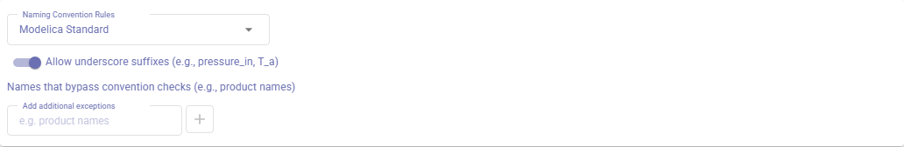
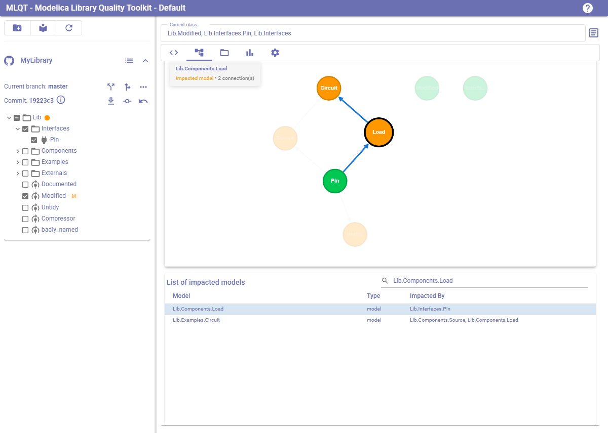
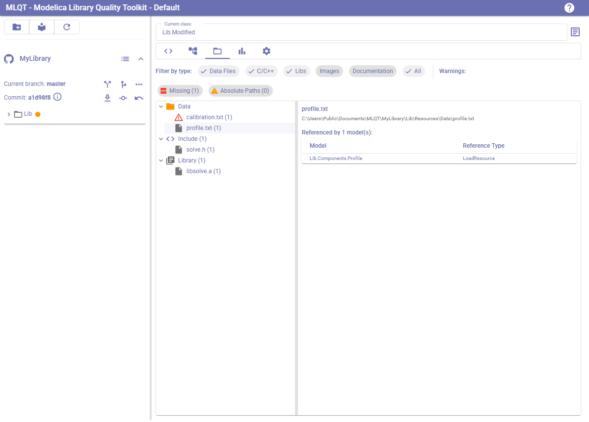

# Overview

This page is for deciding whether MLQT is worth your team's time. It describes the problems it
solves, what each part of the toolkit does, and what adopting it actually involves.

If you have already decided, go to the [Getting Started guide](getting-started.md) for the
desktop application, or the [CI quality gate guide](ci-quality-gate.md) to put the checks on
your build server.

## The problem

Four things happen to a shared Modelica library over years of ordinary work by a changing
team. None of them are anyone's fault.

**Diffs fill up with noise.** Open a model, save it, and your Modelica tool rewrites the
formatting throughout the file. The one change that matters is buried in hundreds of cosmetic
ones, so reviews get skimmed and merges turn painful.

**Style drifts between authors.** Naming, documentation, structure, units — every engineer
brings their own habits. After a few years a single library contains four or five different
conventions.

**The standard lives in people's heads.** Most teams have a modelling standard written down
somewhere. Very few can check it automatically, so it is enforced only when a reviewer happens
to remember it.

**Nobody can see the blast radius.** Change a base class and you find out what depended on it
when something breaks. The same blind spot slows onboarding: new engineers — and AI assistants
— have to read the source to learn what the library contains.

## What MLQT is

MLQT replaces your generic Git or SVN client with one that understands Modelica. You keep
whichever editor and Modelica tool you already use; MLQT sits between them and the repository.

Underneath everything is a single ANTLR parser that builds a real model of your code — classes,
components, connections, equations, annotations — rather than matching text. That parser is
reached three ways:

| | |
|---|---|
| **The desktop application** | Browse libraries, review changes, run the checks, see the dependency graph, commit to Git or SVN. |
| **The `mlqt` command-line tool** | The same checks, headless, for your build server. |
| **The MCP server** | The same capabilities exposed to an AI agent, for reading and authoring models. |

All three run on **Windows and Linux**, and all three arrive in a single installer per platform —
there is nothing to choose between at download time. See [installation.md](installation.md).

They share the same rule configuration, committed to your repository, so all three agree about
what a good model looks like.

## Clean commits

This is where MLQT started and it is still the first thing most teams notice.

The same edit — changing a ramp height from 5 to 10 — committed from a Modelica tool that
reformats on save:

```diff
   Modelica.Blocks.Sources.Ramp ramp(
-    duration = 2, height = 5)
-    annotation(Placement(transformation(
-      extent = {{-60, -10}, {-40, 10}})));
+    duration=2, height=10)
+    annotation (Placement(transformation(
+      extent={{-60,-10},{-40,10}})));
```

…and the same edit committed through MLQT:

```diff
   Modelica.Blocks.Sources.Ramp ramp(
-    duration=2, height=5)
+    duration=2, height=10)
     annotation (Placement(transformation(
       extent={{-60,-10},{-40,10}})));
```

The first version of that change touched four hundred lines, one of which mattered. The second
is the change.

What follows from that is worth more than the tidiness. Reviews start happening, because a
colleague will read five lines where they would skim five hundred. Branches conflict on real
edits rather than on whitespace, so long-lived feature branches become practical again. And
`blame` points at the engineer who changed the equation rather than the last person who opened
the file.


Formatting is configured per repository and stored with it — see
[code-formatting.md](code-formatting.md) and [settings-reference.md](settings-reference.md).

## A standard that enforces itself

The checks fall into two groups: conventions you choose, and defects that are defects whoever
wrote them.

**Conventions.** Description strings on classes, parameters and constants; `Documentation`
info and revisions; icons; naming patterns for classes and elements; imports first and extends
at the top; one of each section; initial sections in a consistent place; equations and
algorithms kept apart; spelling of descriptions and documentation against a dictionary you
extend with your own terminology; and `modelica://` references that resolve.

**Defects.** Unused parameters, constants, components, protected variables and imports.
Classes nothing references. Duplicate and shadowing declarations. `uses` annotations that
disagree with what the library actually depends on. `package.order` files that disagree with
what is on disk. `Real` variables that declare no unit and inherit none.

Every rule can be switched on or off and given a severity of Info, Warning or Error. Parse
errors sit outside all of that: they are always reported, always errors, and cannot be
disabled — because every other rule reads a parse tree, and a file that did not parse was
never really checked.



See [spell-checking.md](spell-checking.md), [naming-conventions.md](naming-conventions.md) and
[settings-reference.md](settings-reference.md).

## You do not have to fix everything first

Point the checks at a library that has been growing for a decade and you will get thousands of
findings. Nobody is going to fix them all, and a tool that insists gets uninstalled by Friday.

MLQT's answer is a ratchet:

1. **Baseline.** `mlqt baseline create` writes a reviewable ledger of every finding you have
   today. Commit it. Those findings become accepted debt and never fail a build.
2. **Gate.** CI runs the check against that baseline. Only findings that are *not* in it fail
   — so the library cannot get worse, whatever state it starts in.
3. **Escalate, when you're ready.** Optionally fail on pre-existing findings in models a
   change has already touched: the boy-scout rule, applied only where someone is working
   anyway.

Two details matter for trusting it. A finding is identified by a fingerprint that survives
reformatting, so reformatting a model never converts its accepted debt into new findings. And
widening the baseline requires an explicit `--force` and shows up as a diff in code review —
CI only ever reads it.

The baseline shrinking over time is your debt burndown. Full detail in
[ci-quality-gate.md](ci-quality-gate.md).

## Where the checks run

**In the desktop application.** Findings appear beside the code in the Code Review tab, and
can be filtered to the models your current change touched. You can send a model to Dymola or
OpenModelica for a compile check before committing.

**On your build server.** `mlqt check` gates the build on its exit code. The report format
decides where findings surface: JUnit for the native test UI of Jenkins, GitLab or Azure
DevOps; TeamCity service messages with build statistics you can graph; SARIF for GitHub
code-scanning alerts; or a pull-request review with comments on the lines that earned them.

```bash
mlqt check ./MyLibrary --baseline .mlqt/baseline.json --fail-on warning --format teamcity
```

**Before each commit.** `mlqt hook install` adds a Git pre-commit hook using the same settings
and baseline, so a missing description is caught while the model is still open rather than
after a build has run. It skips any commit that stages no `.mo` file, and `--no-verify`
bypasses it — deliberately, because a hook nobody can get past is a hook that gets deleted.

**Through an AI agent.** Covered below.

## Seeing what a change will affect

Select one or more models and MLQT shows every model that depends on them, as an interactive
graph and as a searchable list.



This answers three questions that are otherwise matters of opinion: what to re-test after a
change, what else a reviewer should be looking at, and whether the thing you are about to
modify is a leaf model or a base class with a hundred dependents. See
[dependency-analysis.md](dependency-analysis.md).

## Beyond the `.mo` files

Models reference data files, C source for external functions, images and shared libraries.
MLQT scans for every one of those references, builds a resource map, and shows which models
use each file — along with the ones that are missing or will not survive a checkout on another
machine.



Commercial libraries are a related problem. They ship as an unreadable `package.moe`, which
normally means every reference into them looks like an error and every inherited icon
disappears. MLQT recovers their class names, descriptions, base classes and icons from the
vendor's own generated documentation, so references resolve and the findings you are left with
are real. Recovered classes are read-only and are never reported on — a vendor's library is
neither your achievement nor your debt.

See [external-resources.md](external-resources.md) and
[encrypted-libraries.md](encrypted-libraries.md).

## Measuring progress

A list of findings is a poor way to see progress: clearing two hundred out of nine thousand
does not feel like anything. The Metrics tab reports coverage per dimension instead — what
proportion of eligible classes have a description, documentation, an icon, described
parameters, declared units — with the compliant and eligible counts beside each percentage, so
you can see how much work the remaining percent actually is.

Add `--metrics` to the CI run and each commit that moves the numbers appends a point, stamped
with its revision and branch, so the burndown builds itself. Reference libraries, vendor
libraries and any library excluded from checking are measured for nothing: what you are
looking at is your own code. See [metrics-dashboard.md](metrics-dashboard.md).

## AI agents

MLQT ships a headless Model Context Protocol server, so an agent such as Claude can read,
understand, author, check and format Modelica in your libraries using the same parser, graph
and services as the desktop application.

The difference it makes is in what the agent has to read. To learn the public interface of
`Modelica.Blocks.Continuous.Integrator`, an agent would otherwise read the whole of
`Continuous.mo` — close to 59,000 tokens. `get_class_interface` returns the same information in
under 600. That is the difference between working with a real library and working with a toy
one.

More than eighty tools cover session and library management, class queries, compact class views,
search by prose or by interface shape, editing, documentation, diagrams, dependencies, style
checking, spelling, formatting, external resources and Modelica-aware VCS operations. Edits
are element-level rather than wholesale — add a component, set a modifier, add a connection —
and every edit is parse-checked with rollback, refuses read-only files, and can be previewed
first.

The server deliberately does not expose model checking with Dymola or OpenModelica. To let an
agent simulate and verify what it builds, pair it with an MCP server for your Modelica tool of
choice. See [mcp-server.md](mcp-server.md).

## What adoption looks like

A realistic sequence for a team with an existing library and work already in progress:

1. **Run the checks and read the report.** Point `mlqt check` at a copy of one library.
   Nothing is modified. This is the run that tells you whether the rest is worth doing.
2. **Choose your rules, then baseline.** Enable the checks nobody will argue about first and
   leave the contentious ones until the team has had the conversation. Then baseline what
   remains and commit it.
3. **Turn on the gate.** Add the check to CI with `--fail-on warning`. From this point the
   library cannot get worse.
4. **Format once, deliberately.** One large, clearly labelled commit that reformats the
   library, scheduled when nobody has a long-running branch open. Every diff after it is
   clean.
5. **Roll out the application, the hook and the MCP server.** Now that the rules are settled,
   put them in front of engineers where the feedback is cheapest.

Steps 1 and 2 need nobody's permission. Only step 4 needs coordinating across the team.

## What you need

One installer per platform carries the desktop application, the CLI and the MCP server together.

| | |
|---|---|
| **Operating system** | Windows 10/11, or Ubuntu 22.04 / Debian 12 or newer — x86-64 on both |
| **.NET runtime** | Nothing to install: the Windows installer fetches it if absent, the Linux `.deb` bundles it |
| **Version control** | Git, or SVN — the SVN client is bundled on Windows, and recommended by the `.deb` on Linux |
| **Model checking** *(optional)* | Dymola 2025x Refresh 1 or later, or OpenModelica 1.24.0 or later |
| **AI agent** *(optional)* | Any MCP client that launches servers over stdio |
| **Licence** | MIT, open source in full |

Full detail, including what each installer puts where and how to remove it, is in
[installation.md](installation.md).

## Where to go next

- [Installation](installation.md) — the Windows and Linux installers, and what they put where
- [Getting Started](getting-started.md) — set up your first project and add a repository
- [CI Quality Gate](ci-quality-gate.md) — baseline a library and gate on new findings
- [CLI reference](cli.md) — every `mlqt` command and flag
- [Settings Reference](settings-reference.md) — every setting, and where it is stored
- [Modelica Concepts](modelica-concepts.md) — a primer on the language concepts MLQT works with
- [Troubleshooting & FAQ](troubleshooting.md)
