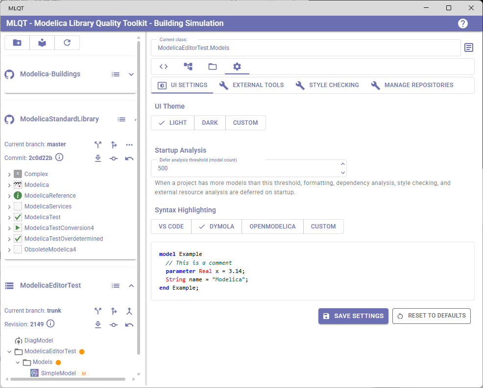
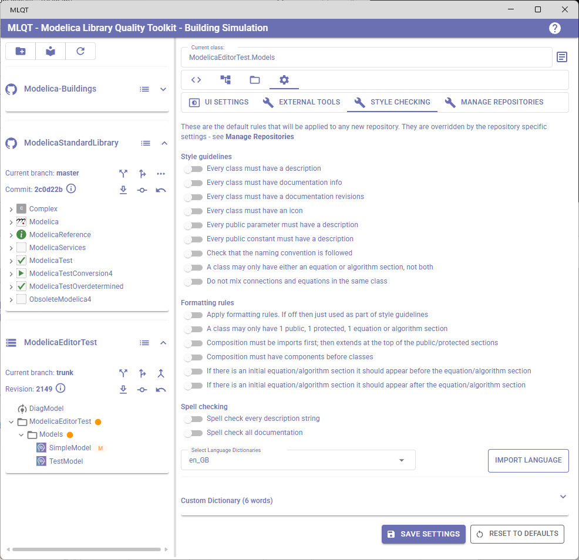
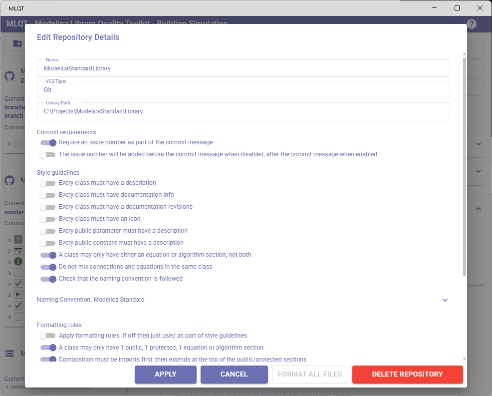
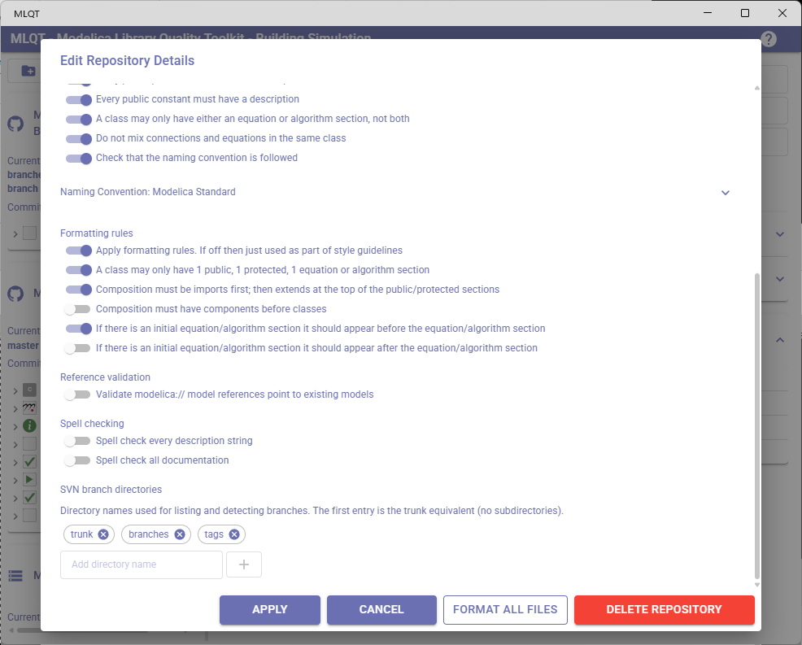
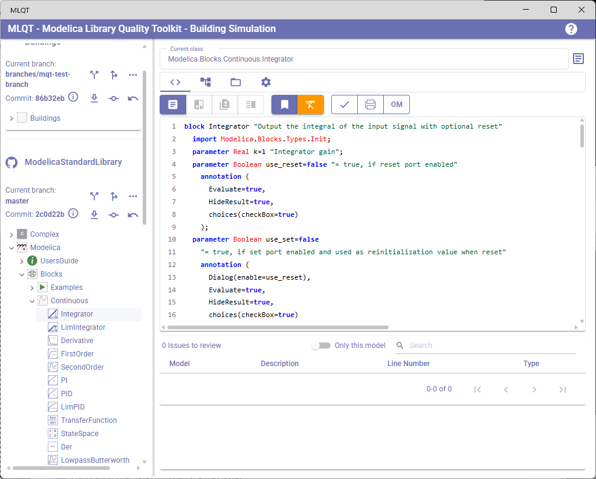
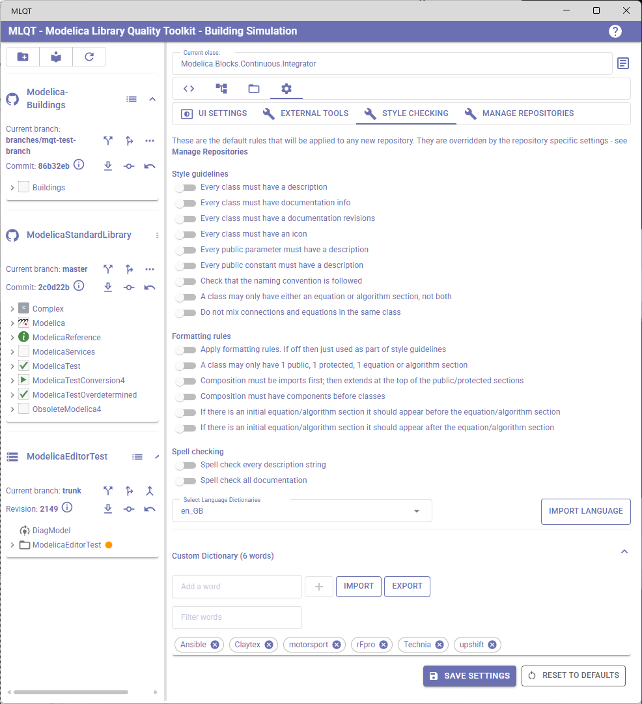
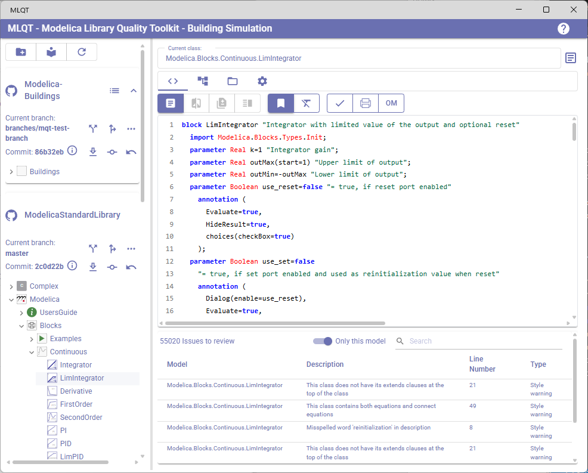

# Settings Reference

MLQT has two levels of settings:

- **Application-level settings** — UI theme, syntax highlighting, external tool paths, and default style checking rules. These are stored locally on your machine and are personal to you.
- **Repository-level settings** — Style checking, formatting, commit requirements, and spell checking rules for a specific repository. These are stored inside the repository itself so they can be shared with your team.

This guide covers both levels and explains every setting in detail.

## Application Settings

Application settings are found in the **Settings** tab on the right panel. They are organized into sub-tabs:

| Tab | Purpose |
|-----|---------|
| **UI Settings** | Theme and syntax highlighting colors |
| **External Tools** | Paths to Dymola and OpenModelica |
| **Style Checking** | Default style rules for new repositories |
| **Manage Repositories** | Project and repository management |

Changes to UI Settings, External Tools, and Style Checking are saved by clicking the **Save Settings** button at the bottom of the settings panel.



---

## Default Style Checking Settings

Found under **Settings > Style Checking**, these are the default rules applied to any newly added repository. They serve as a template — once a repository is added, it gets its own copy of these settings which can be customized independently.

A note at the top of this tab reminds you: *"These are the default rules that will be applied to any new repository. They are overridden by the repository specific settings — see Manage Repositories."*



---

## Repository Settings

Repository settings are edited through **Settings > Manage Repositories** by clicking on a repository row. Each repository has its own independent copy of all style, formatting, and commit settings.

The dialog has four action buttons: **Apply** saves any changes, **Cancel** discards them, **Format All Files** immediately reformats every `.mo` file in the repository using the current formatting rules (see [Understanding "Apply Formatting Rules"](#understanding-apply-formatting-rules)), and **Delete Repository** removes the repository from the project.

### Commit Requirements

These settings control what is required when committing changes to the repository.

| Setting | Description |
|---------|-------------|
| **Require an issue number as part of the commit message** | When enabled, MLQT will require you to enter an issue/ticket number with every commit. This is useful for teams that track all changes against issue trackers. |
| **Issue number position** | Controls whether the issue number is added before or after the commit message text. When disabled (default), the issue number is prepended. When enabled, it is appended. Only available when "Require an issue number" is turned on. |



### SVN Branch Directories

This setting is only visible when the repository's VCS type is SVN.

| Setting | Default | Description |
|---------|---------|-------------|
| **SVN Branch Directories** | `trunk`, `branches`, `tags` | Configures the SVN branch directory names used for branch extraction, listing, and creation. The first entry is treated as the trunk and is matched as a leaf directory name. All subsequent entries are treated as branch containers — MLQT looks for subdirectories within them to discover individual branches. |

The UI presents a text field with an **Add** button to append new directory names, and a chip set displaying the current entries. Click the delete icon on a chip to remove that directory name.

For example, a repository that uses `main` instead of `trunk` and keeps release branches under `releases` could be configured as `main`, `branches`, `releases`, `tags`.



### Style Guidelines

Style guidelines are rules that MLQT checks against your Modelica code. When a rule is enabled, any violation is reported as an issue in the **Code Review** tab. These checks help ensure code quality and consistency across your library.

Style guidelines are **passive** — they only report issues and never modify your code.

| Setting | Default | Description |
|---------|---------|-------------|
| **Every class must have a description** | Off | Checks that every Modelica class (model, package, block, etc.) has a description string. Descriptions appear after the class name, e.g., `model MyModel "A short description"`. Missing descriptions make libraries harder to browse and understand. |
| **Every class must have documentation info** | Off | Checks that every class has an `annotation(Documentation(info="..."))` section. The info section typically contains HTML documentation explaining the purpose and usage of the class. |
| **Every class must have documentation revisions** | Off | Checks that every class has an `annotation(Documentation(revisions="..."))` section. The revisions section documents the change history of the class. |
| **Every class must have an icon** | Off | Checks that every class has an `annotation(Icon(...))` defining its graphical representation. Icons are used by graphical Modelica editors like Dymola and OpenModelica to display the class in diagrams. |
| **Every public parameter must have a description** | Off | Checks that every public `parameter` declaration includes a description string. Parameters are the primary way users configure models, so descriptions are important for usability. |
| **Every public constant must have a description** | Off | Checks that every public `constant` declaration includes a description string. |
| **Check that the naming convention is followed** | Off | Checks that class, variable, parameter, and constant names follow configurable naming conventions. When enabled, an expansion panel appears with granular controls: preset selection (Modelica Standard, snake_case, Modelica + UPPER_CASE Constants), per-class-type naming rules (model, function, block, connector, record, type, package, class, operator), per-visibility element rules (public/protected variables, parameters, constants), underscore suffix handling, and exception names. See [Naming Conventions](naming-conventions.md) for full details. |
| **Don't mix equation and algorithm sections** | Off | Checks that a class does not contain both `equation` and `algorithm` sections. Mixing these can make models harder to understand and maintain. |
| **Do not mix connections and equations** | Off | Checks that `connect()` statements and equations are not mixed together in the same equation section. Keeping connections separate from equations improves readability. |

### Formatting Rules

Formatting rules define structural ordering requirements for Modelica code. These rules serve a dual purpose:

1. **As style checks** — When a formatting rule is enabled but "Apply formatting rules" is off, violations are reported as issues in the Code Review tab (just like style guidelines).
2. **As automatic formatting** — When "Apply formatting rules" is on, MLQT will automatically restructure your code to comply with the enabled formatting rules whenever files are saved.

| Setting | Default | Description |
|---------|---------|-------------|
| **Apply formatting rules** | Off | **Master switch for automatic code formatting.** See [Understanding "Apply Formatting Rules"](#understanding-apply-formatting-rules) below for a detailed explanation. |
| **One of each section** | Off | Requires that a class has at most one `public` section, one `protected` section, and one `equation` or `algorithm` section. When formatting is applied, multiple sections of the same kind are merged into one. |
| **Imports first, extends at top** | Off | Requires that `import` statements appear first in each section, followed by `extends` clauses, before any other declarations. This is mutually exclusive with "Components before classes". |
| **Components before classes** | Off | Requires that component declarations (variables, parameters) appear before nested class definitions within each section. This is mutually exclusive with "Imports first". |
| **Initial equation/algorithm first** | Off | If the class has an `initial equation` or `initial algorithm` section, it should appear before the main `equation`/`algorithm` section. Mutually exclusive with "Initial equation/algorithm last". |
| **Initial equation/algorithm last** | Off | If the class has an `initial equation` or `initial algorithm` section, it should appear after the main `equation`/`algorithm` section. Mutually exclusive with "Initial equation/algorithm first". |

#### Mutually Exclusive Settings

Some formatting settings are mutually exclusive — enabling one automatically disables the other:

- **Imports first** and **Components before classes** — These represent different ordering philosophies. You can have imports first (then extends, then everything else), or components before classes, but not both.
- **Initial equation/algorithm first** and **Initial equation/algorithm last** — The initial section can appear either before or after the main section, but not both. If neither is set, MLQT does not enforce any particular order.

### Formatting Exclusion

Individual models can be excluded from automatic formatting. This is useful for models with intentionally non-standard structure, generated code, or legacy models that should not be reformatted.

| Setting | Description |
|---------|-------------|
| **FormattingExcludedModels** | A list of fully qualified model IDs that are excluded from the formatter. Excluded models skip auto-formatting entirely, and formatting-rule style violations are suppressed for those models. Non-formatting style rules (descriptions, naming conventions, spell checking, reference validation, etc.) still apply normally. |

A helper method `IsModelExcludedFromFormatting(string modelId)` is available for checking whether a given model is in the exclusion list.

**Adding an exclusion from the Code Review page:**

The Code Review page toolbar includes a toggle button (FormatClear icon) that excludes the currently selected model from formatting. When a model is excluded, the button is highlighted in Warning color to indicate the active exclusion. Clicking the button again removes the exclusion.

When you exclude a model that belongs to a VCS-managed repository, MLQT automatically reverts the file to undo any formatting that was previously applied. This ensures the file returns to its pre-formatted state.



### Reference Validation

| Setting | Default | Description |
|---------|---------|-------------|
| **Validate modelica:// model references** | Off | Checks that `modelica://` URIs pointing to other models (e.g., `modelica://Modelica.Blocks.Continuous`) reference models that actually exist in the loaded libraries. This catches broken cross-references caused by renamed or removed models — a common issue since many Modelica tools do not update these URIs automatically. Only model references are checked (URIs without a `/` path separator); file resource references (URIs with `/`) are handled separately by the External Resources system. |

The reference validator handles several edge cases found in real Modelica libraries:

- **Quoted identifiers** — URIs like `modelica://ModelicaReference.Operators.'semiLinear()'` are matched exactly, preserving the single-quoted identifier including any special characters such as parentheses
- **HTML entity-encoded links** — Example markup that uses `&quot;modelica://...&quot;` (entity-encoded `href` attributes shown as visible documentation text) is ignored
- **Plain text mentions** — Text like `Replace modelica://-URIs` that mentions the scheme without being inside an HTML attribute is ignored; only URIs inside attribute values (e.g., `href="modelica://..."`) are validated
- **Hash fragments** — URIs with `#` fragments (e.g., `modelica://Model.Name#info`) are handled correctly, validating only the model path before the fragment
- **Accurate line numbers** — Violations report the actual line within multi-line documentation strings where the broken reference appears, not the line where the annotation starts

### Spell Checking

| Setting | Default | Description |
|---------|---------|-------------|
| **Spell check every description string** | Off | Runs spell checking on all description strings in the library. Helps catch typos in the short text that appears in class, parameter, and variable descriptions. |
| **Spell check all documentation** | Off | Runs spell checking on the HTML content in `annotation(Documentation(info="..."))` sections. Since documentation is often user-facing, catching spelling errors here is valuable. |
| **Language Dictionaries** | English (US), English (UK) | Multi-select dropdown to choose which language dictionaries are active. A word is correct if it appears in any selected dictionary. Additional languages can be imported using the **Import Language** button (requires Hunspell `.aff` and `.dic` file pair). Imported dictionaries are stored at `%LocalAppData%/MLQT/Dictionaries/`. |

The spell checker automatically skips Modelica keywords, camelCase identifiers, ALL_CAPS constants, words with digits or underscores, HTML tag names, decoded HTML entities, component/variable names declared in the current model, and model names from all loaded libraries. A built-in list of Modelica-specific terms (Modelica, Dymola, Jacobian, linearization, etc.) is also included.

Spelling violations appear in the **Code Review** issues table with the line number where the misspelled word appears. Clicking a violation opens a popover with options to add the word to your custom dictionary, view spelling suggestions, ignore the violation, or close the popover. See [Spell Checking](spell-checking.md) for full details.

#### Custom Dictionary

A custom dictionary stores additional words that should be accepted as correct (company names, domain terms, abbreviations). It is shared across all repositories and stored at `%LocalAppData%/MLQT/custom_dictionary.txt`.

In the default settings (**Settings > Style Checking**), the **Custom Dictionary** expandable panel lets you add, remove, filter, import, and export custom words. Words can also be added directly from the Code Review spelling popover — this is the fastest workflow.



---

## Understanding "Apply Formatting Rules"

The **Apply formatting rules** setting is the most impactful setting in MLQT and deserves special attention.

### When "Apply Formatting Rules" Is Off (Default)

The formatting rules (One of each section, Imports first, Components before classes, etc.) behave purely as **style checks**. MLQT will:

- Analyze your code structure against the enabled rules
- Report any violations as issues in the Code Review tab
- **Never modify your files**

This is the safe default. You can see what your code looks like relative to the rules without any risk of changes.

### When "Apply Formatting Rules" Is On

MLQT will **automatically restructure your Modelica source code** to comply with the enabled formatting rules. This happens:

- **At startup** — Only files that VCS reports as modified, added, or untracked are formatted. MLQT assumes the rest of the repository is already correctly formatted (see [Formatting Philosophy](#formatting-philosophy) below).
- **When you save repository settings with formatting changes** — The reformatting is applied immediately to all files in the repository.
- **After VCS operations that change files** (update, checkout, switch branch, merge, revert) — Only the files that VCS reports as changed after the operation are formatted.
- **Before opening the commit dialog** — MLQT formats any modified files that haven't been formatted yet, ensuring committed code always follows the rules.
- **When you click "Format All Files"** in the Edit Repository Details dialog — Forces a full reformat of every file in the repository.
- **When you manually trigger a refresh** — Formats any files flagged as changed by the file monitor.

#### What Formatting Does

When formatting is applied, MLQT parses each Modelica file, restructures the internal sections of each class according to the enabled rules, and writes the file back. For example:

- If **One of each section** is on, multiple `public` sections will be merged into a single `public` section, multiple `protected` sections into one, etc.
- If **Imports first** is on, `import` statements will be moved to the top of each section, followed by `extends` clauses.
- If **Initial equation first** is on, the `initial equation` section will be placed before the `equation` section.

#### Formatting Philosophy

MLQT assumes that once a repository has been formatted, it stays formatted. This means:

- **Startup is fast** — MLQT only formats files that VCS reports as changed since the last commit, not the entire repository.
- **Initial deployment requires a one-time full format** — The first time you enable formatting rules on an existing repository, use the **Format All Files** button to bring every file into compliance. A progress dialog shows while this runs (it can take several minutes for large repositories).
- **After the initial pass, only modified files are reformatted** — Each developer's changes are formatted before commit, keeping the repository consistently formatted without re-scanning everything on every startup.

#### Important Implications

1. **Files will be modified on disk.** The formatter writes changes directly to your Modelica source files. These changes will appear as modifications in your version control system.

2. **Changes are structural, not cosmetic.** The formatter reorders declarations and sections within classes. It does not change indentation style, whitespace, or naming.

3. **This is safe but significant.** The formatter only moves existing code — it never deletes code or changes semantics. However, the resulting diffs can be large on the initial formatting pass.

4. **Coordinate with your team.** Since repository settings are shared (see below), enabling formatting on a shared repository means everyone's files will be reformatted on the initial pass. It's best to agree on formatting rules as a team, apply the initial format in a dedicated commit, and then all subsequent changes are formatted incrementally.

5. **Initial formatting may produce large diffs.** When you first enable formatting rules on an existing library, use "Format All Files" to reformat the entire repository. Consider doing this on a new branch, reviewing the changes, and then merging.



---

## Where Settings Are Stored

MLQT uses a two-tier storage approach for settings:

### Application-Level Settings

Application settings (UI theme, syntax highlighting, external tool paths, and default style checking rules) are stored in the platform's application preferences storage. On Windows, this uses the standard MAUI Preferences API.

These settings are:
- **Personal** — Each user has their own copy
- **Machine-local** — They do not move between machines
- **Not version controlled** — They are not stored in any repository

This also includes the project/repository configuration (which projects exist, which repositories each project contains, local paths, etc.).

### Repository-Level Settings (`.mlqt/settings.json`)

Style checking, formatting, commit, and spell checking settings for each repository are stored in a file called `settings.json` inside a `.mlqt` directory at the root of the repository:

```
your-repository/
    .mlqt/
        settings.json
    MyLibrary/
        package.mo
        ...
```

The `settings.json` file contains all the repository-specific settings in JSON format:

```json
{
    "CommitRequiresIssueNumber": false,
    "IssueNumberAtEnd": false,
    "ApplyFormattingRules": true,
    "ImportStatementsFirst": true,
    "ComponentsBeforeClasses": false,
    "OneOfEachSection": true,
    "DontMixEquationAndAlgorithm": false,
    "DontMixConnections": false,
    "InitialEQAlgoFirst": false,
    "InitialEQAlgoLast": false,
    "ClassHasDescription": true,
    "ClassHasDocumentationInfo": false,
    "ClassHasDocumentationRevisions": false,
    "ClassHasIcon": false,
    "ParameterHasDescription": true,
    "ConstantHasDescription": false,
    "FollowNamingConvention": true,
    "NamingConvention": {
        "PresetName": "Modelica Standard",
        "ModelNaming": 2,
        "FunctionNaming": 1,
        "BlockNaming": 2,
        "ConnectorNaming": 2,
        "RecordNaming": 2,
        "TypeNaming": 2,
        "PackageNaming": 2,
        "ClassNaming": 2,
        "OperatorNaming": 2,
        "PublicVariableNaming": 1,
        "PublicParameterNaming": 1,
        "PublicConstantNaming": 1,
        "ProtectedVariableNaming": 1,
        "ProtectedParameterNaming": 1,
        "ProtectedConstantNaming": 1,
        "AllowUnderscoreSuffixes": true,
        "ExceptionNames": []
    },
    "SpellCheckDescription": false,
    "SpellCheckDocumentation": false,
    "SpellCheckLanguages": ["en_US", "en_GB"],
    "ValidateModelReferences": false,
    "SvnBranchDirectories": ["trunk", "branches", "tags"],
    "FormattingExcludedModels": []
}
```

### Why Settings Are Stored in the Repository

The `.mlqt/settings.json` file is deliberately placed inside the repository directory so it can be **committed to version control** alongside the Modelica source code. This design has several benefits:

1. **Team consistency** — When a team agrees on style rules and formatting settings, those rules are shared through the repository. Every team member who loads the repository in MLQT automatically gets the same settings.

2. **Repository-specific rules** — Different libraries may have different conventions. A legacy library might have relaxed rules, while a new library enforces strict style guidelines. Each repository carries its own rules independently.

3. **Settings travel with the code** — When you clone or check out a repository, the MLQT settings come with it. There is no separate configuration step needed for new team members.

4. **Audit trail** — Because the settings file is version controlled, changes to the team's style rules are tracked in the repository history. You can see who changed a rule and when.

5. **Branch-specific rules** — If you create a branch to tighten formatting rules, the settings change is part of that branch and can be reviewed in a pull request alongside any formatting changes.

### When Settings Are Loaded and Saved

- **On repository load:** MLQT reads `.mlqt/settings.json` from the repository root. If the file does not exist, default settings are used.
- **On settings change:** When you click **Apply** in the Edit Repository Details dialog, MLQT writes the updated settings to `.mlqt/settings.json` and also saves the repository configuration to the application preferences.
- **The `.mlqt` directory is created automatically** if it does not exist when settings are first saved.

> **Tip:** Add the `.mlqt/` directory to your version control system. You may want to add `.mlqt/settings.json` to your repository's tracked files and commit it so your team shares the same settings. If individual developers need to override settings locally, they can change them in MLQT — the changes will appear as local modifications that they can choose not to commit.

---

## Settings Workflow Recommendations

### For New Teams

1. Start with all settings off (the default)
2. As a team, decide which style guidelines matter for your project
3. Enable the agreed-upon style guidelines and review the reported issues
4. Once the team is comfortable, consider enabling formatting rules
5. Enable "Apply formatting rules" and click **Format All Files** to do the initial formatting pass
6. Review and commit the formatting changes on a dedicated branch
7. Commit the `.mlqt/settings.json` file so the team shares the settings
8. Going forward, only modified files are reformatted — startup remains fast

### For Existing Projects

1. Load your repository in MLQT
2. Enable style guidelines one at a time to assess the number of violations
3. Fix violations incrementally or accept them
4. Only enable "Apply formatting rules" after the team has agreed on the structural rules
5. Click **Format All Files** to do the initial formatting pass and commit it as a single change
6. After the initial pass, MLQT only reformats files you modify — no more slow full-library formatting on every startup

### For Individual Developers

If you are working alone, you can freely enable any combination of settings. The formatting rules are especially useful for maintaining consistent code structure across your libraries without having to think about section ordering manually.
