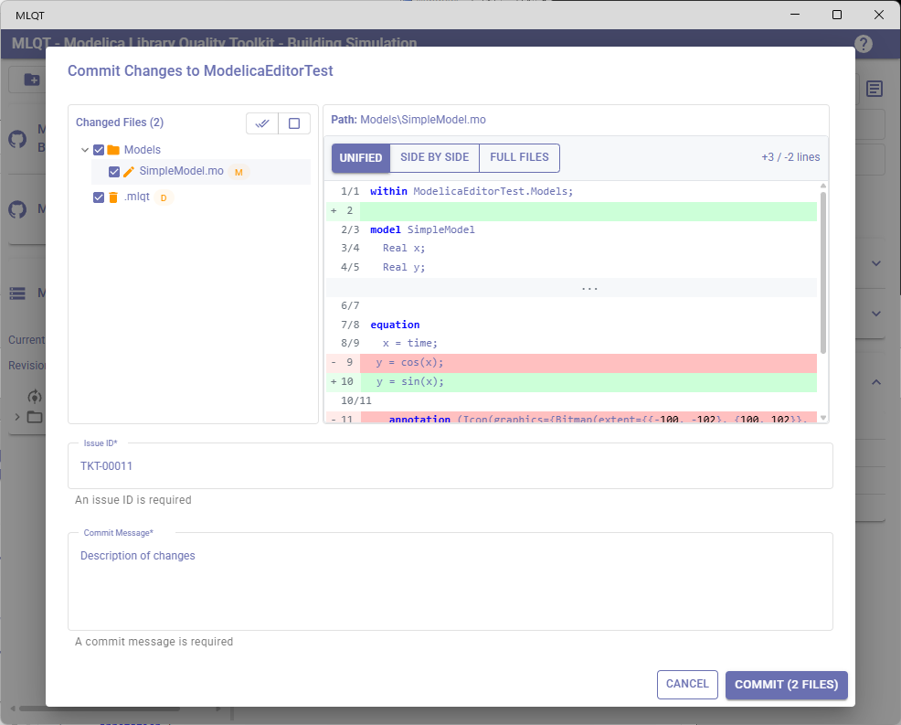
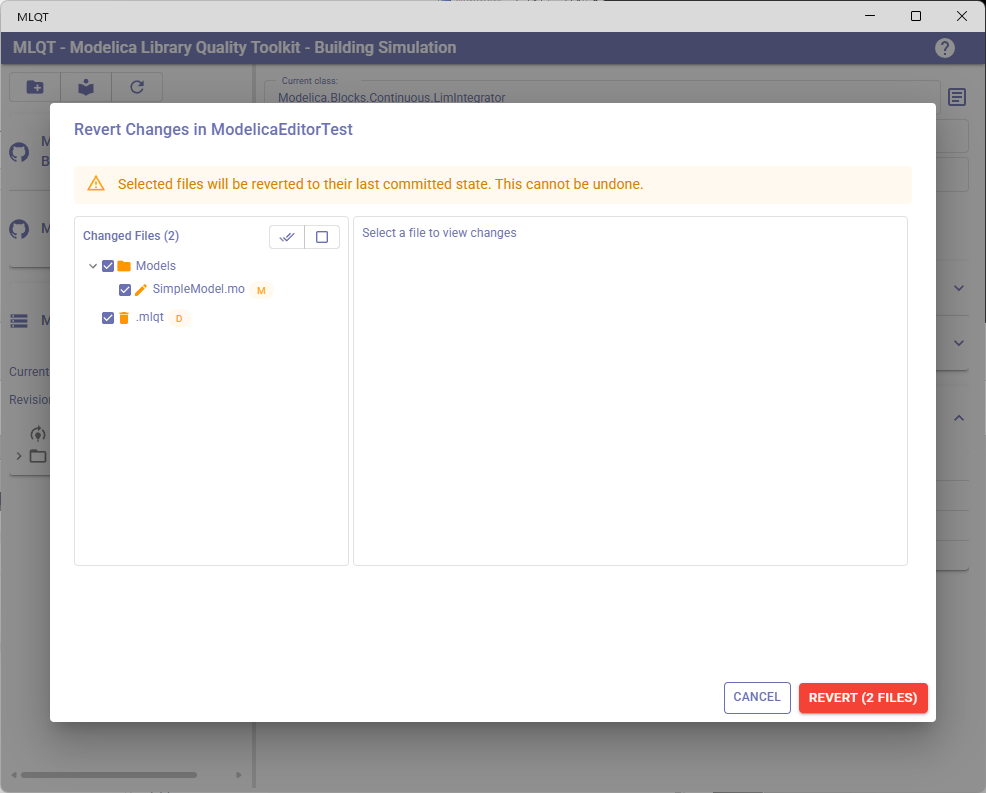
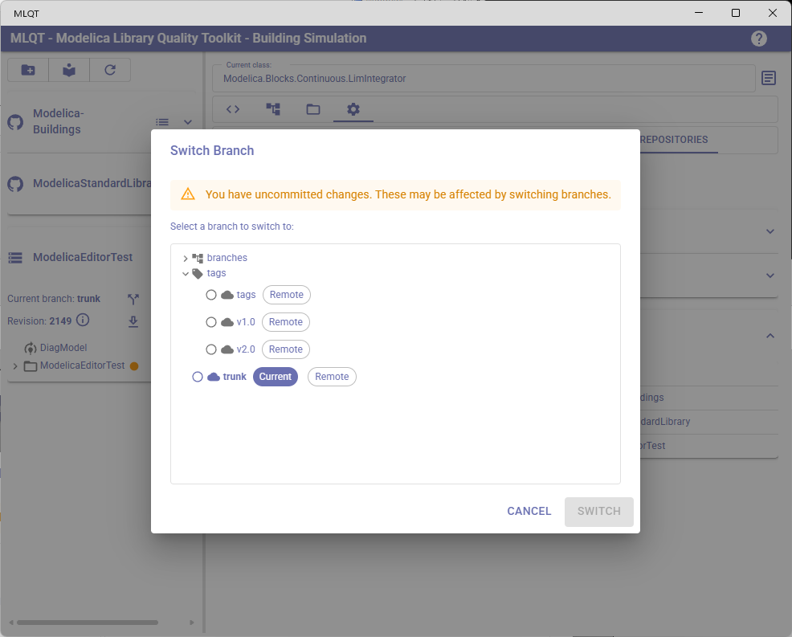
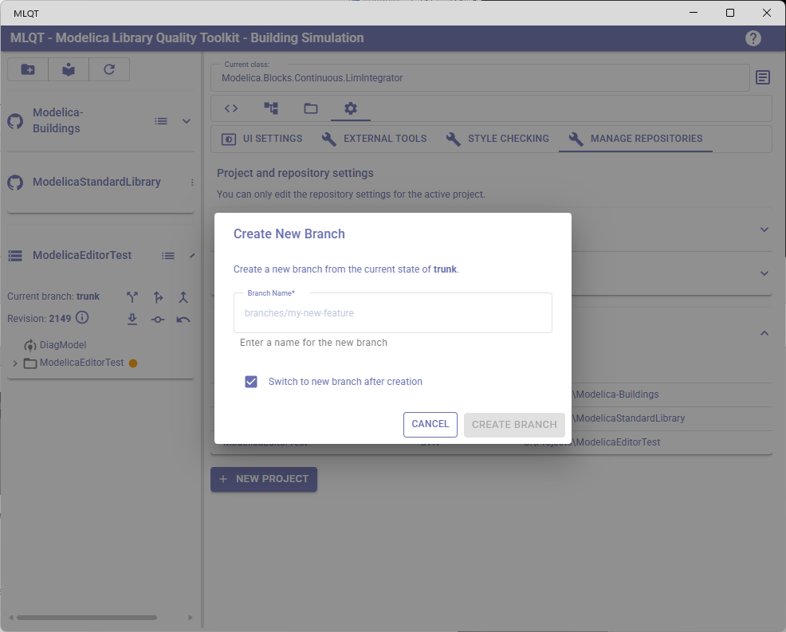
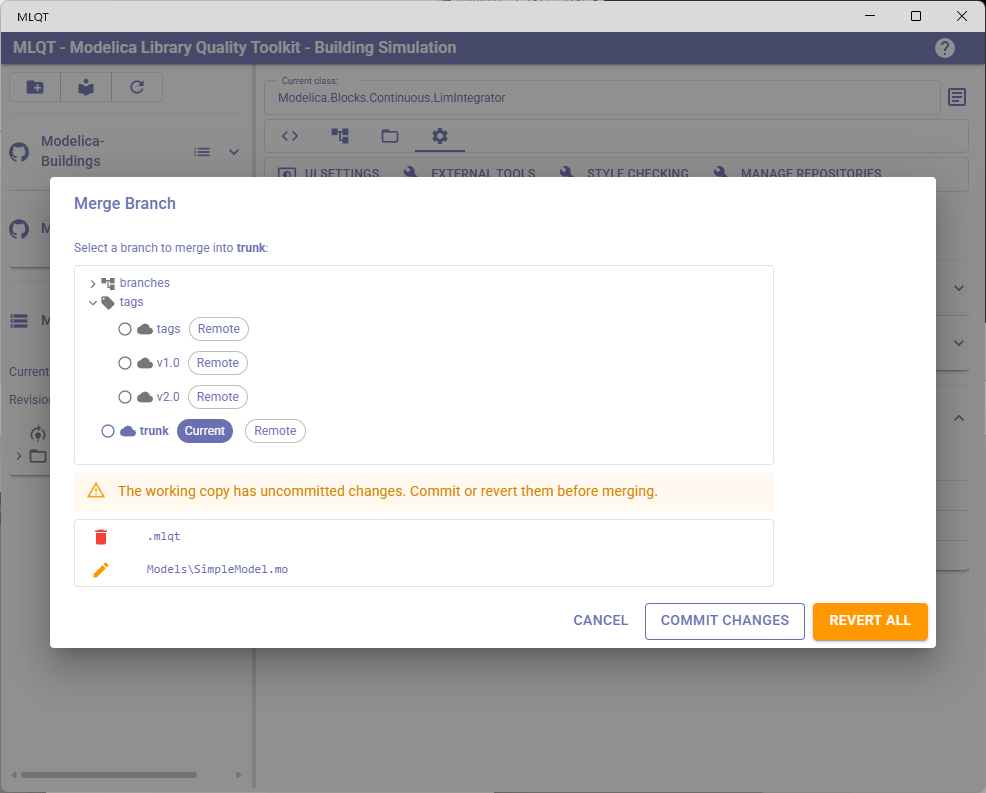
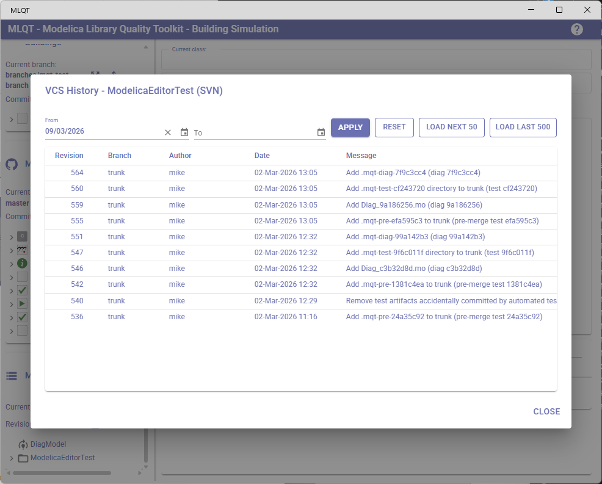

# SVN Operations

MLQT provides integrated SVN (Subversion) operations for managing Modelica libraries stored in SVN repositories. This guide explains each operation and how it fits into common SVN workflows.

## SVN vs Git in MLQT

While MLQT supports both Git and SVN, there are some key differences in the available operations and workflow:

| Capability | Git | SVN |
|-----------|-----|-----|
| Update from remote | Pull (fetch + merge) | Update |
| Commit | Local commit, then push | Commit goes directly to server |
| Branching | Lightweight, instant | Server-side copy |
| Merge | Local merge with auto-commit | Merge into working copy, then commit |
| Rebase | Yes | Not applicable |
| Push | Separate step after commit | Not needed (commit = push) |
| Pull requests | Yes (via hosting platform) | Not applicable |
| History graph | Commit DAG visualization | Linear log |

The most important difference is that **SVN commits go directly to the server** — there is no separate push step. When you commit in SVN, your changes are immediately shared with the team.

## Common SVN Workflows with MLQT

### Trunk-Based Development

The traditional SVN workflow where everyone commits to trunk (the main development line).

**In MLQT:**
1. **Update** to get the latest changes from the server
2. Make your changes in an external editor
3. Click **Refresh** to pick up file changes
4. Review changes in the **Code Review** tab using diff view
5. **Commit** your changes — they go directly to the server
6. Other team members **update** to get your changes

### Branch and Merge Workflow

For larger features or release management, SVN uses branches that are server-side copies of trunk.

**In MLQT:**
1. **Create a branch** from the current revision (creates a server-side copy)
2. **Switch** to the new branch
3. Work on the branch, committing as you go (each commit goes to the server)
4. Periodically **merge** changes from trunk into your branch to stay current
5. When the feature is complete, **switch** back to trunk
6. **Merge** the branch into trunk
7. **Commit** the merge result

### Tag-Based Releases

SVN uses tags (which are really just branches by convention) to mark release points.

**In MLQT:**
1. Use **Browse history** to verify the revision you want to tag
2. **Create a branch** with a name like `tags/v1.0` (SVN tags are branches by convention)
3. Continue development on trunk

---

## Updating

**Button:** Download icon in the repository header (Row 2)

Updates your working copy to the latest revision from the SVN server. This is equivalent to `svn update`.

**What happens:**
1. MLQT pauses file monitoring
2. Fetches the latest changes from the server
3. Merges them into your working copy
4. Reloads libraries to reflect changes
5. Formats any files that changed during the update (if "Apply formatting rules" is enabled)
6. Re-runs dependency analysis and style checking on affected files
7. Shows "Updated to revision [number]" or "Already up to date"

**When to use:** Before starting work each day, and periodically throughout the day to pick up teammates' commits.

**If conflicts occur during update:** SVN marks conflicted files in the working copy. You'll need to resolve them externally and then use the commit/revert operations in MLQT.

---

## Committing Changes

**Button:** Commit icon in the repository header (Row 2, only enabled when uncommitted changes exist)

Opens the **Commit Changes** dialog. In SVN, a commit sends your changes **directly to the server** — there is no separate push step.

### Dialog Fields

| Field | Description |
|-------|-------------|
| **Commit message** | Required. Describes what you changed. |
| **Issue ID** | Optional (required if "Require an issue number" is enabled in repository settings). |

### Issue Number Handling

Same as Git — see [Git Operations: Committing Changes](git-operations.md#committing-changes) for details on issue number settings.

### File Selection

Select which modified files to include in the commit. Unlike Git, SVN commits are atomic — all selected files are committed in a single revision.

### Out-of-Date Handling

If the server has a newer revision than your working copy (someone else committed since your last update), MLQT automatically:
1. Detects the out-of-date condition
2. Updates your working copy to the latest revision
3. Retries the commit

If the update introduces conflicts, the commit is aborted and you'll need to resolve the conflicts first.

### After Committing

- The dialog closes with a success message
- The repository header updates to show the new revision number
- VCS status chips are cleared for committed files
- Because SVN commits go directly to the server, **your changes are immediately available to teammates** who update

---

## Reverting Changes

**Button:** Undo icon in the repository header (Row 2, only enabled when uncommitted changes exist)

Opens the **Revert Files** dialog. This is equivalent to `svn revert`.

The revert behavior is identical to Git — see [Git Operations: Reverting Changes](git-operations.md#reverting-changes). Selected files are restored to their last committed state and **this cannot be undone**.

---

## Switching Branches

**Button:** Branch/split icon in the repository header (Row 1)

Opens the **Switch Branch** dialog to switch your working copy to a different branch or tag. This is equivalent to `svn switch`.

In SVN, branches are directories on the server (typically under `/branches/`), and switching redirects your working copy to point at a different branch directory.

### Branch Selector

The dialog shows available branches from the SVN repository. Unlike Git, SVN branches include:
- **trunk** — The main development line
- **branches/** — Feature and development branches
- **tags/** — Release tags (which are technically branches in SVN)

### Uncommitted Changes Warning

If you have uncommitted changes, the dialog warns that switching may affect them. In SVN, uncommitted changes are carried over to the new branch when possible, but conflicts may arise.

### After Switching

- MLQT reloads all libraries from the new branch
- Any files that VCS reports as changed are formatted (if "Apply formatting rules" is enabled), then dependency analysis and style checking run on affected files
- The repository header updates to show the new branch name and revision

---

## Creating Branches

**Button:** Fork icon in the repository header (Row 1)

Opens the **Create Branch** dialog. In SVN, creating a branch is a server-side copy operation (`svn copy`), which creates a copy of the current working copy's URL at a new branch path.

### How SVN Branching Works

Unlike Git's lightweight local branches, SVN branches are:
- **Server-side copies** — The branch is created on the server immediately
- **Cheap copies** — SVN uses copy-on-write, so creating a branch is fast and doesn't duplicate data
- **Visible to everyone** — As soon as the branch is created, all team members can see and switch to it

### Dialog Fields

| Field | Description |
|-------|-------------|
| **Branch name** | The name for the new branch. This becomes a directory under `/branches/` on the server. |
| **Switch to new branch after creation** | Checkbox (default: on). If checked, your working copy switches to the new branch immediately. |

---

## Custom Branch Directory Names

By default, MLQT recognizes the standard SVN repository layout where `trunk` is the main development line, `branches` contains feature and development branches, and `tags` contains release tags. However, some organizations use non-standard directory names for their SVN layout. For example, a repository might use `tickets` for feature branches, `release` for tags, or `dev` for parallel development lines.

MLQT allows you to configure the branch directory names on a per-repository basis, so it can correctly identify branches regardless of the directory naming convention used by your organization.

### How It Works

The branch directory names are an ordered list. The entries are interpreted as follows:

- **First entry** — Treated as the trunk equivalent. MLQT matches this as a leaf directory name in the SVN URL (e.g., a URL ending in `/trunk` matches the default first entry `trunk`).
- **Subsequent entries** — Treated as branch container directories. MLQT expects these directories to contain subdirectories for individual branches (e.g., `branches/feature-1`, `branches/bugfix-2`).

The default value is `["trunk", "branches", "tags"]`.

### What This Affects

Configuring custom branch directory names affects how MLQT:

- **Extracts the current branch** from the SVN working copy URL
- **Lists available branches** in the Switch Branch and Merge Branch dialogs
- **Creates new branches** by determining where to place the server-side copy

### Configuration

The setting is available in **Settings > Manage Repositories** and is only visible when the repository's VCS type is set to SVN.

The UI provides:
- A **text field** to enter a new directory name
- An **Add button** to append it to the list
- Each entry is displayed as a **removable chip**, so you can delete entries you don't need

### Examples

| Organization Convention | Branch Directory Names |
|------------------------|----------------------|
| Standard SVN layout | `trunk`, `branches`, `tags` |
| Ticket-based branching | `trunk`, `tickets`, `tags` |
| Separate release branches | `trunk`, `branches`, `release` |
| Custom naming | `main`, `dev`, `releases` |

> **Note:** If your repository does not follow any recognizable branch directory convention, MLQT may not be able to determine the current branch or list available branches. Ensure the directory names match the actual structure of your SVN repository.

---

## Merging Branches

**Button:** Merge icon in the repository header (Row 1)

Opens the **SVN Merge Branch** dialog to merge changes from another branch into your current working copy. This is equivalent to `svn merge`.

SVN merging is a multi-phase process that MLQT guides you through step by step.

### Merge Workflow

**Phase 1: Working copy check**
MLQT checks for uncommitted changes. A clean working copy is required for merging. If changes exist, you must:
- **Commit Changes** — Opens the commit dialog to save your work first
- **Revert All** — Discards all uncommitted changes

**Phase 2: Branch selection**
Select which branch to merge from. MLQT shows available branches excluding the current one.

**Phase 3: Merge execution**
MLQT performs the merge into your working copy. The result is **not automatically committed** — you get to review the merged changes first.

**Phase 4: Conflict resolution** (if needed)
If the merge produces conflicts, the dialog shows each conflicted file with resolution options:

| Action | Description |
|--------|-------------|
| **Accept Incoming** | Use the version from the branch being merged |
| **Keep Mine** | Keep your current working copy's version |
| **Mark as Resolved** | For tree conflicts (file/directory structure conflicts), marks the conflict as resolved without changing content |
| **Edit Externally** | Open the file in your default editor for manual resolution |
| **View Conflict** | Opens a side-by-side diff showing "Ours (current branch)" vs "Theirs (incoming)" |

#### SVN Tree Conflicts

SVN can produce **tree conflicts** — conflicts that involve the structure of the file system rather than file content. For example:
- A file was modified on one branch and deleted on another
- A directory was renamed on one branch and modified on another

Tree conflicts can only be resolved by marking them as resolved (after manually deciding what to do with the files). They cannot use Accept Incoming or Keep Mine.

**Phase 5: Commit the merge**
After all conflicts are resolved, click **Commit Merge** to open the commit dialog with a pre-filled merge commit message. Complete the commit to finalize the merge.

Because SVN commits go directly to the server, the merged result is immediately shared with the team.

---

## Browsing History

**Button:** List icon in the repository header

Opens the **VCS History** dialog showing the SVN revision log.

The SVN history view works similarly to the Git version but with some differences:

### SVN-Specific Differences

- **No commit graph** — SVN has a linear history, so there is no branch/merge graph visualization
- **Revision numbers** — SVN uses incrementing integer revision numbers instead of hashes
- **Server-side log** — The log is fetched from the SVN server

### Table Columns

| Column | Description |
|--------|-------------|
| **Revision** | The SVN revision number. The current working copy revision is shown in **bold**. |
| **Branch** | The branch this revision belongs to. |
| **Author** | The commit author. |
| **Date** | The commit date. |
| **Message** | The commit message (hover for full text). |

### Date Filtering and Loading

Same as Git — use the date pickers to filter, and the "Load Next 50" / "Load Last 500" buttons to load more history.

### Viewing Changed Files and Diffs

Click on any revision row to see the changed files. The **Diff** button shows the file at that revision compared to the current working copy.

MLQT handles SVN path differences automatically — it strips branch prefixes (`trunk/`, `branches/X/`, `tags/X/`) from server-relative paths to correctly match files in your working copy.

### Checking Out a Revision

You can check out (switch to) a specific revision from the history view. This switches your working copy to that exact revision, similar to Git's detached HEAD state. A confirmation warns that uncommitted changes will be lost.

---

## SVN-Specific Considerations

### No Local Commits

Unlike Git, SVN has no concept of local commits. Every commit in SVN goes directly to the server. This means:
- **You need network access to commit** — You cannot work offline and commit later
- **Commits are immediately visible** — Other team members see your changes as soon as you commit
- **Think before committing** — Since you can't amend or squash SVN commits, make sure your changes are ready

### Branch Lifecycle

SVN branches persist on the server until explicitly deleted. MLQT does not provide a branch deletion operation — use an SVN client or command line for branch cleanup.

### Working Copy State

SVN working copies maintain more state than Git working copies:
- Mixed-revision working copies are possible (different files at different revisions)
- `svn update` brings everything to the latest revision
- `svn switch` changes the branch but preserves local modifications when possible

### Merge Tracking

SVN 1.5+ tracks which revisions have been merged using `svn:mergeinfo` properties. MLQT leverages this to avoid re-merging revisions that have already been integrated.
